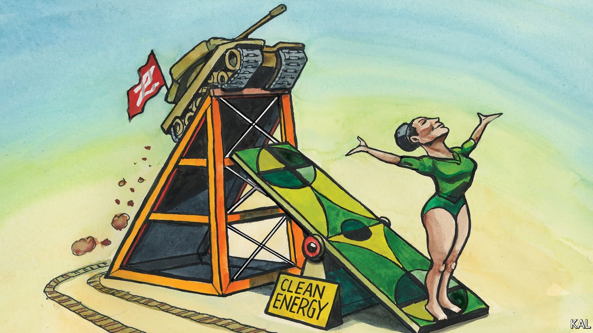

###### Lexington

# American energy innovation’s big moment 

##### The war in Ukraine could unleash enormous demand for clean tech that America will soon be able to supply 

 

> Mar 26th 2022 

T HE OPPORTUNITY to make the covid-19 recovery green has been squandered. A new analysis of over $14trn in pandemic stimulus, injected by 19 countries and the European Union, finds that just 6% went on programmes likely to cut emissions. America did particularly badly: hardly any of its $6trn splurge was climate-friendly. Perhaps the best that can be said for the catastrophe in Ukraine is that the ensuing energy crisis has provided an opportunity to reverse that failure.

The early responses, it is true, have been somewhat discouraging. As European countries cast around for substitutes for Russian oil and gas, short-term fixes are the need of the hour, leading to a higher oil price and probably more oil and gas production. Joe Biden’s administration, which branded itself the greenest ever, is urging producers to drill, baby, drill. Its signature climate policy is meanwhile snarled up in Congress. Mr Biden said as much about diabetes as climate change in his recent state-of-the-union message. Yet there is also cause for hope—in America especially.


Its clean-tech sector is in ferment. The administration used one of the world’s biggest energy confabs, held in Houston this month, to broadcast its plea for more hydrocarbons. Less publicised, notes Daniel Yergin, an energy guru and one of CERAWeek’s organisers, was the fact that the summit’s energy-innovation section drew bigger crowds than the main event. Clean tech attracted over $87bn of investment from venture-capital and private-equity firms alone in the year to June 2021. And there is little expectation, even as interest rates rise, of the boom petering out. It is being driven by three forces that seem likelier to grow: society’s fear of climate change, long-term corporate commitments to decarbonisation, and the underappreciated impact of shrewd legislation.

The last includes the bipartisan Energy Policy Act of 2020, which hugely expanded the Department of Energy’s role in research and development, and the infrastructure law of 2021, which amplified that effort. The climate components of the stalled Build Back Better bill are better known and indeed essential to Mr Biden’s time frame for decarbonising the economy. Yet they are largely dedicated to accelerating the deployment of mature technologies such as solar and wind energy. The two earlier laws were focused more on developing the breakthrough technologies on which most of the world’s decarbonisation effort will depend.

The Department of Energy, hitherto best known for looking after the country’s nuclear weapons, has been restructured for the task. One of its under-secretaries has been dedicated to innovation. Among its new clean-tech programmes are three climate “Earth-shots”—the first in what looks like a promising series. One aims to reduce the production cost of hydrogen by 80% in a decade; another to cut the cost of grid storage by 90%; and a third to develop affordable ways to suck carbon from the atmosphere.

Scepticism is warranted about how far such efforts will go. The department’s network of 17 national labs has always been excellent. Yet America’s record in commercialising their inventions is abject. Having invented photovoltaic cells, America left it to Japan, Germany and then China—where over 70% of panels are now made—to bring them to market. Having poured public money into electric vehicles, notably after the oil shock of 1973, it let Japanese, Chinese and European firms commercialise them.

The problem, suggests Nikos Tsafos of the Centre for Strategic and International Studies, is that whereas politicians share an almost ideological belief in America’s genius for innovation, those on the right, especially, struggle to understand that it involves deployment as well as invention. To deploy clean tech rapidly requires two things that America still mostly lacks. One is a national climate policy to raise the cost of pollution, thereby creating demand. The other is an industrial policy sufficient to boost supply.

The optimistic case for the energy crisis is that it could help deal with both these shortages. It is already boosting European demand for American clean tech. And it might conceivably persuade Congress to expend more political and public capital on accelerating America’s ability to meet that demand: most pressingly by passing the climate portions of Build Back Better; and by thinking more creatively about industrial policy in the bills that members of both parties are drafting.

In eastern Europe, fear of Vladimir Putin had recast the energy transition as a geopolitical imperative even before he invaded Ukraine. Poland and Romania are among the countries keenest on small modular nuclear power stations, an unproven technology, in which American companies are experimenting. The war has made its promise of faster, cheaper, safer nuclear energy seem more attractive—and the existing nuclear-tech leaders, Russia and China, less appealing. Even as Germany and others make hurried plans to invest in new fossil-fuel infrastructure, moreover, they are promising to adapt it to non-fossil alternatives. In committing to build two new LNG import terminals, for example, Olaf Scholz, Germany’s chancellor, suggested they would later be converted to green hydrogen, another potential American strength.

Having exhausted all the alternatives…

This represents a clear opportunity to connect the world’s most advanced clean tech with the continent with the most advanced climate policies. The Biden administration claims to be seized by it. “The whole government now wants to accelerate the energy transition on the basis of energy security, as well as climate,” says one of its senior members. “Even foreign-policy experts, who generally don’t talk about climate change, are obsessed with this.”

The question is whether at least a little of the spirit will arise in Congress. Don’t hold your breath. But don’t count it out, either. The politics of national security, supply chains, energy and climate are in flux, deeply interconnected and capable of inspiring surprising coalitions even there. ■

Read more from Lexington, our columnist on American politics: (Mar 19th) (Mar 12th) (Mar 5th)

For more coverage of climate change, register for , our fortnightly newsletter, or visit our 

