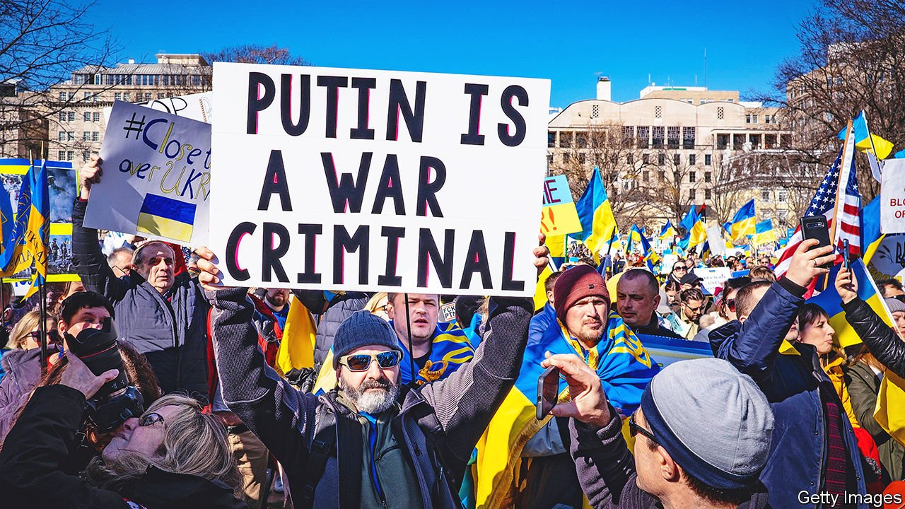
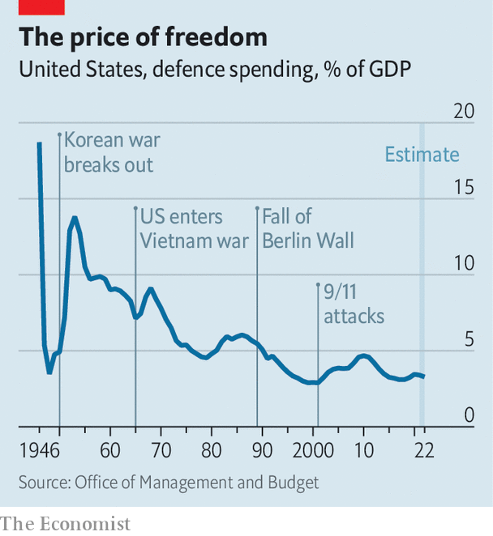

###### Great-power politics

# In Ukraine, Biden must relearn Truman’s lessons from the cold war 

##### America once again seeks to curb Russia and China without blowing up the world 

 

> Mar 26th 2022 

JOE BIDEN entered the White House last year styling himself on Franklin Roosevelt. The better model today might be Harry Truman. His words to Congress 75 years ago this month—“It must be the policy of the United States to support free peoples who are resisting attempted subjugation by armed minorities or by outside pressures”—girded America for the cold war. Those words have a new resonance as Ukraine, helped by the West, battles to resist Russia’s month-old invasion.

As in the 1940s and 50s, the world is separating into distinct blocs. The Eurasian giants, Russia and China, are again making common cause. America is seeking to counter them by mustering allies around their periphery, from Europe to Japan. Truman’s America was engaged in a fight against communism; Mr Biden sees a global contest against autocracy. The cold-war strategy of “containment” is being studied for the current age.


This arouses dread, but also hope. Dread, because of the return of war in Europe, renewed big-power confrontation and the increased risk of nuclear conflict. Hope, because Russia’s military incompetence, Ukraine’s valour and the West’s newfound unity raise confidence that the American-led liberal order can prevail. Writing in American Purpose, an online magazine, Francis Fukuyama of Stanford University, who in an earlier bout of optimism coined the notion of the “end of history” about the demise of the Soviet Union, goes so far as to predict that Ukraine will inflict “outright defeat” on Russia and make possible a “new birth of freedom”.

Mr Biden’s strategy will become clearer in the coming days. On March 24th he was due to take part in a trio of summits in Brussels with the leaders of NATO, the European Union and the G7. The signs are he will steel the allies for a long struggle. “This war will not end easily or rapidly,” said Jake Sullivan, his national security adviser, on March 22nd. The West would stand by Ukraine “for as long as it takes”.

Another signal will be the president’s request for more defence spending in the coming financial year, expected to be sent to Congress next week. A succession of formal strategy documents—for national security, defence and nuclear posture—will follow after hurried redrafting. For Robert Gates, a former American defence secretary, the war “has ended Americans’ 30-year holiday from history”. Ahead lies a two-front contest, against both Russia and China. “A new American strategy must recognise that we face a global struggle of indeterminate duration against two great powers that share authoritarianism at home and hostility to the United States,” he wrote in the Washington Post.

Strategists are reaching for the annals of the cold war. Is Vladimir Putin’s invasion akin to the Soviet Union’s blockade of Berlin in 1948, the start of the Korean war in 1950 or the Cuban missile crisis of 1962? Some are re-reading George Kennan, the American diplomat whose “long telegram” from Moscow in 1946 set the intellectual foundation for containment. American “unalterable counterforce”, Kennan argued in a later essay, could hasten “either the break-up or the gradual mellowing of Soviet power”. In practice containment involved more than the high-minded means Kennan imagined, such as the Marshall plan to rebuild Europe. It also involved coercive instruments: military alliances and build-ups, nuclear standoffs, proxy wars and much else short of a direct conflict.

Dean Acheson, Truman’s secretary of state, wrote that America’s task after 1945 was “just a bit less formidable than that described in the first chapter of Genesis. That was to create a world out of chaos; ours, to create half a world, a free half, out of the same material without blowing the whole to pieces in the process.”

Mr Biden’s burden is to prevent the world from reverting to chaos, and to preserve as much of the free portion as possible. Russia today may be a lesser foe than the Soviet Union, “a wounded empire” rather than a superpower with a global ideology and a semi-autarkic economic hinterland, as Eliot Cohen of Johns Hopkins University notes. Yet China is a greater challenger, not least in economic terms. Its navy is already larger than America’s, and it is fast expanding its nuclear arsenal.

To judge Mr Biden, then, consider three measures: first, how he deals with Russia; in the longer term, how he confronts China; and, throughout, how he carries his profoundly polarised country.

Vladimir the terrible

Team Biden had no illusions about Russia. Its early warning about the invasion of Ukraine, and its release of intelligence about the Kremlin’s plans, were innovative and prescient. It denied Mr Putin a pretext, and primed allies to respond forcefully, both by arming Ukraine and by imposing severe sanctions on Russia. Like Mr Putin, however, Mr Biden may have underestimated Ukraine. On the eve of war America seemed to think that, at best, Ukraine might become another Iraq or Afghanistan, easy to invade but hard to control. Instead Russia has found it surprisingly arduous to take Ukraine’s cities, even as it pulverises them. The longer the horrors go on, the greater the cries for the world to stop them.

At their summits in Europe, the Western allies will resolve to strengthen NATO’s defences, provide more weapons to Ukraine and increase economic pressure on Russia. Above all, American officials say, they will stiffen their sinews for a long contest as economic pain spreads.

How far dare the allies go in waging a proxy war against a nuclear power? The answer keeps shifting. In 2014, when Russia took a first chunk of Ukraine, America declined to provide weapons. It later began to deliver anti-tank missiles. Now it is shipping small anti-aircraft weapons and drones. Soon it may facilitate the supply of longer-range air-defence missiles.

Yet there are limits. When Mr Biden vows that America will defend “every inch” of NATO’s territory he declares, in effect, that American forces will not defend any inch of Ukraine’s. To get involved directly, says Mr Biden, would be “World War III”. He has refused calls to impose a no-fly zone over Ukraine, act as the intermediary for Polish MiG-29 jets or even supply American-made Patriot anti-aircraft batteries.

The point at which America becomes a “co-combatant” will not be decided by lawyers but, ultimately, by Russia. The Kremlin has given notice that arms convoys to Ukraine would be legitimate targets. It has bombed sites close to Poland.

History suggests the boundaries of proxy conflicts can be dangerously fuzzy. Chinese “volunteer” forces fought against American troops in the Korean war of 1950-53, when America considered using atom bombs against them. Russians manned anti-aircraft batteries and, perhaps, flew missions against American aircraft in the Vietnam war of 1955-75.

“During the cold war the United States and the Soviet Union were at daggers drawn but usually did not stab each other directly,” explains Richard Fontaine of the Centre for a New American Security, a think-tank in Washington. Mr Putin has rattled his nuclear sabre, but American officials say they have detected no change in Russia’s nuclear posture, nor have they changed theirs.

Mr Biden’s caution in Ukraine contrasts with his almost careless talk about defending Taiwan against China. Last year Mr Biden said America had a “commitment” to defend the island. America’s “strategic ambiguity”, whereby it promises to help Taiwan defend itself but will not say whether it would intervene directly, has become less ambiguous.

Nobody can say quite why America seems readier to risk “World War III” for Taiwan than for Ukraine. Perhaps the danger in Ukraine is concentrating minds. Some note that America has no alliance with Ukraine, a non-NATO country, whereas it has a semi-obligation to Taiwan. The island’s important semiconductor industry is a consideration. The main reason is that America considers China, not Russia, to be the greatest danger.

“Russia is the acute threat. But China is the pacing challenge, the only country able to challenge the United States systemically,” says a senior American official. “Nothing about the crisis in Ukraine has changed that.” Or, as one diplomat puts it, “Ukraine is the tsunami; China is climate change.” America’s response in Europe contributes to alliance-building, says the envoy; it will expect Europeans to help in Asia.

The fact that Australia, Japan and other Asian countries have imposed sanctions on Russia is a sign of their fears about the war’s wider repercussions. American military chiefs have warned that a Chinese invasion of Taiwan could happen before the end of the decade. A successful Russian attack on Ukraine might have emboldened China. Now that Russia is bogged down, the danger may have receded.

Russia and China have declared that their friendship has “no limits”. America is hoping that Xi Jinping, China’s leader, will now have second thoughts. In a video summit on March 18th Mr Biden issued a threat to impose sanctions on China if it came to Russia’s aid. One aim of Mr Biden’s trip this week is to push Europeans to deliver the same message at the EU-China summit on April 1st. China maintains the fiction that it is neutral, so could in theory distance itself from Russia. Few in Washington think Mr Xi is prepared to let Mr Putin fail. But America now sees “an opportunity to deal a strategic blow to Russia, and an opportunity to make Russia increasingly a strategic burden for China,” the official says.

Home alone

On the home front, foreign-policy types give Mr Biden high marks for his handling of the crisis. Opinion polls suggest his actions are in line with the public’s views: support Ukraine and impose sanctions on Russia, but don’t send American troops or shoot down Russian planes.

Yet Mr Biden is not enjoying much of a “rally round the flag” bounce. A YouGov poll for The Economist, conducted on March 19th-22nd, found that 41% of those surveyed approved of his foreign policy, whereas 49% disapproved. Asked about his ability to handle an international crisis, just 33% said they were confident and 48% were uneasy. Such views are highly skewed by party affiliation. Plainly, Mr Biden has failed to restore confidence after his chaotic withdrawal from Afghanistan.

A moment of bipartisanship over Ukraine is dissipating. Republicans accuse Mr Biden of being “weak”. Some advocate a no-fly zone. Most say Mr Biden should not have blocked the delivery of MiG-29s to Ukraine. Much of this criticism looks like posturing. In what promises to be a long global struggle, America’s extreme polarisation will be an enduring vulnerability.

 


The left wing of the Democratic Party has long wanted to shrink the defence budget to make room for ambitious social spending. Mr Biden has favoured continuity, and accepted a nominal increase in the current fiscal year. He may have to change his priorities. Defence spending, now some 3.3% of GDP, is close to its post-war low—down from a high of 13.8% during the Korean war and an average of 7.2% during the cold war (see chart).

Hal Brands, author of a book about the lessons of the cold war, argues that the figure should increase to about 5% of GDP to enable America to cope with trouble in both Europe and Asia. “One parallel between Harry Truman and Joe Biden is that both dramatically under-resourced defence in the early part of their presidencies. The question is whether the Ukraine war will play the role that the Korean war did in convincing the country to increase defence spending.”

The gruelling Korean war did much to destroy Truman’s presidency. That is a lesson in the need for caution. But even if Mr Biden shows skill and sound judgment in the new cold war, he, like Truman, may not get much credit for it until decades later. ■

For more coverage of Joe Biden’s presidency, visit our dedicated  and follow along as we track shifts in his . For exclusive insight and reading recommendations from our correspondents in America, , our weekly newsletter.

