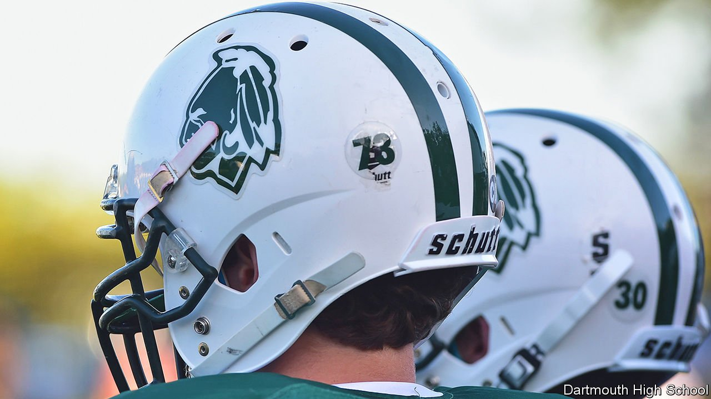

###### Symbols in sports

# The debate about Native American-themed team names goes local 

##### To be Brave or not to be Brave? 

 

> Mar 26th 2022 

WHAT DO GUARDIANS and Commanders have in common? Both project enough moxie for sports fans to rally behind, and neither is offensive. The Commanders are the former Washington Redskins, an American-football team; the Guardians are the baseball team once known as the Cleveland Indians. They are the latest examples of the scrubbing of Native American imagery from organised sports. In a video voiced by Tom Hanks, the Cleveland name change is portrayed as the forward march of history, from racism towards justice. For some Native Americans, it’s not that simple.

Brenda Bremner, former general manager of the Confederated Tribes of Siletz Indians, has a closet full of Warriors and Braves shirts. Her parents met at the Chemawa Indian School in Salem, Oregon, and her father played for the Chemawa Braves. “We wore Indian-type logos proudly,” she says. In 2017 it became illegal for Oregon public schools to have Native American mascots, logos or team names, but an exception—petitioned for by Ms Bremner—allowed schools to retain their mascots by entering into agreements with local tribes. Eight school districts did so.


A similar law is now in the Massachusetts Senate, and the town of Dartmouth is wondering what to do with its high-school team, the Indians. Is the Indian logo racist (causing “shame, horror and harm”, as critics said at a school-committee meeting this week)? A non-binding referendum is scheduled for April 5th.

The Pocasset Wampanoag Tribe, which was living in this area when the pilgrims landed in 1620, is divided on the issue. The Mashpee Wampanoag Tribe opposes the Dartmouth Indian logo. But 22 members of the Aquinnah Wampanoag Tribe signed a letter defending it. The image was drawn by a tribal member. “The symbol is not disrespectful,” the Aquinnah’s Sean Carney said at a previous school-committee meeting, on March 8th. In a separate letter, the Aquinnah chairwoman said the ban attempts to eliminate Native people from “today’s culture and society”.

Mr Carney has no love for the Redskins or for Chief Wahoo, the cartoonish mascot of the Cleveland Indians. The damaging effects of this kind of imagery on students have been well documented, which is why Maine banned such mascots in 2019, and why a new Colorado law will fine any public school with an unacceptable Native-themed team name or logo $25,000 a month from June. But the Dartmouth Indian is not Chief Wahoo.

Statewide bans are a crude instrument. What many tribes want above all is meaningful consultation on decisions ostensibly made in their name. The local approach has worked. Athletes at the University of Utah continue to call themselves Utes, with the approval of the real Utes, in exchange for lesson plans and scholarships for tribal members. It is similar with Florida State University’s Seminoles. Prejudice is the problem, says Ms Bremner, “and you don’t get rid of prejudice without education”.

For exclusive insight and reading recommendations from our correspondents in America, , our weekly newsletter.

