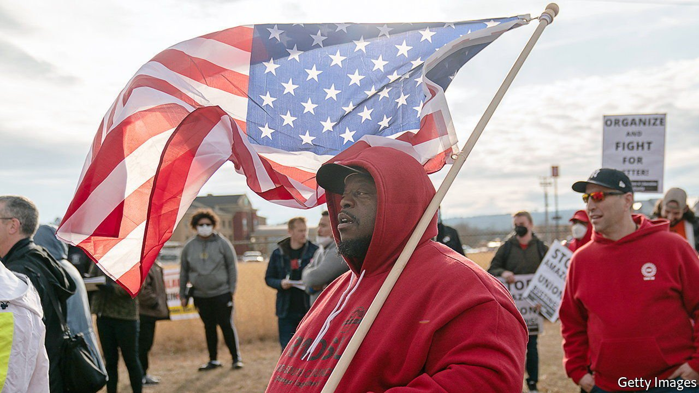

###### The United States of Amazon

# What happens when Amazon comes to town 

##### The e-commerce giant is expanding at a rapid pace. How might that change America? 

 

> Mar 26th 2022 

FOR NEARLY a century Birmingham, Alabama, was synonymous with steel. The suburb of Bessemer was named after Henry Bessemer, a British inventor who transformed steelmaking. Workers moved from as far away as southern Europe to toil in the Birmingham area’s mines and factories, says Henry McKiven, a historian at the University of South Alabama.

The steel industry around Birmingham shrank as manufacturing moved overseas. Bessemer’s unemployment rate reached 35% in the early 1980s. Another vestige of steelmaking disappeared from Bessemer in 2018 when US Steel sold its land to Amazon, which had chosen the town as the site for its first warehouse in Alabama. The sale symbolised Bessemer’s metamorphosis from industrial powerhouse to wannabe logistics hub, a transformation that is being mirrored in cities across America.


Amazon’s business depends on getting goods to consumers fast, which means opening fulfilment centres—as it calls its huge warehouses—near big population areas. MWPVL, a Canadian consultancy, reckons Amazon will have opened about 400 of these in America by 2024 (see top chart). As well as warehouses, it is opening sorting centres and delivery stations—the last stop before a customer’s doorstep. The company is now America’s second-biggest private employer, after Walmart. At the end of 2021 it had 1.1m “Amazonians” working in the country, and plans to hire at least 125,000 more.

 


Amazon’s  is not just revolutionising shopping. It is also affecting towns, such as Bessemer, that wooed it in the hope of revitalising their economies. Many cities that were snubbed in the  to become Amazon’s second headquarters (after Seattle) were brought into the firm’s orbit anyway as a regional tech hub, such as Phoenix and Nashville, or as a home for a fulfilment centre. Holly Sullivan, Amazon’s vice-president for economic development, says that when picking a warehouse site her team considers factors such as transport infrastructure, workforce and availability of industrial land. Bessemer ticked the boxes.

But what happens once Amazon arrives? It can change a place in several ways. Start with wages. Warehouse workers in counties where Amazon operates made about $41,000 a year in 2017, 10% less than those in counties without Amazon. When Amazon instituted a $15 minimum wage in 2018, workers’ fortunes rose, but not faster than for warehouse workers as a whole (see bottom chart). Amazon says this is not a fair comparison. Workers elsewhere may belong to unions or be trained to use equipment such as forklifts, boosting their pay. Most workers in Amazon’s fulfilment centres, the firm says, are younger and come without any training, often after being unemployed. Employing these workers may depress average wages in the industry, but boost earnings across the economy as a whole.

The effects of Amazon’s wage floor were felt beyond its own workforce. A paper published in 2021 by Ellora Derenoncourt, now of Princeton University, and colleagues found that a 10% increase in Amazon’s average hourly wages led other companies in the same region to raise wages by an average of 2.3%. Walmart, Target and Costco caused similar spillover effects.

A forthcoming study by Vikram Pathania and Serguei Netessine, economists at Amazon who have posts at the University of Sussex and the University of Pennsylvania respectively, found that Amazon’s presence boosts a county’s economy. Comparing counties with Amazon warehouses with similar counties without them, the researchers found that in the first three years after opening a fulfilment centre jobs were created beyond Amazon’s hires, poverty declined and household income rose.

It is no surprise that a study co-produced with Amazon highlights such benefits. Still, logistics experts and local officials in Alabama describe a positive “Amazon effect”. Marc Wulfraat, the president of MWPVL, says logistics firms tend to cluster: if Amazon picks a town because of its highways and workers, it may make sense for parcel carriers such as FedEx to be there.

Amazon was not the first big firm to come to Bessemer. Dollar General opened a distribution centre there in 2011. But netting Amazon is “a Good-Housekeeping seal of approval”, says Ron Kitchens, until recently boss of the Birmingham Business Alliance. “If you get Amazon, others are coming.” Kenneth Gulley, the mayor of Bessemer, saw wooing Amazon as a way to buck the trend of small-town decline. Bessemer’s poverty rate is still around 26%, much higher than the state average of 15%.

Signed, sealed, delivered

The process of persuading Amazon to choose one town over another comes with its own costs, however. Good Jobs First, an economic-development watchdog, estimates that Amazon has been given at least $4.2bn in subsidies from state and local governments for its facilities. Critics of such incentives suggest that towns are doling out subsidies to Amazon when it would settle there anyway to serve its customers quickly. Timothy Bartik, of the W.E. Upjohn Institute for Employment Research in Kalamazoo, Michigan, reviewed 30 studies of incentives in 2018, and found that at least 75% of firms analysed would have made a similar decision without a subsidy.

That does little to deter local officials. “You’re competing not only with cities in other states, you’re competing with cities right here in the state of Alabama,” says Mr Gulley. “You’re going to have to incentivise or you’re not going to be able to secure the companies.” Even if Amazon had chosen another town near Birmingham for its fulfilment centre, Bessemer probably would have benefited. The warehouse employs about 6,000 people—more jobs than Bessemer’s 26,000 residents could fill alone.

Workers in Bessemer complain that Amazon’s focus on efficiency and its use of performance-tracking algorithms feel like surveillance, and that bathroom breaks are too short and security checks onerous. Injuries at fulfilment centres are more common than at other warehouses and employee turnover is high. In his book “Fulfilment”, Alec MacGillis, a journalist, relates several stories of Amazon employees hurt on the warehouse floor, fired for encouraging unionisation or, simply, unfulfilled by the work of picking and packing orders.

Last year discontent in Bessemer led to a . It failed, but the National Labour Relations Board said Amazon had pressed workers into opposing the union, and ordered a new election. Votes will be tallied on March 28th, two days before Amazon workers at a Staten Island warehouse in New York finish their own union drive.

Around Bessemer, red posters in residents’ front yards shout “Vote union yes!” and “This home supports Amazon workers”. Jennifer Bates, one of the leaders of the union drive and a native Alabamian, doesn’t think Bessemer has changed much since Amazon arrived, but she does have one observation: “The only thing I see is more businesses coming.” ■

For exclusive insight and reading recommendations from our correspondents in America, , our weekly

