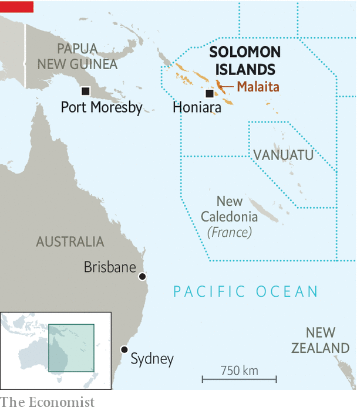

###### Getting closer

# China makes inroads in the Solomon Islands 

##### Australia and New Zealand are alarmed 

 

> Apr 2nd 2022 

TO THE ALARM of Australia and New Zealand, the Solomon Islands has reached a security agreement with China. The prime minister, Manasseh Sogavare, confirmed this on March 29th, furious that a draft of the agreement had been leaked a few days earlier. It envisaged the arrival of Chinese military personnel and police and occasional “ship visits” in order “to protect the safety of Chinese personnel and major projects in Solomon Islands”. Already, China has started training the local force in riot control and handling replica weapons, after years when Australia and New Zealand have taken primary responsibility for dealing with unrest in the Solomon Islands and for reforming the police force.

The Solomons switched diplomatic recognition from Taiwan to China in 2019. Since then China has begun repairing the country’s only gold mine and taken over Taiwan’s financing of controversial “constituency development funds” for MPs, and the state-owned China Civil Engineering Corporation has started building a stadium for the South Pacific Games next year. China’s Pacific expansion does not offer commercial rewards as big as those available in Africa or South-East Asia, but it does bring important prizes in its long war of diplomatic attrition with Taiwan. Kiribati, too, switched recognition to China in 2019, leaving only four Pacific countries still aligned with Taiwan (Nauru, Tuvalu, the Marshall Islands and Palau).


But China’s enhanced presence has met stiff resistance from the provincial government on Malaita, the Solomons’ most populous island, whose provincial premier, Daniel Suidani, is the most vociferous opponent of Chinese influence. Mr Sogavare has tried in vain to dislodge him. To back Mr Suidani, many Malaitans in November descended on the capital, Honiara, demanding that the prime minister himself step down. The protests triggered serious rioting, and the destruction of most of the Chinatown business district. Australia, New Zealand, Papua New Guinea and Fiji deployed peacekeepers. Mr Sogavare now says he wants to diversify his security partners by seeking assistance also from China. He denies Australian media reports of a planned Chinese military base.

 


Mr Sogavare, who has had four stints as prime minister (all of which have ended prematurely), has long had frosty relations with Australia. His second term followed serious rioting in April 2006, during the 14-year-long Australia-led Regional Assistance Mission to the Solomon Islands (RAMSI), which also involved New Zealand. He did his utmost to undermine RAMSI. He expelled both an Australian high commissioner and an Australian police chief, but was himself then ousted in a no-confidence vote in December 2007.

His downfall then was partly a consequence of his poor relations with regional allies. This time, however, Mr Sogavare survived a no-confidence vote only in December, allegedly thanks to Chinese money disbursed as largesse to pro-government MPs. Another election looms in 2023, but Mr Sogavare wants to extend the parliamentary term to give himself an extra year. That suggestion has proved hugely unpopular with Solomon Islanders.

Australia and New Zealand can do little to meddle directly in the Solomons’ domestic affairs, but both wield considerable influence. Covid-19 struck at last in January, wreaking havoc, particularly in Honiara, increasing the country’s dependence on traditional aid partners to prop up the city’s dilapidated “Number 9” hospital. And many Solomon Islanders are horrified by pictures in the local press of baton-wielding Chinese riot police honing their skills in quelling protests.

The new security arrangement with China bears some resemblance to the ones with Australia and New Zealand covering police assistance. A big difference stems from Chinese settlers’ big presence in Honiara. They own many of the city’s small retail outlets, benefit from shady deals with the cash-strapped ethnic-Melanesian government and were the main targets of rioters in both 2006 and 2021. The main job for the next generation of would-be peacekeepers may be protecting Chinese settlers—or even exercising their policing talents on some of those rugged migrants on the Pacific frontier. ■

