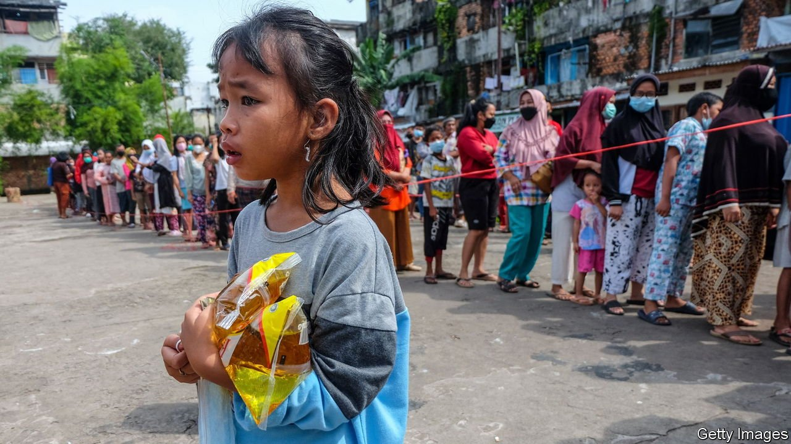

###### Out of the frying pan

# Indonesia, the world’s biggest producer, has a palm-oil crisis 

##### Ukraine, the pandemic and local profiteers get the blame 

 

> Apr 2nd 2022 

IN MID-MARCH Izawati Dewi, a mother of one, began queuing at 4am at her local shop to buy cooking oil. By the time it opened, the line snaked 2km through her town in central Java. She was lucky enough to secure a pack. The shortage was nationwide. In East Kalimantan, on Borneo, which produces nearly two-fifths of Indonesia’s palm oil, at least two homemakers have died this month while queuing.

In February Indonesia’s government capped the retail price of cooking oil (made from palm oil) at 14,000 rupiah ($1) a litre for the highest-quality oil, and 11,500 rupiah for the cheaper sort. Overnight, shelves emptied across the country of 273m people. For most Indonesians, imported oil is an unaffordable luxury. On March 16th the price cap was lifted and stocks miraculously reappeared. But in the process, prices have more than tripled.


Yeka Hendra Fatika, of the government ombudsman, which monitors cooking-oil prices throughout 274 markets in Indonesia, blames the price rise on factors including the war in Ukraine and the pandemic. By February, the price of crude palm oil (CPO) had spiked by 40% year on year. Hoping to curb the retail price of an important commodity, the government in January imposed a 20% “domestic market obligation” (DMO) for all producers—ie, the share of output they must offer on the local market before exporting. In early March this was raised to 30%. Then, after suppliers resisted fiercely, the government a week later did away with the DMO, in favour of charging higher export levies on CPO.

Cooking oil under the initial DMO scheme was sold at a fixed price, which producers said made it hard to cover the cost of materials. Mr Yeka says it was “the big disparity between CPO and DMO prices that caused the panic buying and stockpiling that ensued”.

Arie Rompas of Greenpeace Indonesia, an environmental lobby, says the government should “go after the oligarchs of the industry, which frequently stockpiles supply.” In 2019 Indonesia produced 47.1m tonnes of CPO, of which 76% was exported. Eddy Hartono of the Indonesian Palm Oil Association, known as GAPKI, a producers’ lobby, says the initial 20% DMO easily exceeded local demand, and oil was being lost somewhere in the distribution chain. Indeed, in mid-March, a government commission found millions of tonnes of cooking oil stockpiled by conglomerates. State prosecutors in Jakarta, looking into the shortage of cooking oil, say they are investigating the role of cartels.

Whatever the cause of the shortage and price rises, few want to make do with less cooking oil. Indonesians love their tempeh (deep fried fermented soyabean) and bakwan (vegetable or fruit fritters). Megawati Sukarnoputri, a former president and still a leader of the current president’s party, speaking recently at a webinar on “ageing gracefully”, made an appeal for culinary reform: “Isn’t there a way to boil or steam? It’s an Indonesian menu, you know. Why is it so complicated?”

Indonesians did not take her remarks well. One netizen responded with a video of boiling krupuk udang (prawn crackers) and steamed tempeh. Another posted a photo of steamed bakwan with the caption “Is this the future?” It did not look tasty. ■

