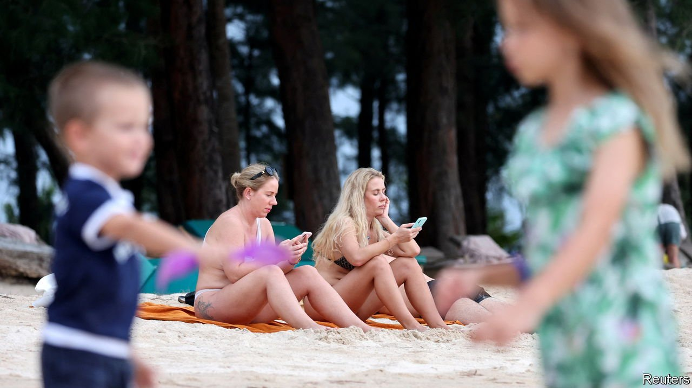

###### Roubles in paradise

# Russian tourists stranded in Asia are running out of cash 

##### It has become costlier to live in Thailand than in Russia 

 

> Apr 2nd 2022 

NOTHING BREAKS the spell of a beach holiday as abruptly as news that it is impossible to go home, as many Russians know through hard experience. In February tens of thousands of tourists fleeing their country’s bitter winter thawed out in several equator-hugging countries in Asia. But on February 24th their holidays came to a sudden end when Russia invaded Ukraine, spurring many countries to impose sanctions on Russia. Airspace restrictions prompted some airlines, including Russia’s flagship carrier, to cancel flights. Then Visa and Mastercard announced that from March 10th credit cards issued in Russia would no longer work abroad. Cut off from their bank accounts, many Russians struggled to rebook their flights. Some 7,000 are now stuck in Thailand, with 11,500 more in Sri Lanka and more than 19,000 on Bali, an Indonesian island.

They are feeling the pinch. Ivan Klokov, a 36-year-old web-designer holidaying on Phuket, a Thai island, has had to move to cheaper accommodation several times. Olga Bebekina, a 31-year-old writer, managed to withdraw some money from a cash machine in Sri Lanka a few days before her credit cards were frozen. But at the end of March she had enough to last her only two or three weeks.


Some help has been forthcoming. Governments have extended Russian tourist visas by a month in Thailand and three months in Sri Lanka. Many hoteliers are offering Russians steep discounts on room and board. Toke Terkelsen has invited those in need to stay at his hostel in Phuket for free. “Better they stay here than be a soldier,” he says.

Some tourists have found ways to get access to their funds, by purchasing crypto currencies or via money-transfer systems like Western Union and TransferWise. Yet they are finding that their dosh does not go as far as it used to. The value of the rouble plummeted by half in the weeks after the invasion (though it recovered sharply this week). As a result, the cost of living in Sri Lanka, Thailand and Bali has become higher than that in Russia, according to several tourists this correspondent spoke to. For the amount Alena Murkes paid for her “not luxury, just the usual” villa in Bali, “I can have a four-bedroom flat in the centre of Moscow, near the Kremlin, with best design inside.”

The rouble’s fall made Russians’ scramble to get home even more urgent. With great difficulty, Mr Koklov managed to buy a plane ticket to Russia but worries it will be cancelled. Those who prefer not to return to Russia face hard choices. Ms Bebekina hopes to live abroad. She does not think she will pick up much work in Russia, given the economic turmoil, and is scared the authorities will punish her for social-media posts criticising the regime. But she finds the prospect of making a new life outside Russia both daunting—finding a job abroad will be hard—and depressing. As a writer, “my life is connected with the Russian language.” She speaks for many of her compatriots when she says, “I am not happy that I need to consider other ways to live my future.” ■

