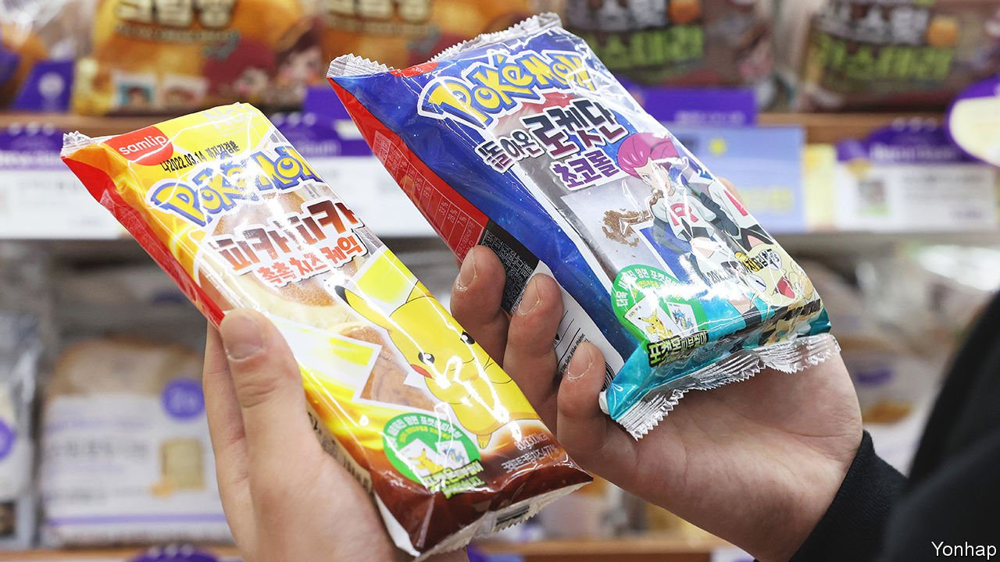

###### Pokémon dough

# South Korean millennials battle to get hold of Pokémon snacks 

##### They may have grown up, but their tastes have not evolved 

 

> Apr 2nd 2022 

YOON SANG-SOON leaves a 7-11 in Seoul, downcast. He showed up at 11pm, after the convenience store is restocked, but the 27-year-old missed out. No matter. Earlier, after waiting an hour for a delivery van to arrive at another shop, he had found the prize that millennial South Koreans are hunting for obsessively: Pokémon bread.

“This is all because of nostalgia shared by people in their 20s and 30s,” he explains. In 1998 SPC Samlip, a confectioner, launched more than ten varieties of cake, each packet sporting characters from Pokémon (short for “pocket monsters”), an empire of games, TV shows and merchandise, with one of 151 different stickers inside. Kids queued to buy “Team Rocket’s chocolate rolls” and “Ghastly’s peeling bread”, because, in the words of Pokémon’s self-serving official slogan, “You gotta catch ’em all.”


This February Pokémon bread was back in shops after a 16-year hiatus. The cakes have since become scarcer than teeth of a combusken (a flaming chicken-like Pokémon). Production lines have been running round the clock, but Samlip can make enough only to supply each convenience store with two a day. Catching them is daunting—your correspondent gave up after 17 shops.

So aspiring Pokémon masters travel far and wide to stalk delivery vans and launch late-night “raids” on shops. Even RM, a member of the K-pop behemoth BTS, has complained about the difficulty of finding them. In a lively secondary market some stickers go for more than 30 times the price of the snack cake.

Some shopkeepers have taken advantage, adding heavy markups or bundling the cakes together with less popular products. Others have put up hand-drawn posters of Pokémon characters, explaining that they are out of stock. But many report that millennials’ nostalgia is more toxic than the most poisonous Pokémon. Battle-ready Pokémon-hunters curse and scream at them for not having the cakes. One incident reportedly got so out of hand that six police officers turned up.

Mostly, it is glossy, sugary fun. “Collecting Pokémon bread and stickers has become kind of a meme,” says Mr Yoon, who visits at least a couple of shops a day. Undeterred by the empty shelves, he heads home, ready to hunt for wild Pokémon in the tall grass of the convenience stores again tomorrow.

