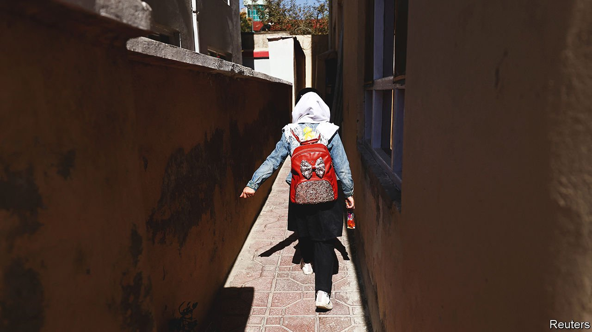

###### No country for young women

# The Taliban are pushing females out of public life 

##### Bigotry is making Afghanistan poorer 

 

> Apr 2nd 2022 

ON MARCH 23rd thousands of Afghan girls headed to school for the first time in eight months, kitted out in bulging rucksacks, neatly pressed headscarves and covid-19 face masks. Within hours, they were at home in tears—and not because of playground fights or test results. In a last-minute pivot, the Taliban had backtracked on a decision to reopen secondary schools for girls and sent them home.

The new Taliban are beginning to look a lot like the old Taliban who ran Afghanistan from 1996 to 2001, when women who failed to cover every inch of flesh in public were beaten and adulterers were stoned to death. But Afghan women have changed after two decades of American-backed government. Many have university degrees. Before the Taliban seized power last year, almost 30% of civil servants were women. On the streets of Kabul book-waving girls have been chanting: “open the schools”.


When American forces withdrew from Afghanistan, the big question was how the Taliban would make the transition from a fundamentalist insurgency to running a country. Girls’ education became the litmus test. In August there was some hope they wanted to show a gentler face. Officials were interviewed by female presenters on television. At the Taliban’s first press conference after seizing power, a spokesman reassured the world that women would be “very active” in Afghan society.

That balancing act seems over. The abrupt U-turn on education, which affects over 1m school-age girls, is one of a string of recent repressive edicts. New rules ban women from travelling long distances without a male chaperone. That can mean they need a brother or a husband to enter a government building or a taxi. A surgeon in Kabul says Taliban officials often visit, warning him not to see female patients who turn up alone. “This is a sad moment for all of us,” he adds.

Years of progress are imperilled. Under the previous democratic government, backed by American troops and money, there was corruption and bigotry. But the female literacy rate more than doubled between 2000 and 2018 to 30%. Thousands of women got jobs as doctors, lawyers or cops. Some became entrepreneurs. Maternal mortality declined sharply and female life expectancy rose by ten years.

Now a generation of girls is falling behind. Some risk their lives to attend underground schools. Sexist violence was a problem even before the Taliban takeover, with 87% of women and girls saying they had suffered abuse. Many teenagers will become mothers before schools reopen.

Life is no better for older women who managed to get an education before last year’s takeover. The Taliban have purged women from most workplaces. In a UN survey conducted in October, every single person interviewed knew a woman who had lost her job in the previous month. Qamarulbanat Quraishy has been unemployed since August and is frantically searching for work. But employers are turning away female candidates. Ms Quraishy’s savings have run dry and her debts are mounting. “I have no hope,” says the 24-year-old.

Bigotry affects the economy too. In terms of the increase in hourly earnings from an extra year of schooling, the return on educating girls in Afghanistan was more than double that of educating boys. The children of educated mothers have long been better educated, healthier and likely to earn more later in life. The UN reckons that keeping women out of work costs Afghanistan up to $1bn, or 5% of GDP.

In the midst of an economic crisis, the country can ill afford the loss. When the Taliban took over, sanctions stemmed the flow of money. Foreign aid, which made up three-quarters of the state budget, dried up. Ordinary Afghans cannot withdraw savings from local banks. Many have been unpaid for months. Almost the entire population could be desperately poor by the middle of the year.

The chaotic way in which decisions have been announced points to a split between hardliners and pragmatists within the Taliban. Secondary schools received orders not to admit girls only after they had arrived on campus last week. Taliban leaders have been ambiguous about this policy. In some provinces, such as Kunduz and Balkh in the north of the country, girls were allowed to return to school not long after the Taliban takeover. A handful of high-ranking officials continue to educate their daughters overseas.

As Ashley Jackson at the Overseas Development Institute, a think-tank in London, puts it, “competing visions” within the Taliban are playing out in public. The only hope is that decisions that shut women out of public life could be reversed as quickly as they were announced. ■

