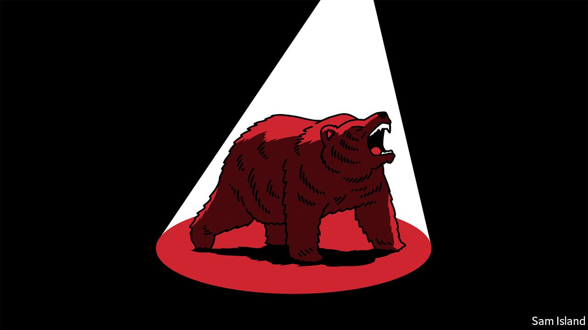

###### Banyan

# The invasion of Ukraine has turned Japan definitively against Russia 

##### And made a solution to their territorial dispute even more remote 

 

> Apr 2nd 2022 

THE ARRIVAL of Russian soldiers shocked the villagers. An escape plan was hatched. The children were told to keep silent, recalls Tsunoka Yasuji, who was eight years old in 1945 when his family fled Habomai, one of four Japanese islands just north of Hokkaido that defeated imperial Japan lost to Russia in the final days of the second world war. The islands, which Japan calls the Northern Territories and Russia the Southern Kuriles, have remained contentious ever since, preventing the two neighbours from concluding a formal peace treaty.

The arrival of Russian soldiers in Ukraine has conjured up painful memories for former residents. It has also precipitated a dramatic shift in Japan’s policy towards Russia. The Japanese government long sought to maintain friendlier relations than its Western partners, in part to ease negotiations for the return of the islands. Japan refrained from imposing harsh sanctions on Russia after the invasion of Ukraine and annexation of Crimea in 2014. Abe Shinzo, Japan’s longest-serving prime minister, met Vladimir Putin, Russia’s president, 27 times between 2012 and 2020.


Under Kishida Fumio, the current prime minister, Japan is firmly behind Ukraine and beside the West. Breaking with pacifist precedent, it sent bulletproof vests to Ukraine’s army. It also cracked open its doors to people fleeing Ukraine, a contrast with its usual reluctance to take refugees. Volodymyr Zelensky, Ukraine’s president, addressed the Diet (by video link), an honour never afforded Mr Putin. Japan has also adopted the full slate of Western sanctions, despite long-standing scepticism about their use in general.

One motivation for the change is domestic. The Japanese public overwhelmingly supports tough measures against Russia. Another is geopolitical. If Japan opted out of the Western coalition this time, it would be harder to call for solidarity in an Asian security crisis. Japanese officials may also calculate that a second aim of engaging Russia—driving a wedge between it and China—will be near impossible as Russian dependence on China increases after the war.

Yet solidarity with the West against Russia creates new challenges for Japan. Around 8% of Japan’s natural gas comes from Russia—less than Europe imports, but enough to matter. Japan has resisted calls to pull out of its energy projects on Russia’s Sakhalin island. Japanese firms have reported an increase in cyber-attacks since the start of the invasion.

Russia does not directly threaten Hokkaido, but it can still make trouble, especially in concert with China and North Korea. On March 25th some 3,000 of its troops held drills on the disputed islands. Russian ships have been unusually active near Japan in recent weeks. Russia called off the peace-treaty negotiations and cancelled visa-free travel for former residents of the islands. On Hokkaido’s northern coast, locals fret about tensions over fishing rights and rising prices for sea urchin and crab imported from Russia. The situation will get “incredibly dire”, warns Odajima Hideo of Hoppoukan, a museum in northern Hokkaido dedicated to the Northern Territories, noting that thousands of Japanese fishing boats and sailors were taken prisoner during the cold war.

Since the cold war ended, Japan, more than most countries, has enjoyed what Japanese call heiwa bokeh, or the blur of peace. China’s rise had begun to sharpen the vision. For some, Russia’s invasion has been like putting on glasses. Hasegawa Michiko, whose family owns a bakery just off the coast in Shibetsu, from where the Russian-controlled islands are visible, says it has “flipped my worldview”. Calls for increased defence spending are louder. So is talk of controversial new capabilities, including the possession of missiles to strike enemy bases or the hosting of American nuclear weapons.

The invasion of Ukraine has another, more hopeful echo in Japan: the Russo-Japanese war of 1904-05. Russia entered that contest too confident in its army and too dismissive of its foe. As a result, it suffered a humiliating defeat that helped fuel the revolution of 1905 and weakened the monarchy. “I’m hopeful about the islands: maybe Putin will fall,” offers Sasaki Masashi, who oversees a small information centre for Russian sailors on Hokkaido’s north-eastern coast, where Ukrainian embroidery is now displayed alongside a Russian matryoshka doll. Yet such thinking seems wishful, at least so far. For as long as the current tsar remains in power, Mr Tsunoka and his kin have no prospect of moving home.

Read more from Banyan, our columnist on Asia: (Mar 26th) (Mar 19th) (Mar 12th)

Read more of our recent coverage of the 

