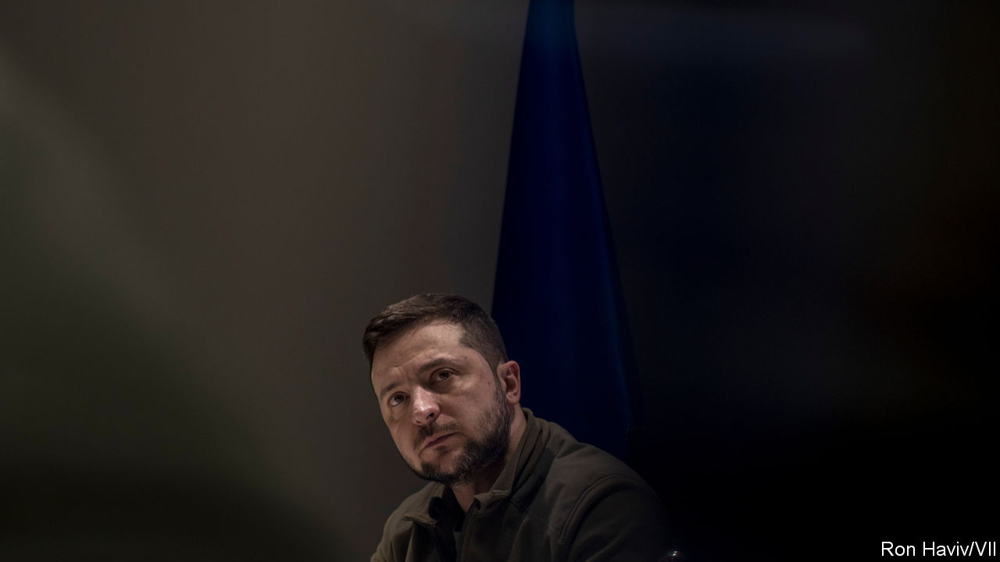

###### The war in Ukraine

# Ukraine’s president tells The Economist why Vladimir Putin must be defeated 

##### Surrounded by sandbags and tank traps, Volodymyr Zelensky holds forth 

 

> Apr 2nd 2022 

HE NEVER WANTED a war and he did not prepare his country for one. He may quote Winston Churchill, but he is no Churchill. He wears khaki but he is leaving the battle-plans to Ukraine’s generals. “[The] people are leaders,” declares Volodymyr Zelensky.

Speaking to The Economist in a government building fortified with sandbags and surrounded with tank traps, Mr Zelensky is disarmingly authentic and humane. So great is the real-life tragedy that has befallen his nation that there is no room for acting. He talks of Ukraine’s need for weapons, of his views of President Joe Biden and his other Western backers, of what victory would mean. But Mr Zelensky speaks most powerfully about the inhumanity of the Russian commanders ranged against him.


“The invaders do not even mourn their own casualties,” he says. “This is something I do not understand. Some 15,000 [Russian soldiers] have been killed in one month…[Vladimir Putin] is throwing Russian soldiers like logs into a train’s furnace. And, they are not even burying them… Their corpses are left in the streets. In several cities, small cities, our soldiers say it’s impossible to breathe because of the… stench of rotting flesh.”

Mr Zelensky compares the pitilessness of Mr Putin’s war machine with the compassion of the soldiers and volunteers defending Ukrainian cities. “Our fearless soldiers are defending Mariupol now…They could have left a long time ago, but they are not leaving the city.” After 31 days of bombardment and siege, they are still fighting—not because Mr Zelensky ordered it, but because they “say they must stay and bury those killed in action and save the lives of those wound ed…[And] long as people are still alive, we must continue to protect them. And this is the fundamental difference between the way the opposing sides in this war see the world.”

Mr Putin and Mr Zelensky are both native Russian-speakers, but they talk a different language of power. Mr Putin’s world, where life is cheap and history belongs to great men, has no place for pity and no room for Ukraine. “I don’t think he visualises in his own mind the same Ukraine we see,” Mr Zelensky says. “He sees Ukraine as a part of his world, his worldview, but that doesn’t correspond with what’s happened over the last 30 years. I don’t think Putin has been [in] a bunker for two weeks or six months, but for more like two decades.”

To Mr Putin, strength means violence. Anyone too squeamish to shed blood is weak. That explains why the Russian army is using the same methods in occupied territory that it used in the Donbas region of eastern Ukraine that Russia invaded using proxy militias in 2014. “They are kidnapping the mayors of our cities,” Mr Zelensky says. “They killed some of them. Some of them we can’t find. Some of them we have found already, and they are dead. And some of them were replaced…The same people are carrying out these operations.”

Mr Zelensky, by contrast, sees strength in the grit of the humble, unarmed Ukrainians who “waved their hands in the middle of the streets in order to stop tanks” in Kherson, one of the cities now occupied by Russian forces. “They decided to stand up and do this of their own volition. I could not have ordered them not to do it or to throw themselves under the tank treads,” he says. “I will stay with these people until the end.”

He is emphatic about what that end will be. “We believe in victory,” he says. “It’s impossible to believe in anything else. We will definitely win because this is our home, our land, our independence. It’s just a question of time.” However, getting there depends not just on the fighting spirit of Ukrainians, but also on support from the West. If Ukraine is to defend its way of life, he says, it needs tanks, armoured personnel vehicles and military aircraft—and it needs them now.

“[The West] can’t say, ‘We’ll help you in the weeks [to come],’” Mr Zelensky argues. “It doesn’t allow us to unblock Russia-occupied cities, to bring food to residents there, to take the military initiative into our own hands.” And however strong the spirit of Ukraine’s people, Russia has far more firepower. “The Russians have thousands of military vehicles, and they are coming and coming and coming. If we can joke in this situation, I will. There are some cities where there are so many tanks, they can’t go away. They have tank traffic jams,” he says.

Mr Zelensky divides NATO into five camps. First are those who “don’t mind a long war because it would mean exhausting Russia, even if this means the demise of Ukraine and comes at the cost of Ukrainian lives”. Others want a quick end to the fighting because “Russia’s market is a big one [and] their economies are suffering”. A third, more diverse group of countries “recognise Nazism in Russia” and want Ukraine to prevail. They are joined by smaller liberal countries that “want the war to end quickly at any cost, because they think people come first”. And last are the embarrassed countries that want peace right away and in any way possible, because they are “the offices of the Russian Federation in Europe”.

Mr Zelensky praises America and Britain. Although he notes that the complexities of American politics have sometimes caused delays, he acknowledges that Mr Biden has become increasingly engaged. But Germany, he says, is trying to strike a balance between Russia and Ukraine. “They have a long relationship with Russia and they are looking at the situation through the prism of the economy,” he says. “They can help, if there is pressure on them domestically to do so, and they can stop when they see what they have done is sufficient.” Asked why leaders like President Emmanuel Macron of France say Ukraine’s partners could not supply tanks to help Ukraine win, he retorts, “They are afraid of Russia. And that’s it.”

Mr Zelensky is equally frustrated by the reactive nature of sanctions that are designed to punish Russia for what it has done rather than prevent it from going further. Existing sanctions have loopholes. Russia’s largest bank, Sberbank, for example, has not been cut off from the SWIFT payment system, because it is one of the main ways Europe pays for its gas. America has imposed an embargo on Russian oil and gas but Europe, a far bigger customer, has not. “The first thing is to put yourselves in our place and act pre-emptively…We are hearing that the decision depends on whether Russia launches a chemical attack on us. This is not the right approach. We are not guinea pigs.”

What does Mr Zelensky believe victory will look like? He pauses, before delivering the sort of answer that would be simply unimaginable coming from Mr Putin: “Victory is being able to save as many lives as possible…because without this nothing would make sense. Our land is important, yes, but ultimately, it’s just territory.” To save everyone, defend all interests while protecting people and not giving up territory is probably an impossible task, he concedes. He does not know when or how it will end, but he knows that “it will end with us still standing here defending” life in Ukraine.

Nobody knows for certain where Mr Putin was when his army attacked Ukraine. But Mr Zelensky was at home with his wife and his two children. It was they who woke him up early on February 24th. “They told me there were loud explosions. After a couple of minutes, I received the signal that a rocket attack was under way.” Soon after the invasion began, America offered him a passage to safety. He chose to stay.

“It’s not about being brave,” he says. “I have to act the way I do.” He did not prepare for the role of war hero. “If you don’t know how to do something this way or that way, be honest and that’s it. You have to be honest, so that people believe you. You don’t need to try. You need to be yourself…And it’s important not to show that you are better than who you are.”

In Mr Putin’s world honesty is weakness. His power is based on secrecy and deception. Mystery and violence fuel his cult of authority. Mr Zelensky might be sitting in what his aides call a fortress, but his strength lies in his openness and his ability to hear and reflect what people want of him. It is the strength of Everyman.

Vasily Grossman, a Soviet novelist and war correspondent born in the small Jewish town of Berdychev in northern Ukraine, put it well in “Life and Fate”, his vast novel about the second world war: “Human history is not the battle of good struggling to overcome evil,” he writes. “It is a battle fought by a great evil struggling to crush a small kernel of human kindness. But if what is human in human beings has not been destroyed even now, then evil will never conquer.” ■

Watch the  with Mr Zelensky, read the , and get a look . For more of our recent coverage of the Ukraine crisis, visit our .

