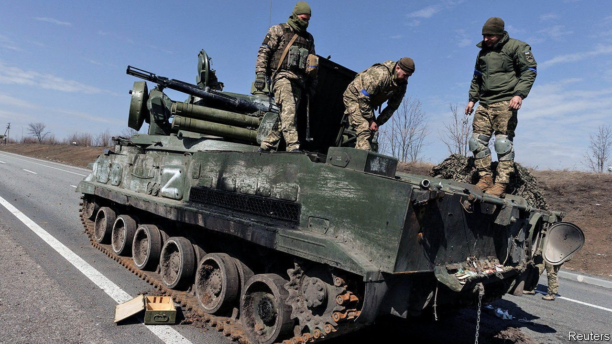
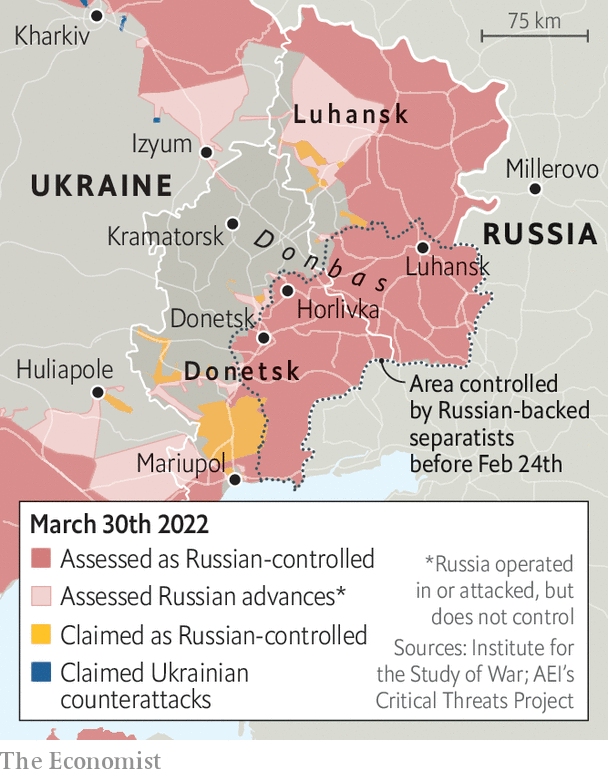

###### The fortunes of war

# What next for Russia? 

##### For the moment, Russian forces have given up on Kyiv 

 

> Apr 2nd 2022 

WHEN RUSSIAN and Ukrainian negotiators met in Istanbul to discuss a potential settlement on March 29th Alexander Fomin, Russia’s deputy defence minister, had something to offer. “In order to increase mutual trust and create the necessary conditions for further negotiations,” he said, Russia would “drastically reduce” operations around Kyiv and Chernihiv, a city 150km to the north.

According to previous Russian announcements, backing off from Ukraine’s capital was not a gesture of much consequence. “Our main aim,” a trio of generals said at a defence-ministry briefing on March 25th, had always been “liberating Donbas”—two Russian speaking provinces in the east of the country. Before the invasion the Russian proxies in the two “People’s Republics” of Donetsk and Luhansk had occupied about a third of Donbas. Russian troops have since grabbed more of the territory, including parts of Mariupol, a now ruined port on the Sea of Azov. This meant that the “main tasks of the first stage of the operation” had been completed. The assault on Kyiv, in this telling, had been a mere feint designed to distract Ukrainian forces from the real action in Donbas.


Bunkum. Abundant evidence from a range of sources, including pre-cooked Russian media reports published in error, shows that Russia both intended to take Kyiv and expected to do so quickly. Ukrainians claim to have found dress uniforms presumably packed for victory parades. But a pincer movement from the north-west and north-east of the capital met fierce Ukrainian resistance and suffered from jammed up supply lines.

Now Russian forces in the area are pulling back, blowing up bridges behind them to ward off counterattacks. Well-placed officials from two Western countries say that Russia has probably made a strategic decision to cut its losses: “It is going to be a genuine withdrawal,” says one. The retreat may be real rather than a ruse. But it is not a gracious gesture and it is not a cunning, far-sighted plan. It is a startling defeat.


Nor is it the only one. Towards the end of March Ukraine’s army mounted a series of increasingly ambitious and effective counterattacks, including towards Kherson in the south, the only big city the Russians currently occupy. Some of these appear to have been devastatingly effective. Battles around Myrhorod, roughly half way between Kyiv and Kharkiv, 400km east, are thought to have resulted in severe losses for Russia’s 4th Guards Tank Division. The unit is part of the army’s elite 1st Guards Tank Army and operates some of Russia’s most modern armour. Konrad Muzyka of Rochan Consulting, a research group, thinks the division has lost at least a fifth of its tanks.

Spreading the invasion over four separate salients—a push south from Belarus to Kyiv, one out of Russia towards Sumy and Kharkiv in Ukraine’s north-east, one from further east into Donbas and a fourth north out of Crimea—was always going to leave Russian forces overstretched. They have paid a heavy price. Though Russia claims that only 1,351 of its soldiers have died, on March 30th Victoria Nuland, an official in America’s State Department, said that the true figure was more than 10,000. (Ukrainian officials put the number at more than 15,000.) The last army to lose soldiers on that scale in the course of a month was Iraq’s in 2003. Morale is, understandably, poor. Jeremy Fleming, the head of GCHQ, Britain’s signals-intelligence agency, says there is clear evidence of Russian soldiers “refusing to carry out orders, sabotaging their own equipment and even accidentally shooting down their own aircraft”.

The Russian army's failures and shortcomings do not make it a spent force. Though its spokes-generals were lying when they said that they had never really wanted Kyiv, they were accurate when saying that they had made progress in Donbas, and may have been truthful in saying that that was where their efforts would now be focused. A researcher at the Conflict Intelligence Team, an investigative group, says that by pouring in troops from Kyiv, Chernihiv, Sumy and elsewhere Russia can probably muster enough manpower in Donbas to outnumber the Ukrainian forces there, perhaps by 50% or so: a significant margin, if not necessarily an overwhelming one.

 


In recent weeks, Russian forces have attempted to move south from the north bank of the Donets river in Izyum, a town 125km south-east of Kharkiv, at the same time as they advance north along a front that stretches from the outskirts of Zaporizhia, on the Dnieper, to Mariupol on the coast. This looks like an attempt to isolate the Ukrainian troops fighting Russian proxies in Donbas—what Ukraine calls the Joint Forces Operation (JFO).

The envelopment, please

Before the war the JFO consisted of ten particularly well equipped and trained brigades, all of them battle hardened. Some of those troops were redeployed to fight invaders elsewhere. How many of them remain in the area, and what condition they are in, is very hard to gauge. But one credible estimate has two-fifths of Ukraine’s army still in the area. Were the Russians to cut those forces off and, thanks to numerical advantage and the tactical edge provided by encirclement, defeat them, it would be a huge blow to Ukraine. It would provide Mr Putin’s army with a solid base for further gains along the coast in the south, providing a continuous connection from Donbas to Crimea and maybe more. It might even lead the Russians to look again at Kyiv and the regime change they claim not to have wanted.

So far Russia’s advance through Kharkiv has been slow, grinding and, again, costly. Its forces have struggled to cross rivers—here, it is Ukraine that has blown up bridges—and to travel off-road. As to the northward advance, it has yet to get past Huliaipole, a city more or less midway between Mariupol and Zaporizhia. This means that the jaws of the trap, if such they are, are a good 250km apart. “It's an easy thing to draw some arrows on a map and write the word ‘envelop’ on it,” says one Western official. “It's a fundamentally different thing to try and achieve that on the ground.”

If or, more realistically, when besieged Mariupol falls, Russia will have more troops to commit to the advance, though they may be battered and exhausted. But it will also need to fix a range of other deficits, including problems using air power. Its planes still seem unable to track and hit moving targets, for example. And it will need to improve its woeful logistics. Encircling the JFO will require much longer supply lines than any Russia has made use of so far in its campaign.

It will also have to deal with the risk of further and perhaps more ambitious counterattacks by Ukraine. The possibility of taking the fight to the enemy in this way is probably one reason why Volodymyr Zelensky, Ukraine’s president, is insistently asking its supporters in the West for heavier kit, including tanks, armoured personnel carriers and combat aircraft.

Some officials think that Mr Zelensky is asking for kit his country does not need, and is unlikely to get, so as to have a better bargaining position when it comes to things he really wants, such as more advanced air-defence systems. Others reckon that he needs to replenish his depleted stocks; there is no clear sense outside the country of how much materiel Ukraine has lost. But tanks would also support more ambitious Ukrainian counter-offensives, and given the success of some counter-offensives so far, it would be strange to think that was not part of the genuine rationale. As Mr Zelensky said in his interview with The Economist, planes and tanks would “allow us to unblock Russian-occupied cities, to bring food to residents there, to take the military initiative into our own hands”.

There are hundreds of Soviet-made tanks in the arsenals of former Warsaw Pact members now in NATO, most of which would be familiar enough to Ukrainian tank crews for them just to hop in and drive off. There are also Soviet-built Mi G fighter jets, which Poland, in particular, initially seemed keen to hand over, but which America declined to help deliver. “We’re looking at what we can do,” said Boris Johnson, Britain’s prime minister, after a NATO summit on March 24th, “but…logistically at the moment it looks very difficult with both armour and jets.”

Logistics are not the only issue. Emmanuel Macron, France’s president, has declared that providing Ukraine with tanks and planes would cross a “red line”, turning NATO into a “co-belligerent”. But Mr Zelensky does not accept this argument, insisting that those who espouse it are simply afraid of Mr Putin.

No tanks, EU

Even if Ukraine were to get more tanks, though, they might not provide it with quite the advantage that is being looked for. Tanks remain necessary for some sorts of action. At the same time, as the past weeks have shown, they are increasingly vulnerable. “One thing that I'm taking away from this war is that, in land warfare, the defence remains all-powerful,” says Billy Fabian, a former infantry officer now at CNAS, an American think-tank. Defenders require fewer forces, chew through less ammunition and fuel and suffer fewer losses. What is more, anti-tank weapons have got a lot better. Ukraine has benefited from that dynamic thus far. If it were forced to manoeuvre and supply forces over longer distances, Russian forces might be able to do as they were done to.

The balance of defence versus offence; the ability to keep supply lines open; the morale and willingness to fight of the opposing side; the capacity to “close the skies”. If there is to be a large, decisive clash in Donbas it could turn on any one of those factors. But what would come after?

If Russia were to emerge with the upper hand, it might continue the war. It might alternatively use the win as an exit strategy. With Donbas “liberated”, Russia could declare its “special operation” to be a famous victory. With Ukraine’s army dealt a heavy blow it might prove possible for Russia to achieve quite a lot of its broader goals with regard to its victim’s future status through negotiation.

If negotiations failed, Russia could garrison troops in Donbas for years, as it has done in the “frozen conflicts” in Moldova and Georgia. (On March 30th a Russian-backed breakaway statelet in Georgia, South Ossetia, said it would seek to join Russia.) But if Russia held the territory without a deal, it would find itself locked in a protracted struggle. Ukrainian counterattacks would be relentless. Western countries—buoyed by Ukraine’s resilience, surprised by their own solidarity and wary of setting a precedent for other aggressors—would continue applying pressure. Britain and Poland both said this week that they would oppose lifting sanctions until Russia withdrew entirely.

Not an ideal situation. But better for Russia than the outcome should it seek a decisive victory in Donbas and fail. If that were to happen, the generals of spin would need to find a whole new war aim to claim to have been following all along. ■

Read more of our recent coverage of the 

