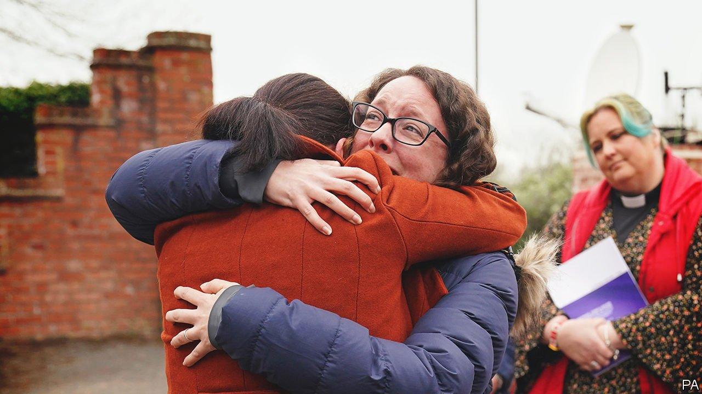

###### Birthing pains

# A report castigates the National Health Service 

##### Many babies and mothers died, needlessly 

 

> Apr 2nd 2022 

ONE BABY died at 21 minutes of age; another, at 34. A third made it to six hours, and a fourth to six days. The skull of one baby was crushed. The skull of another, after nine attempts at delivery, at times with forceps, was fractured on both sides.

The final Ockenden Report, published on March 30th after years of campaigning by bereaved parents (two are pictured), does not make for easy reading. It looks at the maternity care provided by Shrewsbury and Telford Hospital NHS Trust over two decades. Its 250 pages are unprecedented in NHS history, in length and scale—and, arguably, in condemnatory tone. Although finely detailed—noting the strength of this mother’s contractions; when that mother’s waters broke; when this baby ceased breathing—its chief finding is simple. This report, writes Donna Ockenden, the midwife who led it, “is about an NHS maternity service that failed”.


Those failures came in many forms, over many years. Ms Ockenden and a team of midwives and doctors looked at the maternity care provided to 1,486 families, chiefly between 2000 and 2019. They found that 131 stillbirths, 70 neonatal deaths and nine maternal deaths might have been avoided, had care been better. A police investigation has been under way for some time. The trust often failed to investigate serious incidents, sometimes even when a patient died. When complaints were responded to, those responses “often lacked compassion” and at times “implied that the woman herself was to blame”.

No one claims that childbirth is easy. When at rest, the diameter of the average woman’s cervix is less than 1cm—less than the length of the word “cervix” written in this font. The average baby’s head has a diameter a little over 10cm. To get the second through the first is hard, and always has been. Roman gynaecological manuals advised on tools such as the “embryo-crusher”, used to remove babies who had become stuck. In the worst countries in the world maternal mortality lurks at over 1,100 deaths per 100,000 births; in the best it is still two.

But disaster need not strike anywhere near as often as in Shrewsbury and Telford. Ideology was one culprit. Childbirth is a biological process that has become peculiarly politicised. Jeremy Hunt, who ordered the inquiry when he was health secretary, says that the “natural-birth ideology” that flourished at that time “proved to be absolutely catastrophic in Shrewsbury and Telford”. It was not the only problem—Mr Hunt also cites a reluctance to admit mistakes—but it was a dominant one.

Ever since Grantly Dick-Read, an obstetrician, published “Natural Childbirth” in the 1930s, there have been people who have argued vehemently that because childbirth is “natural” it should be endured without pain relief or medical intervention. The natural-childbirth movement gained support not only among mothers but also among medical professionals. In 2008 the Royal College of Midwives launched a campaign for “normal birth”, in which it advised midwives to “trust your intuition” and “wait and see” before intervening. The relentless rise in Caesarean sections in Britain in recent decades has often been greeted with hand-wringing.

Without doubt, there are advantages to giving birth without drugs and scalpels. A Caesarean is a gruelling operation. Ideally it would be followed by weeks of bed rest; instead it is followed by months of broken nights, and days spent lugging a grizzling baby about. If one can be avoided, it should be. But only when all relevant factors are taken into account—and a target for natural childbirths is not one of those.

Few women give birth today without having been at least exposed to, at worst oppressed by, the notion that a “natural” birth is not merely physically superior, but ideologically superior, too. This dogma seems to have held sway in Shrewsbury and Telford. Mr Hunt observes that the trust “made a big deal” of its very low Caesarean-section rate: in 2005 it was around 14%, compared with a national average of 23.2%. When one woman pregnant with twins requested a Caesarean, a doctor is said to have replied: “We’ve got the lowest Caesarean rate in the country and we are proud of it and we plan to keep it that way.” One of her twins died. ■

