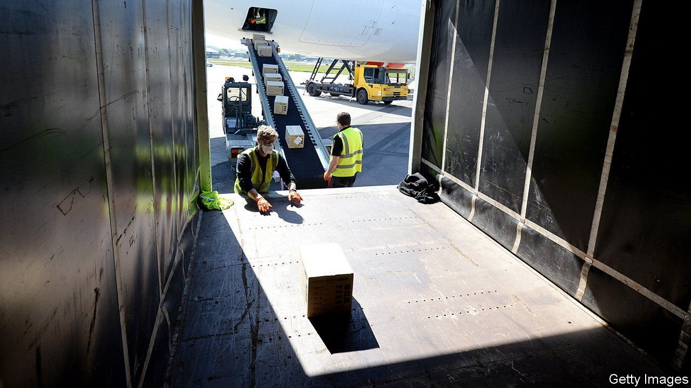

###### When waste is worth it

# The British government made mistakes when sourcing protective gear 

##### Not all of them were bad 

 

> Apr 2nd 2022 

STORING TENS of billions of surgical masks, gowns and gloves is expensive, it turns out. By the end of 2021 the government had spent about £737m ($967m) for the privilege of owning unused personal protective equipment (PPE) bought in a panic during the pandemic. Although £301m of this was normal storage fees, such as renting warehouses, the majority was fines. It racked up £436m in the logistics equivalent of parking tickets—charges for leaving goods in shipping containers because it had nowhere to put them.

A report published on March 30th by the National Audit Office, an official spending watchdog, into the government’s purchase of PPE during the crisis is littered with such horrors. A buying frenzy in spring 2020, as the pandemic let rip, saw it spend about £13bn on 38bn pieces of PPE. By July, the health department realised it had purchased far more than it could possibly use. About 14bn items remain unopened in shipping containers and warehouses. Around 1.5bn of them are likely to pass their expiry date soon and to end up in the bin. Nearly 4bn were never fit for front-line use in the first place, at a cost of roughly £3bn. That is an awful lot of waste, both physical and fiscal.


So mistakes were undeniably made, but some were worth making. At the start of the pandemic, the government had to take risks. Countries were fighting over PPE supplies. “We had Trump sending the CIA round trying to gazump everybody on PPE,” recalled Dominic Cummings, a former aide to the prime minister, before a parliamentary committee in 2021. Meanwhile, NHS staff were reduced to wearing bin-bags. The price of a surgical gown shot up from £0.33 before the pandemic to £4.50 in the middle of it. In short, all was chaos.

The government abandoned caution in response. Usual spending rules were set aside. Officials buying PPE were exempted from usual procurement rules, with the aim of speeding up the process and avoiding them being outbid by foreign spooks. Due diligence was sometimes replaced by a quick Google, and some suppliers were paid up-front. Predictably, on occasion nothing was received in return. Some PPE was substandard. About 20% of all orders were expected to be unusable. In the end, the figure was only 11%.

In normal times, the government’s problem with risk is aversion rather than addiction. Civil servants can be overcautious, moving slowly to avoid wasting money or having a decision reversed by a judge. Usually, this instinct is healthy. A business can move fast and break things; a government should not. Reversing this principle in the pandemic made sense, despite the sometimes poor results, which were entirely predictable. Business as usual would have meant less money wasted. But it would also have meant less PPE available, argue the government’s defenders, and potentially more NHS staff dying.

Some mistakes cannot be forgiven so readily, however. The government set up a “ VIP lane” along which suppliers known to ministers or officials were fast-tracked. Chancers claiming to have access to PPE were splashed across newspapers and then put before ministers, who were desperate both for supply and to avoid negative headlines. “Most of them were full of shit,” says one person involved. It looked like crony capitalism and a court later said the scheme was unlawful. Perhaps worse, it was ineffective. Equipment bought through the usual channels turned out less likely to be defective and more likely to arrive on time. By contrast, the NAO estimates that a third of spending through the VIP lane, or roughly £1.4bn, is “at risk”.

Memories of the chaos of 2020 are already fading. Labour has attacked the Conservatives over wasteful spending in this period. At the time, however, the government was waging a war against a new and terrifying illness, with the state balance-sheet as a weapon. Gloves and gowns were a fraction of the £400bn bill for surviving the pandemic. Inevitably not all of it was spent well. John Maynard Keynes summed up a similar situation when describing the British government’s decision to trash its finances to fight the second world war: “We threw good housekeeping to the wind, but we saved ourselves.” ■

