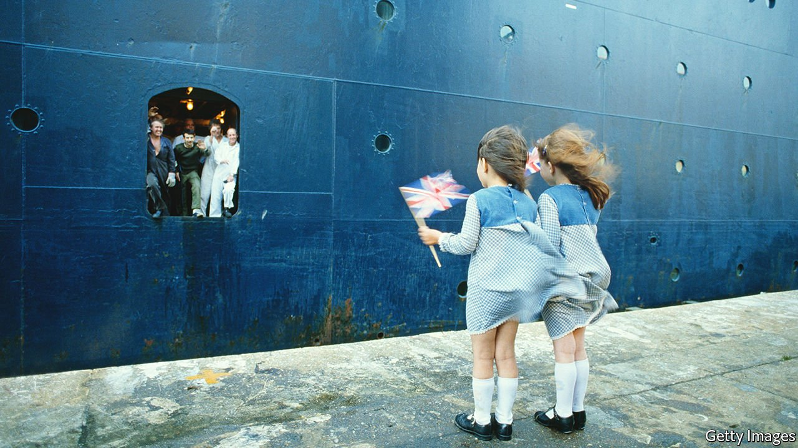

###### Not even past

# The Falklands war resonates 40 years on 

##### The ten-week conflict in the South Atlantic has renewed salience, especially among Conservatives 

 

> Apr 2nd 2022 

LATE ON THE afternoon of March 31st 1982, the head of the Royal Navy, Sir Henry Leach, returned to Whitehall after a day of routine inspections. On his desk he found two documents. One warned that a feared Argentine invasion of the Falkland Islands, a British overseas territory in the South Atlantic, was imminent. The other concluded that Britain could do precious little about it. Leach, a tall man with a bluff manner, had other ideas, and stormed off to find the prime minister.

The First Sea Lord found Margaret Thatcher in the House of Commons, closeted with ministers and officials. The atmosphere, he later recalled, was one of “complete gloom”. Thatcher asked whether he thought they could retake the Falklands. “Yes,” he answered decisively, against all the advice she was getting. “And in my judgment, we must.” “Why do you say that?” snapped Thatcher. “Because if we do not,” Leach replied, “if we muck around, if we pussyfoot…in a very few months’ time we shall be living in a different country whose word will count for little.”


Thatcher gave Leach a “cold stare”, and then cracked a grin. Leach had given the prime minister her mission. Argentina invaded the islands on April 2nd; a British naval task force set sail a few days later.

Forty years on, the Falklands war still resonates—especially among Conservatives. It changed both Thatcher’s fortunes and the post-war narrative of Britain’s decline. And it happened at a formative time for the current generation of political leaders: Boris Johnson, the prime minister, was 17 when Argentina invaded.

The most immediate consequence of the war, which cost the lives of 649 Argentinian and 255 British servicemen, was to transform Thatcher’s premiership. She captured and channelled an outpouring of patriotic pride in the successes of the armed forces 8,000 miles away. At the end of 1981 Gallup, a polling outfit, put the Conservative Party’s approval rating at just 23%; by the time the Argentines surrendered on June 14th it was around 50%.

A thumping majority for Thatcher at the next election, in May 1983, was not due only to the war: a feeble opposition and a recovering economy helped. But without the “Falklands factor” she would have been hard-pressed to win a majority of any size. As it was, she exploited her strengthened mandate to take on and face down militant trade unionism.

The change in mood was captured by one of the banners slung off the side of the Canberra by Royal Marines as the converted cruise ship returned to Southampton: “CALL OFF THE RAIL STRIKE—OR WE’LL CALL AN AIR STRIKE!”. Even those who had opposed the war conceded that the political environment had changed. One tribune of the left, Tony Benn, accepted that “we have just come to the end of an era.”

The longer-term cultural consequences also mattered, especially for Conservative and right-of-centre politicians. Defending the rights of the Falkland Islanders to determine their own future was Thatcher’s immediate casus belli, but, as Leach had suggested, for Britain there was much more at stake. Decline had been the leit motif of post-war British politics as the country slipped inexorably down the economic and diplomatic league tables.

No one felt this more painfully than Thatcher herself, elected prime minister in 1979. “I can’t bear Britain in decline. I just can’t,” she wailed to the BBC before polling day that year. “We, who either defeated or rescued half Europe, who kept half Europe free, when otherwise it would be in chains! And look at us now!” Doing nothing in response to the Argentine invasion would have confirmed this sorry picture.

Instead, argues Dominic Sandbrook, a historian and author of “Who Dares Wins: Britain 1979-1982”, a “deeply buried sense of national exceptionalism began to stir”. A new generation was less bashful about expressing a sense of pride in Britain and its historic role in the world. Many of those who had favoured Britain’s entry into the European Economic Community (as it then was) in 1973 had argued that the country needed to join the trade bloc because of its relative weakness.

Lord David Owen, then a leader of the centrist Social Democratic Party, argues that the Falklands conflict “changed Britain”, suggesting that Britain could look at different options. “There is a line that goes from the war to Brexit,” he says. Nigel Farage, who corralled Euroscepticism into a political movement, also remembers “a massive upsurge in patriotism” after the war and a renewal of “national self-confidence”. Here were the “seeds” for the founding of the United Kingdom Independence Party in 1993.

The Falklands conflict also reshaped the template for political leadership. Thatcher herself listened much less, believing that only the application of an iron will could succeed. And the war entrenched the idea of politics as a Manichean contest of resolution versus appeasement, freedom versus oppression. That contest has a renewed salience now.

No unwounded soldiers

In a speech given to Conservative Party members last month, Ben Wallace, the defence secretary, explicitly invoked Thatcher’s leadership to yoke the events of 40 years ago to a much more significant conflict. “She equipped the forces with the most important weapon of all—the moral component…that deep sense that what we were fighting for was legal, justified and right,” said Mr Wallace. “Today that same moral component is what is arming the men and women of Ukraine.” The Falklands war may have been over quickly, but the narratives it spawned live on. ■

