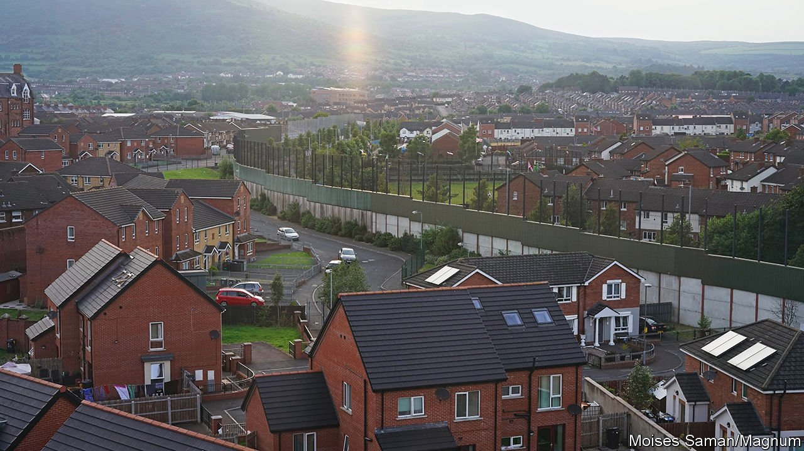
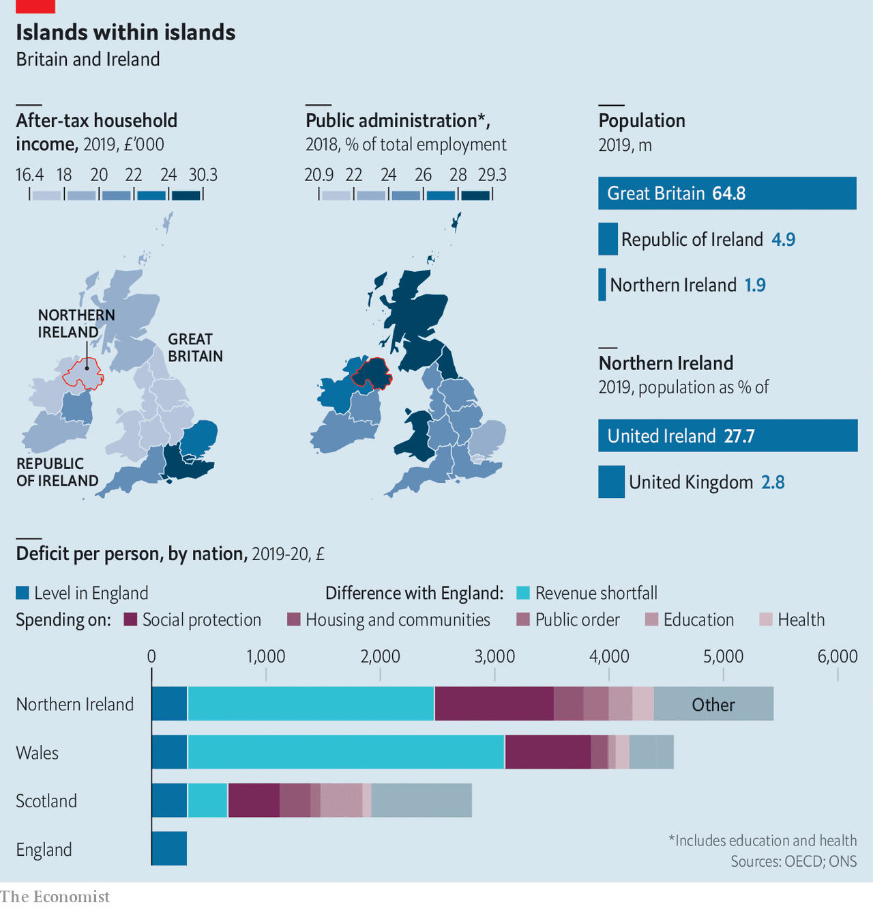
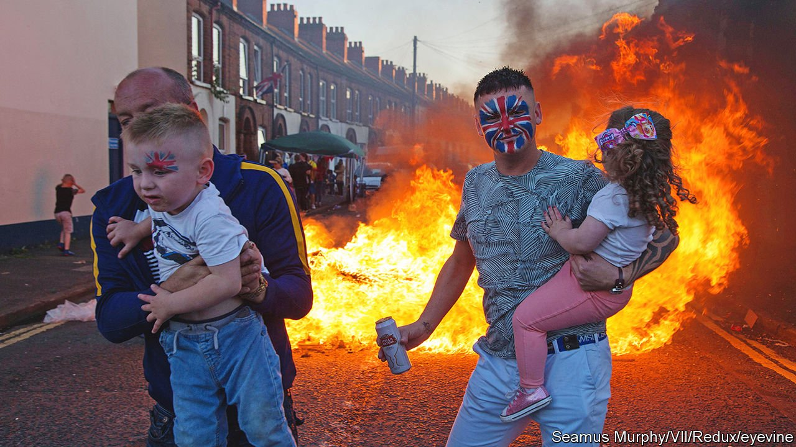

###### So close, so far

# The Good Friday deal deferred the issue of Irish unity to the future 

##### Time was needed to heal old wounds. Then came Brexit 

 

> Apr 2nd 2022 

FOR IRISH nationalists, the border that has sliced through the island of Ireland since 1921 is a scar of British colonialism. For unionists, it delineates Northern Ireland’s distinct British identity. The two sides settled into an uneasy peace after the Good Friday Agreement of 1998. Then came Brexit, and an awkward fix in the form of the Northern Ireland protocol, designed to avoid inflaming the old dispute. Now some hope, and others fear, that it will strengthen the all-island economy and speed political reunification. The reality is more complicated—and more fraught.

Before the Brexit referendum, support was strong in Northern Ireland for the status quo. But the administration in Stormont created by the Good Friday deal failed to provide good government. It has collapsed repeatedly as one side or the other withdraws in a huff, leaving Northern Ireland to be governed from Westminster or administered by local civil servants. Politicians shy away from tough decisions, blaming Westminster for their problems while relying on it for hefty subsidies.


Britain’s vote to leave the European Union jolted this suboptimal equilibrium. Northern Ireland voted to remain, and its politicians were ill-prepared for the fallout. The United Kingdom’s departure from the EU’s customs union and single market meant new customs and regulatory barriers. Neither the EU nor Britain’s government wanted them on the island of Ireland, for fear that border infrastructure became a flashpoint. And so the protocol allowed goods to move freely between Northern Ireland and the Republic, instead imposing checks between Northern Ireland and Great Britain.

Alternative Ulster

The British government, however, has been slow to implement the barriers it had agreed to, not least because it denied there would be any. It has repeatedly delayed implementation, as well as showering traders with subsidies, for example by paying to issue health certificates for animal products going into Northern Ireland. On March 28th Brandon Lewis, the Northern Ireland secretary, said the protocol was “not sustainable” in its current form. Boris Johnson, the prime minister, has threatened to trigger Article 16, which would allow Britain to ditch parts of the deal—and almost certainly bring retaliation from the EU.

One consequence is that Northern Ireland’s politics is becoming more fractious. In February Paul Givan of the Democratic Unionist Party (DUP), the biggest of those supporting the link with Britain, vacated the position of first minister in protest at the Irish Sea border, thereby collapsing the power-sharing administration. At first the party had reluctantly accepted the protocol, but now says it will not return to government as long as the border remains.

On the island of Ireland, unionists have always been a minority. That helps explain their insecurity and unease at anything that weakens Northern Ireland’s ties with Britain and strengthens those with the Republic. In recent years the DUP has moved closer to the position of its fiercest critic within the unionist camp, Jim Allister, who left the DUP in 2007 to found the hardline Traditional Unionist Voice party. He regards the Irish Sea border as intended to redirect Northern Ireland’s trade with the island of Britain towards the Republic, as the precursor to a united Ireland. Northern Ireland, he says, has moved into “a waiting room for Irish unity”.

Others agree that the protocol brings unification closer—but see that as welcome. Ever since the IRA forswore terrorism, its political wing, Sinn Fein, has pursued a two-pronged strategy: press for referendums on reunification on both sides of the border and in the meantime harmonise policy as much as possible, in order to make unity look less daunting.

Before the referendum in 2016, Sinn Fein opposed Brexit, despite having long been staunchly anti-EU. After the vote, it backed the protocol because it would boost trade on the island of Ireland, says Chris Hazzard, one of its MPs: “Trade, much like water running through the rocks, will find the path of least resistance.” He, like many on his side in politics, thinks increased north-south trade will play a big role before any vote on unification, by strengthening cross-border connections and making Northern Ireland more prosperous.

Old trade ties are indeed being broken and new ones forged. An official survey last October found that between a fifth and two-fifths of businesses sending goods from Great Britain to Northern Ireland are reducing quantities. Lloyd Jones runs a business from Northern Ireland supplying Amazon; he complains that English suppliers have been reluctant to send him dried dogfood because of uncertainty over paperwork. Mr Johnson once claimed he had an “oven-ready” deal with the EU. “For me,” says Mr Jones, “the chips are still stuck in the freezer.”

Meanwhile, some of Ireland’s exporters seem to be capitalising on the disruption. Between 2016 and 2019 the share of Northern Ireland’s export sales going to Great Britain fell from 60% to 48%, while the share going to the Republic rose by around six percentage points. Ireland’s statistics show a 31% average annual increase in the value of trade with Northern Ireland between 2019 and 2021. Much of that predates the protocol, which came into force in January 2021. And some is trade in vaccines and plastics for covid-proofing offices. But Fergal O’Brien of IBEC, a business association in the Republic, says that Brexit is driving some of the shift, as businesses “see reshoring or sourcing from Northern Ireland as reduced supply-chain risk”.

Some economic activity has rerouted through Northern Ireland, as hauliers have shifted their operations to avoid the even tougher trade border between the Republic and Great Britain. Indeed, Northern Ireland’s unique position, with privileged access to both the EU and British markets, has fuelled talk of Brexit opportunities. Almac, a pharmaceutical company, boasts of the “Almac Advantage” for just that reason. Official data published on February 24th suggested that Northern Ireland’s economy had recovered more quickly than most other British regions from covid-19.

 


That is encouraging, as far as it goes. But if economic integration were to precipitate political union in Ireland, says Sir Richard Evans of the University of Cambridge, it would be a historical exception rather than the rule. Despite a German customs union in the mid-1800s, members took opposing sides in the Austro-Prussian war of 1866; the first world war happened despite considerable European economic integration in the early 1900s. Newfoundland joined Canada because of economic distress rather than economic ties; similarly with Scotland signing the Act of Union that created the United Kingdom in 1707. Spain was unified by dynastic marriages; Italy by revolution and force.

There are reasons to be sceptical that Northern Ireland will buck this long-run trend. One is that, in some ways, the island may not be integrating at all. The Northern Ireland protocol covered goods but not services, where there are now new barriers. Another relates to the hope that a more prosperous Northern Ireland would make voters in the Republic more eager for unification. But uncertainty about Northern Ireland’s economic and political status is deterring the investment that might make that happen. And the best estimates available suggest that all these new barriers will, in fact, make Northern Ireland poorer.

Although a long-standing arrangement between Ireland and Britain means citizens of either can live and work freely in the other, Brexit means that professional qualifications are no longer automatically recognised. And some positions in Ireland face stricter residency rules. For example, John Martin of the Road Haulage Association, an industry group, says these have meant haulage companies in Northern Ireland having to recruit extra transport managers in Ireland to manage their southern subsidiaries. A study published in March 2020 by Northern Ireland’s Department for the Economy estimated that the impact of a bare-bones deal between Britain and the EU for trade in services would be equivalent to significant tariff increases for exporters in Northern Ireland trying to serve the Republic—from 4% to 9% for accounting services, for example, and from 5% to 14% for commercial banking.

Both the British government’s brinkmanship over the terms of the trade border between Northern Ireland and Great Britain, and political opposition to the protocol, make the business environment more uncertain. Last year rioting broke out in parts of Northern Ireland; in January a poll put unionist support for the protocol at just 2%. Officials carrying out border checks have received death threats. The DUP has briefed loyalist paramilitary groups, and in February loyalist anti-protocol protests resumed on the streets.

If the protocol survives until December 2024, Northern Ireland’s assembly is scheduled to decide then whether to keep it. Moreover, Irish unification would make the Irish Sea border harder still—a point seemingly lost on those who argue that Northern Ireland’s privileged position, with favoured market access to both Great Britain and the EU, will hasten reunification, which would end those privileges.

As for prosperity, it is becoming clear that Northern Ireland’s sweetheart deal merely softens the blow of Brexit, rather than averting it. The new way of doing things is more costly, says Peter Summerton of McCulla, a haulier: after all, were it not, it would already have become standard without Brexit. Previously, Northern Ireland’s retailers were mostly stocked from distribution hubs in Great Britain. But he has recently opened a new hub for a major retailer in Mallusk, north of Belfast, which is supplying both Northern Ireland and Ireland with goods from the EU and Great Britain. A team of 20 is required to handle the new paperwork. A survey in January 2022 from Manufacturing NI, an industry group, found that only 7% of its members saw Northern Ireland’s status as an immediate opportunity, and only 18% saw it as a long-term one.

According to Northern Ireland’s statistical agency, two percentage points of Northern Ireland’s 3% growth since 2019 was accounted for by the services sector, and 0.6 percentage points by the public sector. Production and construction each contributed 0.2 percentage points. That somewhat undermines the thesis that the economy boomed in 2021 because of superior access for goods going to the EU and Britain. Economists at Strathclyde University have estimated that, relative to no Brexit, in the long term Northern Ireland’s investment will be depressed by 3.3%, its GDP by 2.6% and real wages by 3.9%.

That bodes ill for consent to unity in the Republic, where constitutional changes require a referendum, and where it is usual to set out proposals in great detail before any vote. Although unification has broad political support, once pollsters mention the price tag, respondents go cold.

Analysis by the Institute for Government, a think-tank in London, suggests that in the 2018-19 fiscal year, Northern Ireland’s public-sector deficit was 19% of its GDP, or £9.4bn ($12.4bn) more than its people paid in taxes—and that is before the protocol was signed or any long-run effects of Brexit could become apparent. For the United Kingdom, that is 0.4% of GDP; for Ireland, it is 5%. “If you follow the German unification model and you re-rate everything then the burden becomes seven or eight per cent of national income,” says John Fitzgerald of Trinity College Dublin.

Cost is not the only reason citizens of the Republic might reject unification. They generally like the idea of more north-south trade, says Mary Murphy of University College Cork, but that sentiment is rather shallow. Unification would mean harmonising institutions, she points out, from the army and police to health and education systems. The Republic could not simply expect Northern Ireland to fall into line. Its population accounts for 3% of that of the United Kingdom, but would be 28% of a united Ireland. The most basic matters, such as whether the new state would be unitary or whether Northern Ireland would have some form of devolution from Dublin, have barely been discussed. “If you’ve had this 800-year conflict with external forces on this island, you’d think there’d be a plan so persuasive that even Orangemen would give it a read,” says Peter Shirlow of the University of Liverpool. “But there’s nothing there.”

North of the border, attitudes towards reunification are largely a matter of the heart, rather than the head. That is not so unusual internationally: Brexit showed that people do not always vote with their wallets; and Germany, that divided countries can be reunited despite great disparities and vast cost. For nationalists, uniting contentiously divided territory has a powerful patriotic allure. Unionists, too, identify strongly with their political position. Vernon Bogdanor, a constitutional expert at King’s College London, remarks on the difference between the knowledgeable and positive representation of Northern Ireland’s nationalists by the Irish government and even the EU, and how poorly understood unionists are in Westminster. That makes unionists think they have to be militant to be heard, he says.

When Ireland was partitioned in 1921, the position of the border was chosen to create a Northern Ireland populous enough to be viable, but small enough to be dominated by Protestants, who were concentrated in the island’s north-east. Census results due this autumn are expected to show that, a century later, Protestants are now outnumbered by Catholics. This worries many Protestants, yet both the old tribes are now minorities, with growing numbers of other faiths or none.

A new and growing cohort of swing voters regard themselves as in neither camp, and many may be attracted to voting for unification because it would mean rejoining the EU. Moreover, to be Catholic no longer automatically equates to wanting unification—or to wanting it immediately. Research by Mr Shirlow shows that support for the union is less siloed than is support for reunification: “More Catholics support the union than Protestants support unity.”

 


When the Good Friday Agreement was signed, a united Ireland looked like a matter for the distant future. The deal was vague on when a vote might happen, simply saying that the British government would call one if a majority in Northern Ireland looked likely to vote in favour. That moment has not arrived. A poll published in December found that a small majority of 54% wanted to remain part of the United Kingdom. (Other polls have found somewhat larger pro-union shares.) For their part, residents of mainland Britain seem not to care much one way or the other. A survey in April 2021 found that 46% would not be bothered if Northern Ireland left, and 11% would be pleased.

That poll in December also found that 51% in Northern Ireland thought that a referendum in a decade’s time would favour unification. Another the previous month had found that 60% in the Republic would vote for a united Ireland—but also that support for unification fell to 41% when the cost was spelled out in the form of higher taxes. As long as support remains so shallow in the Republic, and so finely balanced in Northern Ireland, it is highly unlikely that any government, whether in Dublin, Stormont or Westminster, would consider calling a vote. If they did, however, an outcome that would have seemed inconceivable when the island was partitioned a century ago is no longer so: that Northern Ireland would say “yes please”, and the Republic would say “no thanks”.

What’s done is done

In one sense Brexit makes a united Ireland seem more likely than it used to, because it has unsettled previously apathetic voters. It has also made it harder, both by increasing the cost to the Republic and by providing a worked example of the difficulties of radical constitutional change. The post-2016 years have been divisive for British society, but there was never the slightest possibility that the losing side in the Brexit referendum would take up arms. In Northern Ireland it might, however, especially if a vote for reunification was close and contested. The Irish border has survived for a century for the same reason it was first drawn: an Ireland united and independent of Britain against the wishes of hundreds of thousands of unionists would probably result in civil war. ■

