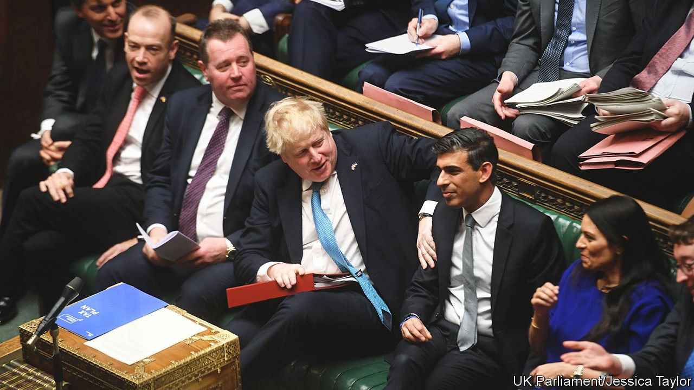

###### By jingo!

# War in Ukraine and a floundering rival boost Boris Johnson 

##### His MPs are soothed. His position in the country remains difficult 

 

> Apr 2nd 2022 

RUSSIA’S INVASION of Ukraine has highlighted one of the less attractive aspects of Boris Johnson’s character: a willingness to squeeze any issue, no matter how grave, if it might yield the slightest political advantage. And there is no doubt that the prime minister is squeezing the war for all it is worth—aided by some of his more impressive qualities. He has a capacity for boldness, dispatching anti-tank rockets to Kyiv before most other European countries had decided what support to offer the country’s defenders. He can be an impressive orator. After a well-judged speech to a Ukrainian church in London, congregants rose to their feet and chanted “Thank you!”, tears on their cheeks.

Mr Johnson needed a boost from somewhere. In January he faced being kicked out of office in a parliamentary rebellion after it emerged that raucous parties were held in Downing Street during covid-19 lockdowns. His approval ratings fell to the lowest of any prime minister since John Major in 1994. On March 29th he hosted a kiss-and-make-up dinner for Tory MPs at the Park Plaza, a hotel across the Thames from Parliament. There, he laughed off the letters of no confidence his opponents had sent seeking to trigger a leadership ballot, declaring that if Russia’s president, Vladimir Putin, had to face anything similar, he would not be so “deluded and isolated”.


Mr Johnson had similarly indulged Tory solipsism in a speech on March 19th to the party’s spring conference in Blackpool, likening Ukraine’s struggle for freedom with Britain’s decision to leave the European Union. (This made sense to those Conservatives who regard the EU as a tyranny; many Ukrainians found it gravely offensive.) Referring to the Labour Party, he asked: “Do we want them running up the white flag? Do you see them standing up to Putin’s blackmail?” (For his part Sir Keir Starmer, Labour’s leader, has used the crisis to stress his commitment to NATO membership.) The Conservative Party’s head office has produced jaunty Instagram graphics about the anti-tank missiles sent to Ukraine, emblazoned with the party logo.

Some Tory MPs suggest that the Ukraine conflict could give Mr Johnson a bounce to rival that enjoyed by Margaret Thatcher after her quick and decisive victory in the . That appears fanciful. But the prime minister’s position does seem more secure, in part because of such jingoism. Several MPs who wrote letters calling for a no-confidence vote have withdrawn them, declaring that a war is no time for a leadership contest. His net approval rating has recovered somewhat, rising to -33 from a nadir of -51 in mid-January. Voters overwhelmingly support arming Ukraine. The Tories’ gap with the Labour Party has narrowed.

Equally important for Mr Johnson’s job security is that Rishi Sunak, his chancellor and chief rival, has faltered. A budget update on March 23rd was widely criticised for doing too little to ease the impact of a squeeze on household incomes. The coming year will be painful: state benefits will fall by almost 5% in real terms and energy bills are expected to rise by a total of 130%.

A series of inept public appearances have confirmed Tory MPs’ suspicions that, despite a slick start, Mr Sunak is too inexperienced for the top job. Asked the price of a loaf of bread—a standard interview question used to probe ministers’ understanding of the hard-pressed worker—he replied: “We all have different breads in my house.” The Labour Party intends to exploit Mr Sunak’s prudence, or tightfistedness, in order to claim that the government’s pre-election promises in 2019 of largesse for poor constituencies count for nothing.

This is all good for Mr Johnson’s short-term survival, which depends on his party. But it is bad for his party’s prospects, which depend on voters. Meanwhile the scandal over lockdown parties is flaring up again. On March 29th the Metropolitan Police announced it would issue 20 fines. The force has refused to name recipients, but Downing Street said that if Mr Johnson were to be handed one, that would be made public. He would then face renewed calls to quit—which he would surely face down. Over their chicken dinners at the Park Plaza, MPs may have recalled one of Thatcher’s favourite phrases: there is no alternative. ■

