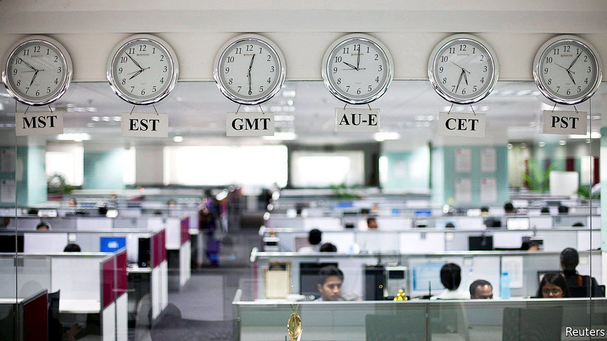

###### The next wave of outsourcing

# A half-a-trillion-dollar bet on revolutionising white-collar work 

##### Digitisation of everything, cloud computing and hybrid working is fuelling a boom in Indian IT consulting 

 

> Apr 2nd 2022 

TWO DECADES ago India’s information-technology (IT) firms were the stars of the rising country’s corporate firmament. The industry’s three giants, Tata Consultancy Services (TCS), Infosys and Wipro, became household names at home and familiar to chief executives of big businesses abroad, who had outsourced their companies’ countermeasures against the feared “millennium bug”, expected to wreak havoc on computers as the date changed from 1999 to 2000, to Indian software engineers. By the mid-2000s the Indian IT trio’s revenues were growing by around 40% a year, as Western CEOs realised that Indian programmers could do as good a job as domestic ones or better, at a fraction of the price. Then, following the global financial crisis of 2007-09, revenue growth slowed to single digits. For years afterwards the stars seemed to be losing some of their shine.

 


Now they are back in the ascendant. Having declined as a share of GDP between 2017 and 2019, exports of Indian software services ticked up again as the world’s companies turned to them for help amid the disruption to operations and IT systems wrought by the pandemic. In the last financial year they reached an all-time high of $150bn, or 5.6% of Indian GDP (see chart). NASSCOM, a trade body, expects the industry’s overall revenues to grow from $227bn last year to $350bn by 2026.

 


In the 12 months to March sales at TCS, Infosys and Wipro are once again forecast to grow by double digits—this time from a much higher base than 20 years ago. All told, they could rake in nearly $60bn next year, up from just over $40bn in 2019 (see chart 3). In the past two years they have added an astonishing 200,000 or so people to their combined workforce, which now numbers nearly 1.1m. Add the Indian businesses of big Western IT-services firms such as Cognizant (which is based in New Jersey but India-focused), IBM and Capgemini, as well as smaller Indian rivals and around 1,600 “captives”, as in-house Indian operations of foreign firms are known, and the headcount rises to 5m.


 


Both revenues and ranks of Indian IT look poised to keep growing briskly. Lalit Ahuja, who runs a firm that helps set up captives, says a new one opens every other week. TCS, the industry’s brightest star, reckons that its sales will rise from nearly $30bn today to $50bn before 2030. The company is eyeing 1m employees. Infosys and Wipro have comparable ambitions. And investors are buying it. The stockmarket value of the big three has doubled to $330bn since covid-19 first emerged. With the addition of Cognizant and Tech Mahindra, another Indian firm, the figure is around $400bn (see chart 4). This represents a huge bet on the future of white-collar jobs.

 


Three global forces lie behind Indian IT’s sparkling outlook. All manner of businesses are digitising ever more of their operations. They are moving more activities to the computing cloud. And work is becoming more remote. India’s low-cost, competent coders can help with all three.

Start with digitisation. The pandemic has turbocharged efforts by companies of all stripes to make their businesses more agile, efficient and clever. Retailers have introduced kerbside pickup. Clinics have launched digital doctor’s appointments. Schools have run online classes. Factories have been kitted out with sensors to allow remote monitoring in the absence of workers, locked down at home. Data from covid-19 vaccine trials have been crunched. All these innovations required sophisticated software. A lot if it has been developed in India since early 2020. And there is more to come. Among Infosys’s projects are several connected to electric cars (including software for the vehicles themselves and for petrol stations to offer charging).

The corporate great migration to the cloud offers further opportunities. According to Anuj Kadyan of McKinsey, a consultancy, big ones include supervising the migration itself for clients, ensuring that the new cloud operations are cyber-secure and adding advanced cloud-based data analytics and artificial intelligence (AI) on top. Earlier this year JPMorgan Chase, an American bank, announced it would add 6,000 people to its substantial Indian business to work on the cloud, cyber-security and AI. IBM has opened a cyber-security centre in India to cater to its Asian clients.

Combined, digitisation and the cloud make it possible for companies to untether from their physical headquarters not just peripheral functions but parts of their ever more digital core business. Many have done just that during the pandemic, thanks to remote work. This opens up the third opportunity for India’s IT consultants. They could assume some of the core corporate roles from white-collar workers in the rich world. Wages for new hires in India can be as little as $5,000 annually, less than a tenth of the going rate in rich countries. Even factoring in other costs, Indian projects are at least 20% cheaper than the same endeavours in the West, estimates Peter Bendor-Samuel, boss of the Everest Group, a consultancy.

A ballooning Indian “talent cloud”, as TCS calls it, is the biggest opportunity of all. It is also the most uncertain. Some Western companies are having second thoughts about hybrid work (which requires at least partial presence in the office), let alone the fully remote sort. Indian wages are also beginning to rise. India’s IT giants and captives are competing for the best and brightest among themselves, as well as with a vibrant startup scene. McKinsey estimates that compensation costs have risen by 20-30% over the past year. Company executives say it is not uncommon for employees to ask for their wages to be doubled. Attrition at the big firms has spiked.

As the nature of outsourced work changes, the Indian advantage may erode further. It is easier for clients to outsource standardised assignments on the periphery of corporate functions to faraway India. It is harder to do so for high-value projects at the heart of their business, which require constant communication, continuity and confidentiality. For these reasons, proximity matters. At the very least, it means being in the same time zone as your client. Infosys and TCS now operate in more than 40 countries. Infosys has more than 30 outposts across America and is building a new $245m campus in Indiana polis. The firm plans to add 10,000 American workers in the next few years, bringing the total to 35,000. “We needed capacity closer to the customers,” explains Ravi Kumar, who oversees Infosys’s global services business. Mr Kumar’s own job has relocated from Bengaluru to New York.

Still, India accounts for the bulk of its IT firms’ workforce. Although the companies are cagey about where their employees are based, securities filings by Infosys and Cognizant show that, give or take, three-quarters of staff are based in India. If India’s entire IT industry grew at the same rate as TCS, more or less doubling its workforce this decade, that could mean nearly 5m new Indian white-collar jobs—and potentially 5m fewer in the West.

This points to a final hurdle. Amid supply-chain disruptions from the pandemic, now compounded by Russia’s war in Ukraine, and a geostrategic contest with China, the West is in a . Few politicians would relish millions of well-paid positions moving to India on their watch. Critical visas that once allowed the Indian firms to send star employees abroad to work directly with clients have already grown harder to come by, forcing these positions to be filled locally. Although data can in theory be stored and analysed anywhere, governments are increasingly keen to limit cross-border information flows, often invoking national security. By building a few more campuses in Western countries India’s IT titans may alleviate some of those concerns. They are unlikely to make them disappear. ■

For more expert analysis of the biggest stories in economics, business and markets, , our weekly newsletter.

