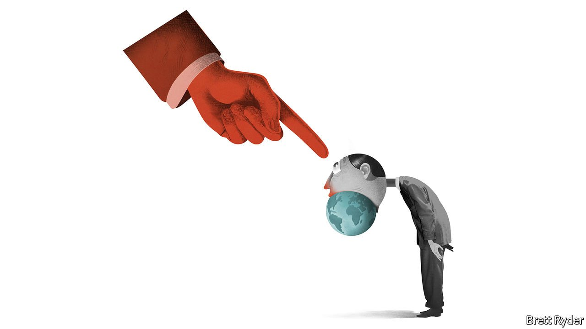

###### Schumpeter

# Is cancel culture coming to free trade? 

##### The risks from Russia extend to globalisation 

 

> Apr 2nd 2022 

JEFFREY SONNENFELD is having what he calls a Marshall McLuhan moment—“15 minutes of prominence soon to subside back into obscurity”. That is because, not long after Vladimir Putin sent his troops into Ukraine on February 24th, the 68-year-old professor at the Yale School of Management drew up a list of firms withdrawing from Russia, helping catalyse a stampede out of the country—470 businesses have closed or cut back operations. His campaign has generated positive media reviews. It has also put him under siege from public-relations types trying to ensure that the companies they represent do not fall into his “hall of shame”.

The “Ukraine morality test”, as the New York Times called it, has dramatically raised the profile of a man already dubbed the “CEO whisperer”. Don’t believe it when he talks about returning to obscurity, though. He sees the withdrawal from Russia not just as a virtuous expression of repugnance against Mr Putin’s murderous regime. It is also a nail in the coffin of globalisation. It would be no surprise if he leads a CEO crusade against that next.


Mr Sonnenfeld is no stranger to the limelight. Indeed, he has become the high priest of a belief system in Western business which he started promoting almost 45 years ago, and which has at last come into fashion. He calls it business ethics. Its critics deride it as “woke” (“as if there is something wrong with the past participle of awakening,” he harrumphs). There is nothing too woke about why Western firms are pulling out of Russia. Some might call it high-minded but in most cases it is inherently pragmatic. It pleases customers and staff who are outraged by the war, and because Russia is a tiny part of most firms’ global revenues, it is immaterial from an investor point of view.

It is a slippery slope, though. Less than a year ago Mr Sonnenfeld was helping whip up scores of CEOs in America in a lather about changes to voting legislation in Georgia and other states. He has celebrated protests by business leaders over gun safety, immigration, climate change and transgender rights. He says that after the corporate pullout from Russia, his most recent powwow with chief executives revealed a sharp increase in their concerns about global supply chains, and a consensus about the need for more self-reliance. In other words, free trade may be next in line on the woke agenda. Amid applause for companies’ quick response to Russian aggression, this ethical mission creep is a worry. Where do bosses draw the line as arbiters of rights and wrongs?

In an interview with your columnist, Mr Sonnenfeld elaborates on why he believes Russia’s invasion of Ukraine will mark a shift in support for globalisation. As he tells it, the era after the fall of the Berlin Wall engendered a “naive belief” that Western-style capitalism and products like McDonald’s hamburgers would usher in global harmony. Russia’s aggression has buried that notion, he reckons. Asked whether the CEOs he talks to want to change a system that has brought their firms profit, as well as helping lift parts of the world out of poverty, he says they do not want the pendulum to swing back completely to isolationism. But he discerns “diminished enthusiasm for limitless free trade”.

He is not alone in thinking that the war will tilt business opinion against globalisation. In his annual letter to shareholders, Larry Fink, boss of BlackRock, the world’s biggest asset manager, said on March 24th that he expected it to prompt companies to re-evaluate their supply chains, probably leading them to bring more of their operations closer to home, even if that means higher costs and margin pressures. Such sentiments gained ground amid the Sino-American trade war during Donald Trump’s presidency, then again amid high labour costs and logistical bottlenecks of the covid-19 pandemic. For the time being, statistics that bear out large-scale reshoring are hard to find. But some anecdotal evidence of it is popping up.

That may reflect nothing more than business pragmatism in action. More and better automation helps offset the higher wages in developed countries while reducing transport costs. As countries divide themselves into opposing camps, with China and Russia on one side and America and Europe on the other, their governments may encourage firms to invest domestically in vital technologies such as semiconductors to bolster security of supply. If domestic demand for firms’ goods is increasing, or being subsidised, it makes sense for them to meet it. Moreover, pressure by investors to put more focus on environmental, social and governance concerns may spur Western companies to think twice about having extended supply chains in hard-to-monitor places.

Autocrats in the C-suite

But when businesses wrap themselves in the flag, rather than standing up for pragmatism (and profits), things become more complicated. As bosses are no doubt aware, when pulling out of Russia, they are leaving the field open to local competitors with no qualms about supporting Mr Putin’s regime. They are abandoning Russian employees who may oppose their government. And their crowd-pleasing stance in Russia may help distract attention from other harmful externalities they are responsible for, such as the carbon footprints of their businesses. As with all ideological positions, there is a kaleidoscope of ways of looking at them.

Then there is democracy itself. Mr Sonnenfeld argues that companies are a rare force pressing for social and political change in Western society today. He sees the corporate campaign against Mr Putin’s regime in the same light as divestment from South Africa in the 1980s, which he argues helped bring about the end of apartheid. By being good citizens, firms are upholding and enforcing democratic values. Yet the idea of an unrepresentative coterie of unelected executives making moral choices on behalf of customers and employees could undermine faith in democracy, not shore it up. In a world at risk from autocracies like Russia, that would be a crushing own goal. ■

Read more from Schumpeter, our columnist on global business: (Mar 26th) (Mar 19th)

 (Mar 12th)


