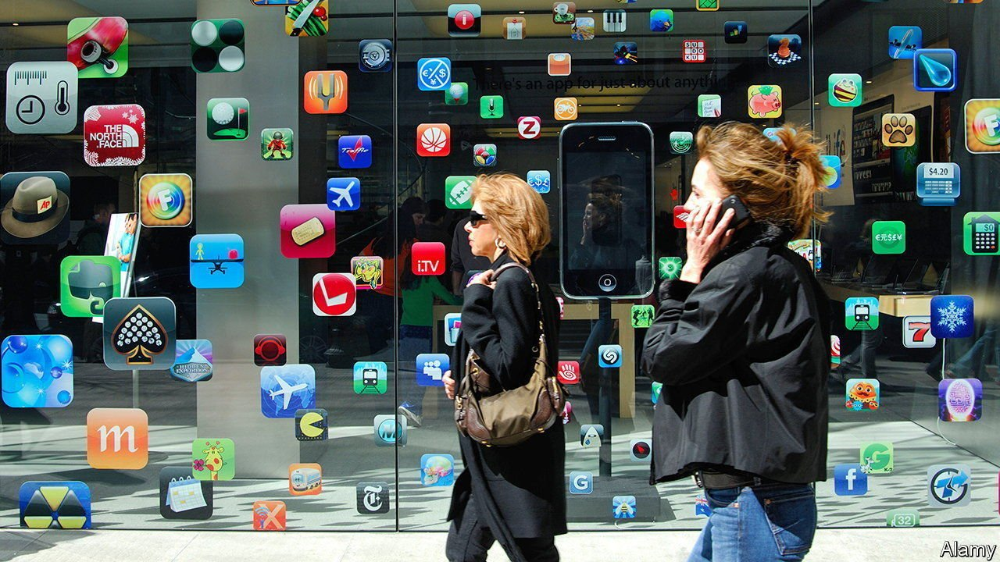
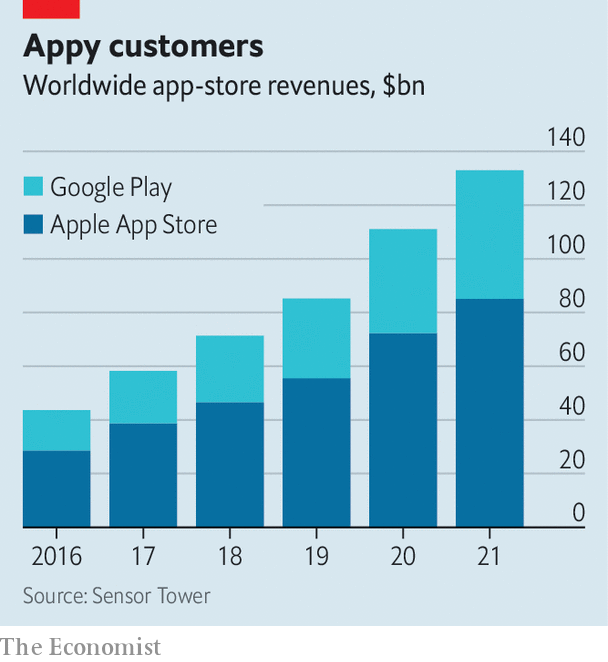

###### Store wars

# Legislation and litigation threaten Apple and Google’s profits 

##### Regulators are coming for the app stores 

 

> Apr 2nd 2022 

WHAT DOES it take to rein in two of the biggest companies on the planet? A coalition of Swedish music-streamers, South Korean politicians and Dutch dating apps, apparently. They seem to be succeeding where America’s federal government has failed: to force changes to the way Apple and Google run their app stores.

 


The app stores are big businesses, with combined sales last year of $133bn, three times the total five years earlier (see chart). Apple and Google take a cut of up to 30%, which is thought to contribute a fifth of the operating profits at Apple and Alphabet, Google’s parent company. The 30% levy began in Apple’s iTunes music store and was copied to its iPhone app store, launched in 2008. As people came to use their phones for gaming, streaming and much else, it evolved into a tax on digital activity. Sign up to a service like Disney+ on your phone and Apple or Google get a cut of your subscription for ever. Apps have had to use the tech duo’s payment systems, and could not tell users about other ways to sign up. Gripes from app developers have forced only minor concessions: last year Apple said it would let them link to external payment pages and Google reduced its fees for subscriptions. Now, though, the dam is bursting.


Last summer South Korea banned app stores from forcing developers to use a particular payment system. In December Dutch regulators made a similar ruling against Apple, after a complaint by developers of dating apps. On March 23rd the trend went global. Google announced a deal with Spotify, a vocal critic of app-store fees, to let the music-streamer handle its own billing. Google will lower its commission rate, probably in line with the four-percentage-point cut agreed in South Korea. It says more deals are on the way.

Google’s magnanimity anticipates laws that may require bigger concessions. A bill before America’s Congress would force app stores to allow payment alternatives and let apps advertise other ways to sign up. A bigger threat comes from the EU’s Digital Markets Act (DMA), approved in draft form on March 24th. The colossal bill covers various aspects of digital markets, including app stores. The DMA, which is on track to come into force next year, would force mobile platforms to allow third-party app stores and “sideloading” of apps directly from the web—something Google permits but Apple does not. Offenders face fines of up to 20% of worldwide revenue and bans on acquisitions. Breaking open walled gardens, the DMA’s proponents say, will strengthen competition.

Apple’s boss, Tim Cook, has warned that sideloading would “destroy the security of the iPhone”. That is a bit much: Apple allows sideloading on its desktop computers without calamity. But Apple’s much bigger share of the mobile market could make the iPhone a juicier target for malware. And the company trades heavily on privacy and security. Despite what the authors of the DMA seem to believe, writes Benedict Evans, a tech analyst, you cannot “pass laws against trade-offs”. ■

For more expert analysis of the biggest stories in economics, business and markets, , our weekly newsletter.

