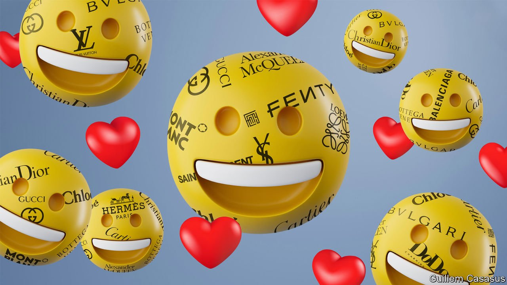
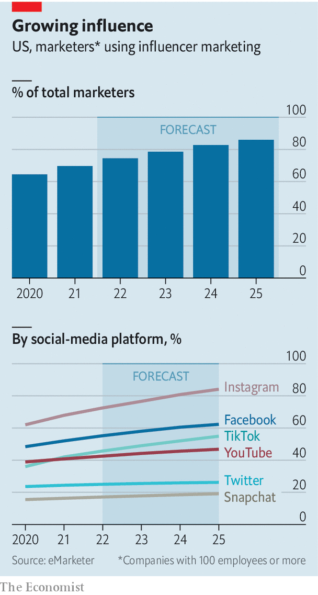

###### Under the influence

# The business of influencing is not frivolous. It’s serious 

##### Influencers are becoming brand ambassadors—even for the poshest of brands 

 

> Apr 2nd 2022 

LUXURY BRANDS used to speak in monologues. News about their latest collections flowed one way—from the boardroom, via billboards and editorial spreads in glossy magazines, to the buyer. In the age of social media, the buyers are talking back. One group, in particular, is getting through to fashion bosses: influencers. These individuals have won large followings by reviewing, advertising and occasionally panning an assortment of wares. Their fame stems not from non-digital pursuits, as was the case with the A-list stars who used to dominate the ranks of brand ambassadors, but from savvy use of Instagram, Snapchat or TikTok. Their posts seem frivolous. Their business isn’t.

For consumers, influencers are at once a walking advert and a trusted friend. For intermediaries that sit between them and brands, they are a hot commodity. For the brands’ corporate owners, they are becoming a conduit to millennial and Gen-Z consumers, who will be responsible for 70% of the $350bn or so in global spending on bling by 2025, according to Bain, a consultancy. And for regulators, they are the subject of ever closer scrutiny. On March 29th news reports surfaced that China’s paternalistic authorities are planning new curbs on how much money internet users can spend on tipping their favourite influencers, how much those influencers can earn from fans, and what they are allowed to post. Taken together, all this makes them impossible to ignore.


Few reliable estimates exist of the size of the influencer industry. One in 2020 from the National Bureau of Statistics in China, where influencers gained prominence earlier than in the West, estimated its contribution to the economy at $210bn, equivalent to 1.4% of GDP. As with many things digital, the pandemic seems to have given it a fillip, as more people were glued to their smartphones more of the time.

 


EMarketer, a firm of analysts, estimates that 75% of American marketers will spend money on influencers in 2022, up from 65% in 2020 (see chart). Brands’ global spending on influencers may reach $16bn this year, more than one in ten ad dollars spent on social media. Research and Markets, another analysis firm, reckons that in 2021 the middlemen made $10bn in revenues globally, and could be making $85bn by 2028. The ranks of firms offering influencer-related services rose by a quarter last year, to nearly 19,000.

The influencer ecosystem is challenging the time-honoured tenets of luxury-brand management. Apart from being one-directional, campaigns have tended to be standardised, unchanging and expensive. An exclusive group of white actresses with the right cheekbones was supposed to signal consistency, as well as opulence. The same smile from the same photograph of the same Hollywood star would entice passers-by to purchase an item for many years. Julia Roberts and Natalie Portman have been the faces of Lancôme’s bestselling La Vie est Belle perfume and Miss Dior, respectively, for a decade. Stars and brands alike are tight-lipped about how much money changes hands, but the figures are believed to be in the millions of dollars. One report put the amount spent by LVMH on the entire Miss Dior campaign at “under $100m” in the past year.

Such star-led campaigns can feel aloof to teenagers and 20-somethings who prize authenticity over timeless glamour. And influencers, with their girl- or boy-next-door charm, offer this in spades—for a fraction of the fee of a big-name star. The best ones are able to repackage a brand’s message in a way that is harmonious with their voice, their followers’ tastes and their platform of choice (Instagram is best for all-stars with over 2m followers and TikTok for niche “micro-influencers” with up to 100,000 followers and “nano-influencers” with fewer than 10,000).

Influencers are particularly adept at navigating social-media platforms’ constantly evolving algorithms and features. For example, when Instagram’s algorithm seemed to begin favouring short videos (“reels”) over still images, so did many influencers. As social-media apps introduce shopping features, influencers are combining entertainment and direct salesmanship. Such “social commerce” is huge in China, where it was invented. In October 2021 Li Jiaqi, better known as Lipstick King, notched up nearly 250m views during a 12-hour streaming session in which he peddled everything from lotions to earphones ahead of Singles’ Day, that country’s annual shopping extravaganza. He and Viya, a fellow influencer, flogged $3bn-worth of goods in a day, half as much again as changes hands daily on Amazon.

Many influencers manage their production in ways that traditional ambassadors never could. They are video editors, scriptwriters, lighting specialists, directors and the main talent wrapped into one. Jackie Aina, whose beauty tips attract over 7m followers across several platforms, explains the importance of high-quality equipment that can show texture, accurate colour grading—“Not to mention the lighting.” Ms Aina’s 30-second lifestyle TikToks can take hours each to make.

This production value, combined with access to the influencers’ audiences, translates into value for the brands. Gauging how much value, precisely, is an inexact science. Launchmetrics, an analytics firm, tries to capture it by tracing a campaign’s visibility across print and online platforms. The resulting “media impact value” (MIV) reflects how much a brand would need to spend to gain a given degree of exposure—itself indicative of the expected return from a marketing drive. On this measure, which brands use to see how they stack up against rivals, the three-day wedding of Chiara Ferragni, an Italian with 27m Instagram followers, a fondness for pink and a Harvard Business School case study, generated a total of $36m in MIV for brands including Dior, Prada, Lancôme and Alberta Ferretti, which made the bridesmaids’ gowns. That compares with $25m for the more conventional—and almost certainly pricier—video campaign for Louis Vuitton’s autumn/winter 2021 collection for which the fashion house enlisted BTS, a hit South Korean pop group.

As well as new opportunities, influencers present new risks, especially for brands whose luxury identities rely on price discipline and exclusivity. Influencer-led live-streamed shopping events in China by Louis Vuitton and Gucci were ridiculed for cheapening their brand. And full-time influencers’ large teams can run up quite a tab. Adam Knight, co-founder of TONG Global, a marketing agency with offices in London and Shanghai, notes how Lipstick King’s live-streaming success has fuelled demand for his services among brands—but also his own kingly demands. Mr Li’s fees, commissions and exclusive perks only pay for themselves if the event is a smash hit. Otherwise, Mr Knight says, the client’s profit “just completely erodes”.

There are more indirect costs to consider, too. A host of younger and more unpredictable brand ambassadors is harder for brands to control than one or two superstars on exclusive contracts with good-behaviour clauses. Though influencers’ shorter contracts make them easier to replace should they step out of line, untoward antics can be costly. Before the latest clampdown Chinese authorities had already forced 20,000 influencer accounts to be taken down last year on grounds of “polluting the internet environment”. Luxury brands are reportedly cutting their influencer spending in China in response. Regulators around the world, as well as some social-media platforms, are beginning to clamp down on influencers who do not tag their content as advertorials.

Such worries explain why some luxury houses are leery of influencers. Hermès, the French purveyor of scarves and Birkin bags, maintains a social-media presence that is conspicuously influencer-free. But more feel the benefits outweigh the costs. Despite Louis Vuitton’s and Gucci’s live-streaming flops, LVMH and Kering, the brands’ respective owners, continue to rely on influencers to create social-media momentum. To be a top-ten brand, says Flavio Cereda-Parini of Jefferies, an investment bank, you have to know how to play the digital game. If you don’t, “you are not going to be top ten for very long.” ■

For more expert analysis of the biggest stories in economics, business and markets, , our weekly newsletter.

