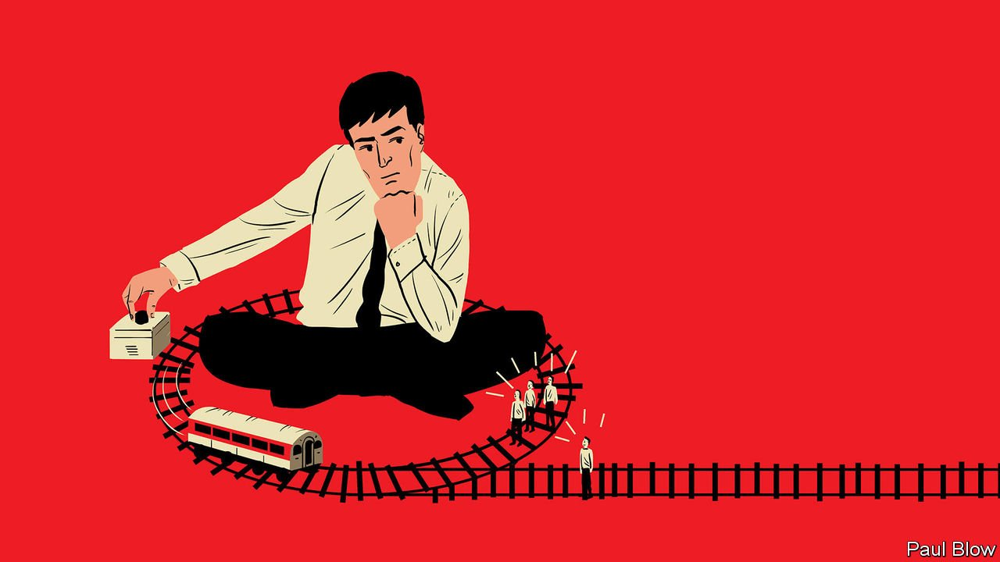

###### Bartleby

# The case for managerial decency 

##### A scandal at Britain’s P&O Ferries shows how not to handle redundancies 

 

> Apr 2nd 2022 

MANAGEMENT ENTAILS some unpleasant conversations, none worse than telling employees that they have lost their jobs. There is nothing enjoyable about giving people this kind of news. But it can be done well or it can be done badly—or it can be done in the style of Peter Hebblethwaite.

Mr Hebblethwaite is the chief executive of P&amp;O Ferries, a ferry operator that carries passengers and freight between Britain and continental Europe. On March 17th the company told almost 800 of its workers on a video call that they were being replaced with immediate effect by cheaper foreign contractors. Security guards were on hand to escort the dismissed workers from the ships.


On March 24th Mr Hebblethwaite was hauled in front of a committee of British MPs to explain himself. “Are you in this mess because you don’t know what you’re doing, or are you just a shameless criminal?” was the first question. And that was before he made them really angry. He admitted he had not seen a safety-risk assessment into the implications of replacing the original crews with agency workers (two of the affected vessels have subsequently been held in port because of safety concerns). He openly acknowledged that the firm had broken the law by not consulting on the dismissals with trade unions, but that he would make the same decision again because the unions would never have agreed to the plans.

If you want to know what slack-jawed astonishment looks like, watch someone telling legislators that the law is not worth following. But what if you take Mr Hebblethwaite at his word—that the business was unsustainable and that the firm faced a choice between cutting some jobs immediately and losing them all? This is a kind of managerial “trolleyology”, the name given to a set of moral thought experiments involving a runaway railway carriage that is careering towards a group of people. In these experiments participants are asked whether they would intervene and sacrifice someone else in order to save the lives of others. Dismissing workers in order to save more jobs is the workplace version of this problem.

The Hebblethwaite approach to managerial trolleyology is a simple matter of accounting: saving 3,000 jobs is worth the loss of 800 workers. That meant moving fast, and not bothering with niceties like following the law or affording people due process or dignity.

But the point of trolleyology is that the brute logic of numbers often conflicts with moral intuitions. Ethical considerations can involve nuances of behaviour, not just outcomes. For example, people are much more willing to switch train tracks so the runaway carriage collides with someone else than they are to push someone off a bridge into the path of the train in order to slow it down.

In managerial trolleyology, too, behaviour matters—even to staunch utilitarians. It makes a difference how people are treated when they lose their jobs, and not just to those who are out of work. Callousness affects the morale of those who are left behind: recent research suggests that a toxic corporate culture is more likely to lead to employee attrition than any other factor. How firms handle redundancies also sends signals to prospective employees, customers and investors. Airbnb chose to publish the memo that Brian Chesky, its boss, sent to employees in May 2020, in which he used a blend of compassion and commercial logic to explain his decision to cut 25% of the workforce.

Displays of humanity can be good for the share price. A new study, from academics at the University of Zurich, the London School of Economics and Judge Business School at the University of Cambridge, looks at how chief executives responded to the outbreak of covid-19 in early 2020. The authors review transcripts of investor calls in which bosses discussed the pandemic, and find that whereas virtually all of them referred to its economic impact, only about half of them mentioned the human costs. The share prices of firms run by the more compassionate-sounding bigwigs outperformed the others in the early stages of the crisis and well beyond.

Every situation is different. The P&amp;O debacle reflects specific aspects of maritime employment law, for example. But if you want a steer on how to handle mass redundancies, Mr Hebblethwaite does not provide it. Managers routinely have to make tough decisions about letting workers go. Whether to show some common decency in the process is not one of the harder ones.

Read more from Bartleby, our columnist on management and work:

 (Mar 26th)

 (Mar 19th)

 (Mar 12th)


