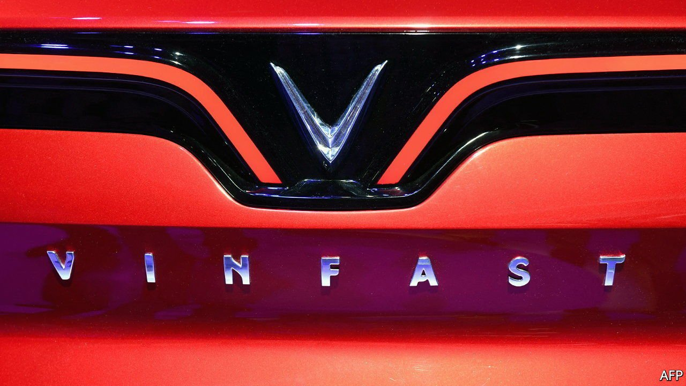
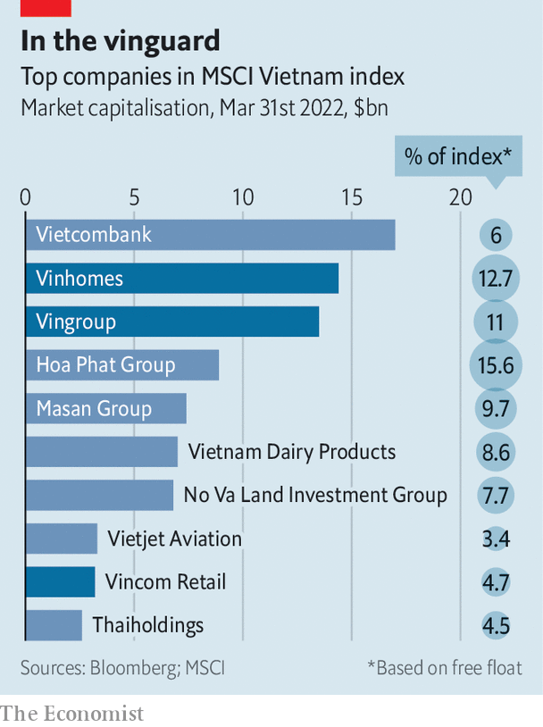

###### Born to Vin

# Vingroup, Vietnam’s top conglomerate, leaps into global markets 

##### Perhaps a bit too boldly 

 

> Apr 2nd 2022 

IN THE HEYDAY of Vietnam’s communist economy, comrades could expect their health care, education, housing and entertainment to be provided by the government. In the freeish-market Vietnam of today, those necessities are still purveyed by one dominant entity, albeit a capitalist one. Vingroup, the country’s biggest conglomerate, and its two listed subsidiaries, Vinhomes (a property developer) and Vincom Retail (which offers other real-estate services), jointly make up 28% of free-float shares in Vietnam’s stockmarket index (see chart). Their revenues are equivalent to nearly 2% of Vietnamese GDP.

 


Having made Vingroup into a dominant force at home, its founder and chairman, Pham Nhat Vuong, now wants to turn it into a household name abroad. In December the group announced plans to list VinFast, its electric-car division, in America this year, to open showrooms across the West, and to sell 42,000 electric vehicles (EVs) globally in 2022, up from a previous goal of 15,000. On March 29th, in the most audacious move yet, VinFast said it would invest $2bn in its first foreign factory, to be built in North Carolina with capacity to make 150,000 EVs a year.


That is quite a ride for a firm that began life in 1993 making instant noodles in Ukraine, where Mr Vuong found himself after studying geological engineering in the Soviet Union. He subsequently expanded operations to his home country and in 2010 sold the Ukrainian business to Nestlé, a Swiss food giant, for a reported $150m. The Vietnamese arm became Vingroup. It has been accruing business lines ever since, turning Mr Vuong, who retains a majority stake in the parent company, into Vietnam’s richest man.

Between 2011 and 2021 Vingroup’s revenues exploded nearly 50-fold, to more than $5bn. Gross operating profit has ballooned ten-fold in the past decade, to around $800m. Vingroup’s share price is also 50 times what it was at its initial public offering in 2007. It spun off Vincom Retail in 2017 and Vinhomes a year later, retaining majority stakes in both. These lucrative property businesses generate most of the parent company’s profits.

Now Vingroup wants more to come from techier sectors, says Le Thi Thu Thuy, Mr Vuong’s deputy at Vingroup and CEO of VinFast. In particular, the company is eyeing EVs. To that end, the group is rejigging its industrial divisions. Last year it wound down VinSmart, an unlisted subsidiary that had grabbed just over 10% of the domestic smartphone market with its own models, and launched two new EV-focused high-tech ventures: Vin ES, a battery-making subsidiary, and Vin AI, a machine-learning arm which is led by a former researcher at DeepMind, Google’s artificial-intelligence unit, and whose task is to develop self-driving technology. As part of the electric shift VinFast will also stop making petrol-driven vehicles by the end of this year.

The plan is to conquer the global EV market with snazzy new models—and a crafty new business model. VinFast will sell cars while leasing their batteries, which account for a large chunk of an EV’s cost. That lowers the sticker price, as well as alleviating concerns about long-term decline in range as batteries degrade (the company will replace those which no longer recharge adequately). VinFast’s $41,000 VF8 is one of the cheapest electric SUVs around, even after you factor in the $100 or so monthly battery payments.

Vietnam’s president, Nguyen Xuan Phuc, whom Mr Vuong took for a spin in a VF8 at VinFast’s factory in Haiphong earlier this year, certainly looked impressed. Afterwards Mr Phuc reiterated just how Vingroup’s business objectives dovetail with the government’s economic goals. These include the creation of large, internationally competitive conglomerates in the mould of South Korean chaebol such as Samsung. No Vietnamese company fits the bill better than Vingroup.

Ambition does not, though, guarantee success. Vingroup’s industrial businesses, of which carmaking is by far the biggest, recorded a net loss of about $1bn last year. Chris Robinson of Lux Research, an analysis firm, is sceptical about VinFast’s ability to compete with established carmakers like Volkswagen, which is ploughing billions into affordable EVs, or Tesla, the industry superstar. He reckons VinFast will struggle to win a big market share outside South-East Asia. Wall Street’s enthusiasm for upstart EV firms has chilled of late in America, which could dash VinFast’s hopes for a blockbuster New York listing. The world’s motorists and investors may prove harder to impress than Mr Phuc. ■

For more expert analysis of the biggest stories in economics, business and markets, , our weekly newsletter.

