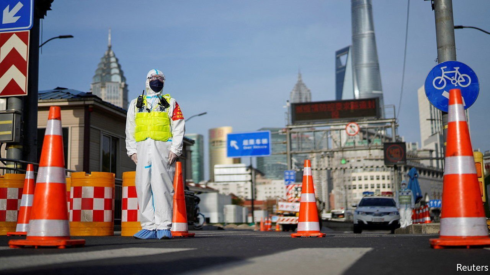

###### The last lockdown?

# What Shanghai lockdowns mean for China Inc 

##### Nothing good 

 

> Apr 2nd 2022 

“SNATCH GROCERIES first, then get a covid test” has quickly become an anthem for the lockdown that started suddenly in Shanghai in the early hours of March 28th. Local hip-hop artists CATI2, P.J. and Keyso describe scenes of panic buying—qiang cai, or snatching groceries—and the threat of being locked out of one’s home amid a frenzied bid to control an outbreak of covid-19 in China’s main business and finance hub. One lyric hints that residents can grow vegetables in the small patches of land outside their apartments or scavenge for edible plants.

The song attracted hundreds of thousands of views online in less than a day, bringing cheer to an otherwise grim situation. China is currently facing its worst outbreak since the pandemic started in the city of Wuhan in 2020. Thousands of new cases of the highly transmissible Omicron variant are being discovered each day. The large cities of Shenzhen and Shenyang, as well as the entire province of Jilin, have been locked down in recent weeks.


Now it is Shanghai’s turn. The two-phase lockdown of the city, whose 25m inhabitants have been mostly spared harsh containment efforts in the past two years, was announced hours before it began at 5am. The local government had gone to great lengths to avoid shutting down the metropolis, especially its wealthy central districts. In coming weeks it will find it difficult to project an image of business as usual—because business is anything but.

The lockdown’s first phase covers areas east of Huangpu river, home to the main financial centre. Many white-collar workers have packed up toiletry bags and moved into their offices until April 1st, when the lockdown is supposed to be lifted in the east and imposed instead in western neighbourhoods. In order to keep the stock exchange running, employees are said to be sleeping on the floor of the bourse. Countless companies listed in Shanghai have put out statements in recent days to notify investors that they are shutting down their factories in the region and, in some cases, elsewhere in the country. Tesla is suspending production at its electric-car factory in the city, according to Reuters.

The pain will be felt abroad, too, just as it was amid the lockdowns in Shenzhen, another city deeply entangled in global supply chains. Although seaborne traffic can be diverted from Shanghai to other ports, such as Ningbo around 100km to the south, the cross-border flow of people is being disrupted. International flights have been rerouted to airports in other cities. Shanghai’s tourism businesses are bracing for a year that will even worse than 2020.

The measures may stretch beyond eight days; parts of the city could remain closed once more cases are identified, as is likely given Omicron’s transmissibility. One team of economists estimates that a one-month lockdown of Shanghai and its spillover effects would knock a staggering 4% off China’s GDP in that period. Whatever the eventual cost, in the short run the Shanghai experiment is the biggest test yet of China’s “zero-covid” approach to snuffing out the virus. Officials hope that “production bubbles”, instituted in Shenzhen and other places to bus workers to and from factories in a covid-controlled manner, will work in Shanghai, too. If they do, China may be able to cling to its draconian strategy for longer. If they fail—as they might in the face of Omicron—the authorities will be under pressure to relent. ■

For more expert analysis of the biggest stories in economics, business and markets, , our weekly newsletter. 

Dig deeper

All our stories relating to the pandemic can be found on our . Read more of our recent coverage of the . 

