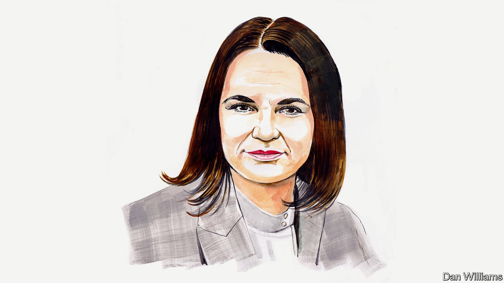

###### Russia and Ukraine

# Sviatlana Tsikhanouskaya argues that Europe will be safer if Belarus is free 

##### The country’s opposition leader says a Russian puppet in Minsk can always threaten Ukraine 

 

> Apr 2nd 2022 

IN ORDER TO help Ukraine, it’s time for the West to learn from the mistakes it made in Belarus in 2020. I feel a sense of déjà vu watching Volodymyr Zelensky desperately calling for the world’s attention. He does so even as peaceful cities are being destroyed by missiles launched from my own country, Belarus. This is only possible because when Alexander Lukashenko, a dictator who has run Belarus for more than 27 years, claimed victory over me in a rigged election in our country less than two years ago, the West did too little. Vladimir Putin props up his regime. The West’s weakness has led to Belarus becoming an accomplice in the most brutal European conflict since the second world war.

Many world leaders I meet are trying to treat the symptoms instead of curing the disease of dictatorship. This war is not just between Russia and Ukraine. It is a battle between autocracy and democracy, as Joe Biden rightly stated in his recent speech in Warsaw. It is a war between a world ruled by law and another controlled by ruthless violence. 


Dictators learn from each other and follow the same pitiless logic. Just as Mr Putin could not stand seeing Ukraine prosper as an independent country, Mr Lukashenko could not stand the sight of hundreds of thousands Belarusians peacefully marching for their rights in 2020. Some 30,000 of them have been detained and thousands have been imprisoned on political charges. My friend, Maria Kalesnikava, has been sentenced to 11 years in prison. My husband, Siarhei Tsikhanouski, has been sent away for 18 years. 

The impunity of Mr Lukashenko’s regime only encourages repression in Belarus. Today any protest is like a revolt in a gulag. This month, for example, a teacher was arrested in class for wearing a blue and yellow ribbon in her hair. The wrong Instagram post can lead to a prison sentence of many years. 

The West has been slow to realise the seriousness of the threat the Belarusian dictatorship poses, and to react to it. The first serious sanctions on the regime were introduced in June 2021—ten months after the stolen election and the brutal repression that followed. This allowed Mr Lukashenko’s regime to fall back on Russia and regroup. Now the regime is paying off the debt by providing our territory, infrastructure and fuel to Russian troops in a bloody war against Ukraine. Forget the hijacking of the Ryanair flight and the Belarus-Poland migrant crisis—how trifling last year’s problems seem now. Had Mr Lukashenko been stopped in 2020, none of that would have happened.

The fate of both Belarus and Ukraine is at stake. Belarus can't be free without a free Ukraine and vice versa. The 674-mile long border between them means that a Russian-controlled autocrat in Minsk, our capital, can always threaten Ukrainian stability. Dismantling the dictatorship in Belarus would help Ukraine win the war. And there could be no stronger punishment for the Kremlin than seeing Russia share a border with a democratic Belarus. Furthermore a Ukrainian victory would make democracy in Belarus far more likely to emerge. 

Europe is more secure if Belarus is free. To avoid pressure, Mr Lukashenko will try to coax and cajole Western leaders as his fortunes change. He is already threatening to station Russian nuclear weapons in Belarus. (He removed the constitutional provision that had previously made Belarus a non-nuclear country in a sham referendum in February.) Mr Lukashenko may even eventually pose as a peacemaker. Don't be fooled: you can't plead for peace while bombing your neighbours. 

Whatever the West's reaction, Belarusians will continue fighting for themselves. The democratic movement that opposes the regime has transformed into an anti-war movement which grows by the day. Our citizens are waging a phenomenal underground resistance. Hackers and partisans are sabotaging railways daily, cutting Russian supplies and stalling the movement of Russian troops and arms. Just 3% of Belarusians support our military involvement in the war on Russia’s side, according to Chatham House, a British think-tank. We're hearing reports of discontent among our country’s elites and from those serving in the armed forces. 

I urge Western leaders to learn from their past errors. I see why they are cautious when faced with Mr Lukashenko and Mr Putin: nobody wants to fight a bully. This is a rational approach. But it fails with dictators. Instead, I call on you to stop recognising the regime in Minsk as legitimate or legal. Do not exchange ambassadors; suspend Belarus from international organisations and ban it from major events, such as sports competitions. Check that existing sanctions have no loopholes and monitor their implementation. Belarus must not become a giant loophole itself through which Russian businesses can circumvent Western sanctions. Ensure that Mr Lukashenko cannot avoid responsibility for the crimes he has already committed. 

Dictators can't be re-educated. But I hope the democratic world can learn to act fast and acknowledge when its future and its security are at stake. I am convinced that dictators can't survive a united democratic response and unrest at home. They've chosen the wrong side of history. We must ensure Belarus and Ukraine fall on the right side of it.

_______________

Sviatlana Tsikhanouskaya is the leader of Belarus’s democratic movement.

Read more of our recent coverage of the .

