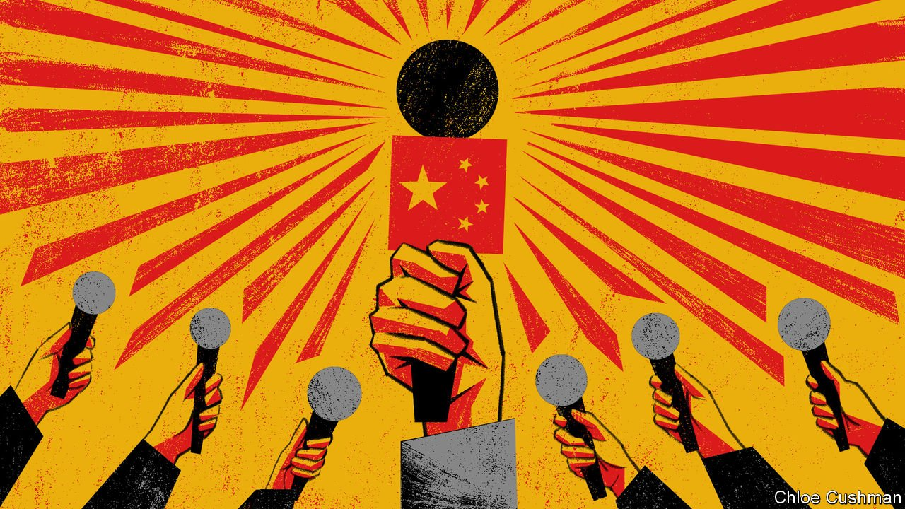

###### Chaguan

# A final victory for China’s propaganda chiefs 

##### A terrible plane crash prompts a revealing anti-media backlash 

 

> Apr 2nd 2022 

ON A FIRST posting to China, two decades ago, Chaguan covered a disaster that was as grim as it was revealing: an explosion that killed 38 children at a school where pupils were assembling fireworks to pay their fees. Reporting that tragedy in March 2001 was made possible by the courage of bereaved parents in Fanglin, a remote village in the southern province of Jiangxi. To alert national leaders to their plight they accepted interviews and identified local officials and teachers who forced children as young as eight to fit fuses to firecrackers in classrooms. Exposing this crime took bravery by Chinese journalists, too, notably from risk-taking, commercially driven outlets that enjoyed a golden age in the 1990s and early 2000s, protected by well-placed patrons and by the profits that their livelier content generated. “I have to go, a China Youth Daily reporter is here,” a grieving mother said during a telephone interview, naming one of the feistier newspapers of that time. Locals smuggled Chinese journalists into their village, then hid them from thugs sent to beat them. As for Chaguan, he was detained for “illegal reporting” at a police roadblock outside Fanglin.

An epilogue followed that would be unthinkable now. Days after the blast China’s prime minister, Zhu Rongji, held his annual press conference in Beijing, carried live on television. A Western reporter asked if Mr Zhu stood by his earlier statement blaming the disaster on explosives set off by a deranged villager. Mr Zhu, a gruff economic reformer, acknowledged that foreign and Hong Kong journalists doubted this account. Therefore, he had sent new investigators in plain clothes to Jiangxi: a tacit admission that foreigners might be more reliable than his own bureaucracy. They found that schoolchildren had made fireworks two years previously, but this practice ended before the blast, he said. Declining further debate with “sceptical journalists”, foreign or Chinese, Mr Zhu promised that children would be better protected in future. Soon afterwards Jiangxi’s governor and police chief lost their jobs.


Jump to the present day and another disaster: the unexplained loss of a China Eastern airliner carrying 132 passengers and crew, seen nosediving vertically from cruising altitude into a hillside in the southern province of Guangxi on March 21st. Public reactions reveal a media landscape transformed. Journalists who rushed to the crash site have been scolded by some internet users for getting in the way, and chided to “wait for the official report” into what happened. A press conference with bosses of China Eastern Airlines was rendered all but useless by cautious questions and scripted answers. A reporter from a foreign news agency, Reuters, stood out for asking about practical matters such as the repair record of the crashed Boeing 737. An airline boss intoned that investigators would “carry out relevant tasks in an orderly manner”.

Today’s leaders do not give credit to foreign reporters for their culture of scepticism. Rather, Western media are accused of inventing reports about repression in Xinjiang or Tibet and of scouring China for negative stories to distract from chaos in America or Europe. When floods hit the central province of Henan in 2021 officials incited crowds of locals to report and harass Western journalists. Presenting the country as under siege by America, nationalist commentators urge citizens to refuse interviews with foreign outlets, rather than “hand the West a knife” to stab China. Increasingly, foreigners are called a national-security threat. Cheng Lei, an Australian who worked as an anchor for China’s international television network, CGTN, went on trial in Beijing on March 31st, charged with supplying state secrets to a foreign power. Australia’s ambassador was barred from the closed-door hearing.

Domestic journalists are under pressure, too. Once there was public sympathy when reporters gave coverage to disaster victims and their families, as they sought answers or redress. Doughty Chinese journalists challenged official cover-ups after an earthquake in Sichuan in 2008, a high-speed train crash in 2011, an explosion in a chemicals depot in Tianjin in 2018 and the start of the covid-19 pandemic in Wuhan in 2020. Now, the public is turning on purveyors of bad news. After the Guangxi plane crash, an unremarkable if mawkish profile of some victims published by Renwu magazine attracted a storm of hostile comments and was deleted. In a blog post that went viral, a journalism student called Renwu’s writer unethical for interviewing victims’ friends, before primly concluding that disaster coverage should focus on rescue work, not stories of the dead. Netizens condemn journalists and even some victims’ relatives for dwelling too publicly on the tragedy, accusing them of “eating steamed buns dipped in human blood”, a garbled reference to a short story by Lu Xun (a champion of free speech, Lu’s satirical target was actually ignorant superstition).

The news is what the party says it is

Growing anti-media sentiment is driven by politics and economics. Until about a decade ago, journalists at swashbuckling news outlets talked openly of holding the powerful to account. Then the Communist Party struck back, hard, neutering liberal publications and purging newsrooms. To earn press cards today, journalists must take politics tests and attend 90 hours of training each year, stressing their primary mission of “public opinion guidance". As an extra incentive to toe the party line, censors allow online nationalists to savage any journalism deemed unpatriotic. Nationalist zealots hounding “liberal media” do not realise that “what they are attacking is already dead,” says a veteran editor.

Meanwhile, commercial pressures drive high-minded outlets to compete with sensationalist “self-media” blogs and videos, to the despair of surviving reporters. That taints the whole industry and boosts the prestige of staid-but-authoritative arms of the state like Xinhua, a news agency, or China Central Television. Today reporters “are respected because they are the government, not because they are challenging the government”, sighs the veteran. The China of 2001 might as well be another country. ■

Read more from Chaguan, our columnist on China: (Mar 26th)

 (Mar 19th) (Mar 12th)

