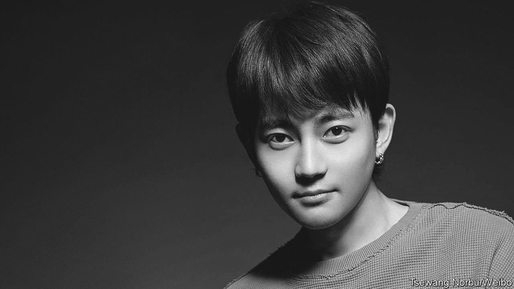

###### The fire inside

# Deciphering a Tibetan pop star’s self-immolation 

##### Tsewang Norbu was not the bubbly singer he appeared to be 

 

> Apr 2nd 2022 

THE STORY of Tsewang Norbu is shrouded in mystery. The Tibetan pop star set himself on fire in Lhasa, the Tibetan capital, on February 25th. Fans have spent the past month mourning his death. But on March 28th the Chinese foreign ministry suggested Mr Norbu might still be alive. In response to questions about him, the ministry said a man in Tibet had “attempted suicide by self-immolation”—and that he had been taken for treatment immediately. The man had long been “troubled by mental illness” and “had attempted suicide multiple times”, claimed the authorities. Activists are unconvinced.

Fans were shocked by Mr Norbu’s action. Over the past decade, scores of Tibetans have burnt themselves to death in protest at Chinese rule. But Mr Norbu did not appear to be a dissident. The 25-year-old had competed on a popular reality show, “Sing! China”, only months earlier. The judges called him luobo (radish), a Mandarin homophone for Norbu. In videos he would rap about love. Sometimes he would play piano or guitar as he sang tunes by Camila Cabello and Frankie Valli. With his pierced ears and groomed eyebrows, he could have been a Gen Z-er from anywhere.


But Mr Norbu was from Tibet. That meant he lived in two worlds. There was the Tibet promoted by the Chinese authorities: a glossy, exotic “minority region”, where grateful nomads and monks were being lifted out of poverty. Then there was the Tibet experienced by locals, who have watched the authorities tear down Buddhist statues, close Tibetan-language schools and arrest anyone who resisted the state’s campaign of sinicisation. Those who only saw the first world could not comprehend why one of its stars would set himself on fire. Those who knew the second immediately understood.

When Mr Norbu spoke of Tibet he was careful. He would mention his father, a composer in a state-run song-and-dance troupe whose songs honoured Tibetan culture. Mr Norbu did not speak of the deadly crackdown after protests in Nagchu, where he grew up, in 2013. He certainly did not mention his uncle, Lodoe Gyatso, who served a prison term for murder (his supporters say it was self-defence) and is now in jail for protesting against Chinese rule.

Mr Norbu may not have been outwardly political, but he clearly took pride in Tibet. He avoided the “red songs” performed by his mother, a singer in a troupe run by the Chinese army. Those ditties featured lyrics thanking the “life-saving” Communist Party. Instead Mr Norbu wrote songs like “Tsampa”, an ode to the Tibetan staple food made of roasted barley flour. A video for the song features the singer dancing around Lhasa. At one point he bows, placing a hand on his heart, as two monks pass.

These were signs of Mr Norbu’s true feelings—his reverence for Tibetan identity—say activists. They point to his rendition of “Return to the Homeland” on “Sing! China”. He wore a traditional chupa robe and delivered the first lines in a Tibetan folk-style vibrato: “There is a land known as the homeland, there is a happiness known as the home.” He even changed the lyrics, referring to Tibet instead of Nagchu in the lilting last verse. Secretly, he was singing for the nation, claim Tibetans.

Whereas his songs contained subtle clues about his politics, his self-immolation made them clear. Mr Norbu chose the most sensitive location in Lhasa: the Potala Palace, the traditional residence of the Dalai Lama. And he picked a sensitive time, days before the meeting of China’s parliament in Beijing. To pull off such an act shows not desperation, but the “utmost determination”, says Matthew Akester, a Tibet researcher based in India.

In some ways Mr Norbu seemed like the Chinese government’s ideal minority youth: urban, educated and fluent in Mandarin. On China’s National Day last year, he posted a video of himself bringing his fingers together. “I make a heart for the motherland,” read the accompanying hashtag. But Tibetans saw through that, says Tsering Woeser, a Tibetan writer and activist (who lives under surveillance). “Chinese people only saw the image. They only saw the surface,” says Ms Woeser. “We know Tsewang’s real struggles.” ■

