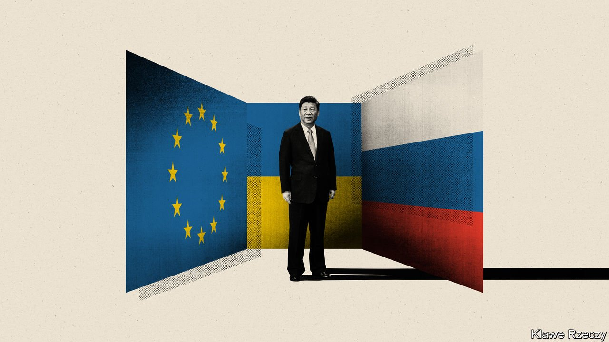

###### We need to talk about Ukraine

# The war makes China uncomfortable. European leaders don’t care 

##### Get ready for a tense summit 

 

> Apr 2nd 2022 

CHINESE LEADERS wanted the mood to be “business as usual”. But the summit between China and the European Union on April 1st will be anything but normal. That is because Russia’s invasion of Ukraine, and China’s cold-blooded response to it, have exposed the limitations of Europe’s old trade-first China policies.

EU leaders approached the summit, which is being held by video-link, with low expectations. They hoped at least to send a message to China’s leader, Xi Jinping, that the Ukraine war is a defining moment for relations, and for China’s image if it refuses to use its influence to end the killing.


In a sense Europe’s representatives at the summit, Charles Michel, the president of the European Council, and Ursula von der Leyen, the head of the European Commission, will be overshadowed by two figures who will not be there: Germany’s former chancellor, Angela Merkel, and President Vladimir Putin of Russia. No leader is more closely associated with Europe’s old China policy than Mrs Merkel. In 16 years as chancellor, she promoted an accommodating approach that treated China as an invaluable source of economic opportunity and a potential partner on such issues as climate change, albeit one prone to disappointing lapses on human rights.

Mr Putin’s invasion of Ukraine on February 24th was a disaster for advocates of this approach. For Russia’s use of force has enjoyed Mr Xi’s tacit support. Though China claims to be impartial, its true stance is anything but neutral. China blames the war on America, for supposedly trampling on Russia’s legitimate security interests by expanding the NATO alliance to take in former Soviet satellite states. Europeans know that NATO’s expansion was actually driven by demand from former communist-bloc countries that feared Russian aggression (for good reason). EU governments are horrified by China’s refusal to urge Russia to stop the war. They see this foot-dragging as unworthy of a self-proclaimed global power, with a permanent seat on the UN Security Council.

It took Chinese diplomats a while to realise that European leaders would not agree to a conventional, trade-focused, summit. China’s first offer was an online meeting with its prime minister, Li Keqiang, a technocrat with an essentially economic portfolio. China’s preferred agenda involved the signing of memorandums, and talks about reviving the Comprehensive Agreement on Investment (CAI), a trade pact heavily backed by Mrs Merkel. That deal has been frozen since China imposed sweeping sanctions on members of the European Parliament and European diplomats in 2021. It was a lopsided retaliation against narrow EU sanctions on three Chinese officials and one ex-official accused of rights abuses in the north-western region of Xinjiang. Several governments have told China that the CAI cannot return to life until the sanctions are lifted and concerns about forced labour in Xinjiang and other abuses are tackled.

An early idea involved preceding the summit with a long-delayed high-level dialogue on human rights. China’s price for resuming those dialogues was high, diplomats say. The EU and members must stop supporting multinational, co-ordinated statements about Chinese rights abuses in such global forums as the UN Human Rights Council, China demanded. That was rejected. Instead Mr Michel and Ms von der Leyen were due to raise human rights at the summit, touching on such thorny topics as China’s iron-fisted rule over Xinjiang, Tibet and Hong Kong. The pair were also expected to raise Chinese threats towards Taiwan, the democratic island that China claims as its own.

China’s hope to mark the summit with a flurry of document signings were also dashed. That would involve progress on various customs and trade rules. And that cannot happen as long as an EU member state, Lithuania, is being subjected to a Chinese trade boycott as punishment for forging quasi-official ties with Taiwan, other governments agree. Indeed, Mr Michel and Ms von der Leyen were expected to express the EU’s horror over Chinese fondness for economic coercion.

But first and foremost, the summit was seen as a chance to deliver messages about Ukraine. That involved seeking and securing a video call with Mr Xi, the ultimate decision-maker in matters of foreign policy. Pre-summit negotiations were tense. Europeans explained that Mr Xi would hear a warning: that China will face a serious cost if it helps Mr Putin circumvent Western sanctions on Russia, or provides military aid. Chinese officials pre-emptively instructed the Europeans not to threaten their leader.

Divisive predictions

Europe is not used to talking war and peace with China. “Our relations are based on trade and the economy, which makes us very opportunistic,” says a European diplomat in Beijing. Arguably, China is doing Europe a favour by explaining how it expects the West to be a loser from the conflict in Ukraine. Chinese officials boast to ambassadors in Beijing that they see the EU dividing between old and newer members. Those Chinese also predict that transatlantic unity between Europe and America will crumble and that sanctions will fail to break Russia’s will, not least as European voters protest against high energy prices and flows of refugees from Ukraine.

Chinese glee about Western disunity is useful: proving it wrong is a good starting point for an EU strategy towards China. As a second diplomat puts it: “China is watching our Russia policy closely: how much pain we are willing to suffer. Europe is demonstrating that it is united and willing to pay a price.” The stakes are high, he adds. Deterring a potential Chinese attack on Taiwan requires demonstrating that the West is capable of unity and resolve.

Other voices urge calm. China needs Europe as a market, and as a source of technology and investments, they note, especially when China’s ties with America are in dire shape. Some of Europe’s largest companies have lucrative China operations which they are not about to abandon. According to diplomats, there is no sign of China circumventing sanctions on Russia. But Mr Putin is trying to redraw Europe’s borders by force, and Mr Xi will not condemn him. That is a direct challenge to the EU’s founding principles. It cannot be business as usual. Mr Putin has shown Europe that it needs a new China policy. ■

Read more of our recent coverage of the 

