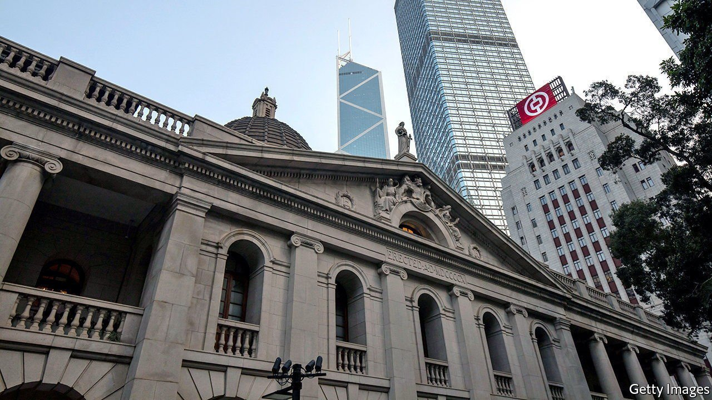

###### The dangers of sitting too long

# Two British judges quit Hong Kong’s top court 

##### Foreigners on the bench in the city face a tricky dilemma 

 

> Apr 2nd 2022 

IN 2016 Leung Kwok-hung, a politician also known as “Long Hair”, snatched a folder of confidential documents from a government official during a meeting at Hong Kong’s legislature. Charged with contempt, his case ended up in Hong Kong’s court of final appeal last year. One of the five judges was Lord Reed, the head of Britain’s supreme court.

To anyone unfamiliar with Hong Kong’s tangled history, this may seem odd. But judges from Britain’s highest court have been doing double duty on Hong Kong’s since 1997 as part of the deal that handed the city from Britain to China.


This legacy of Hong Kong’s past will not feature in its future, though. On March 30th Lord Reed and his colleague, Lord Hodge, resigned from Hong Kong’s top court. No other serving British judge will be allowed to succeed them. According to Liz Truss, Britain’s foreign secretary, a national-security law imposed on Hong Kong in 2020 has exerted a “far-reaching chilling effect”. To stay on the top court “would risk legitimising oppression”, she said.

In commercial cases and ordinary criminal cases Hong Kong courts remain independent, says a British barrister who appears before them. But the national-security law has nonetheless had an “insidious effect”. Ambitious judges “are not going to deliver rulings that displease Beijing”. This is true even in cases that are not tried under the national-security law, but are politically charged.

That puts the foreigners on the bench in a tricky position. Hong Kong welcomes judges from common-law jurisdictions—and it has attracted some of the world’s best. Such minds would improve any judiciary. The fact they could resign may also serve as a deterrent, preventing officials in Beijing from meddling more than they do. But by hanging around, foreign judges could also make it seem as if little has changed in Hong Kong. Their presence makes the courts better than they would otherwise be. It also makes them seem better than they actually are.

Even now, some judicial links with Britain remain. Six retired British judges still serve on the top court; others appear elsewhere in the system. And because the legal system has English roots, cases still sometimes cite English precedents. Mr Leung’s (unsuccessful) defence referred to the bill of rights passed in England in 1689. ■

