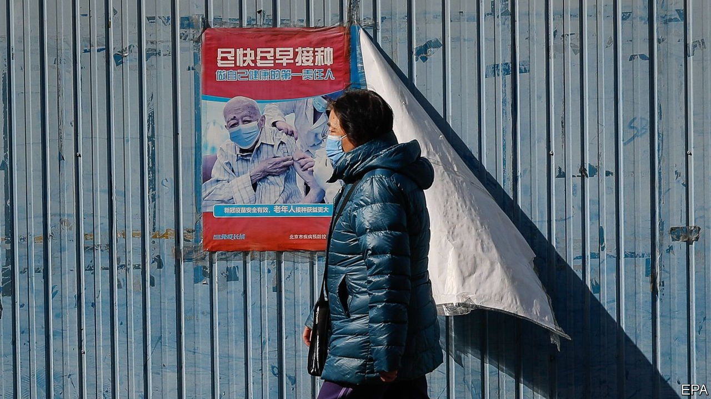
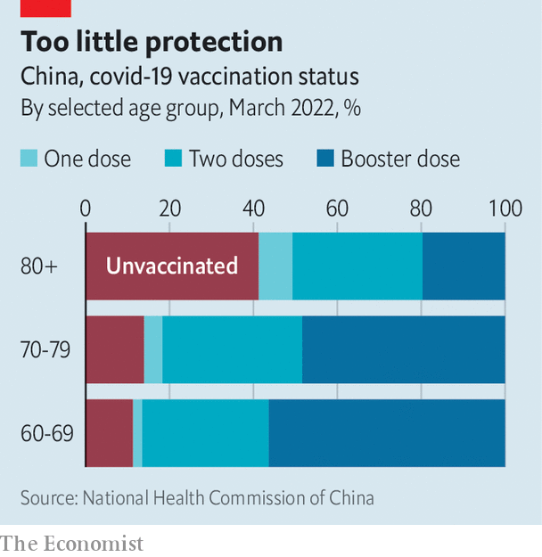

###### An old problem

# Why so many elderly Chinese are unvaccinated 

##### Some are complacent, others are afraid 

 

> Apr 2nd 2022 

FOR WEEKS the authorities in Shanghai tried to stem an outbreak of covid-19 with a whack-a-mole approach. Individual buildings were locked down, only for the virus to spread elsewhere. Finally, on March 28th, officials decided to  all of the city’s 25m residents in two phases, beginning with the east side of town, home to the main financial centre. People scrambled to buy supplies. Vegetables became scarce. Some bankers began sleeping in their offices.

The lockdown is in line with China’s “zero-covid” strategy, which aims to crush outbreaks before they can spread widely. Thousands of new cases of the highly transmissible Omicron variant are testing this approach. The wave has hit most provinces. Restrictions have been imposed on dozens of cities and towns. The experience of Hong Kong is causing Chinese officials to be extra-vigilant. Not long ago the city had very few cases. Now it has one of the highest daily death rates from the virus. The vast majority of the dead are unvaccinated old people. Around 65% of over-80s in Hong Kong had not been jabbed when the Omicron wave started.

 


The mainland has a similar problem. Unlike other countries, which made jabbing the elderly and other vulnerable people a priority, China focused on its overall vaccination rate. It stands at nearly 88%. But only about half of over-80s have been fully vaccinated (see chart). Less than a fifth have received a booster shot. Some 52m people over the age of 60 have not received two jabs. In official statements, the government sounds alarmed. Its efforts to jab mature folk face big obstacles, though.


Start with the fact that many old people think covid vaccines might be dangerous. When they were rolled out in late 2020, the state only approved shots for healthy people under 60. It cited a lack of clinical-trial data for elderly and vulnerable populations. Many old people assumed that the vaccines could harm them. Some health workers did, too. “The first impression is really critical,” says Chen Zhengming, an epidemiologist at the University of Oxford. “Once you have formed your opinion it’s really difficult to change, it requires ten times more effort.”

Since then, the messaging surrounding covid vaccines has not helped. Jingoistic state media have criticised effective foreign-made jabs, which have not been authorised in China for seemingly political reasons. This has probably increased suspicion of Chinese vaccines, too, says Huang Yanzhong of the Council on Foreign Relations, a think-tank in America. Even though the Chinese kind have now been declared safe for old folk, some health workers still tell elderly patients with certain conditions, such as high blood pressure, not to get jabbed. That makes little sense, says Mr Huang. “Even if you’re concerned about side effects, when you weigh that against the risk of getting infected and dying, it’s a no-brainer.”

But the risk of getting infected with covid and dying is, for now, very low in China—and that makes the government’s job tougher. At least until recently, the state’s zero-covid policies have been effective. Many cities have never logged a case. Most old people have hardly been exposed to the virus, and have little fear of it as a result.

Don’t end up like the chicken

Local governments are trying a range of strategies to get old people vaccinated. In the eastern city of Nantong, officials are leaning on younger people, appealing to their sense of filial duty. Get your parents vaccinated so they can become the “silver-haired guardians” of their own health, say the authorities. A city in the province of Hainan has put out a less lofty appeal: get vaccinated and receive a dead chicken. Officials in other towns are offering cooking oil, eggs or cash in return for getting a jab.

In a park in Beijing, two green tents were recently set up for vaccinating old folk. Signs promised 200 yuan ($31) for those receiving their first dose. When your correspondent visited, half a dozen people were sitting in one tent. They had just been jabbed and were waiting to see if there were any side effects. Even with a steady flow of patients, it will take months for China to vaccinate and boost its elderly population. And some will remain unwilling. Outside the tent, in a wheelchair, was a woman in her 80s. Would she get the shot? “Not interested,” she said. “It does no good. And I can’t be bothered.” ■

