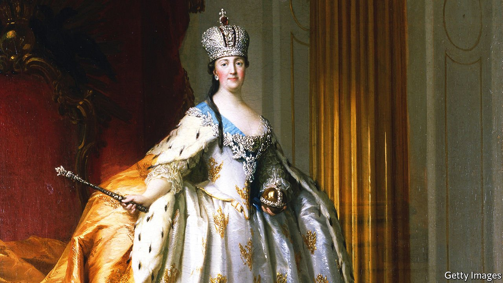

###### Great and smallpox

# Catherine the Great was a pioneer of inoculation 

##### Lucy Ward tells the story in “The Empress and the English Doctor” 

 

> Apr 2nd 2022 

The Empress and the English Doctor. By Lucy Ward. Oneworld Publications; 352 pages; $30 and £20

THE MOST dramatic showdown between humans and smallpox probably took place in Europe in the 18th century. The disease had by then been gathering momentum for a couple of hundred years, and despite the advent of the first effective tool for stopping it in its tracks—inoculation—it embarked on a spree of regicide, diverting more than one royal house’s line of succession.


So recounted Donald Hopkins in his encyclopedic history of the disease, “Princes and Peasants”, published in 1983. Now Lucy Ward has zoomed in on one of the more dramatic episodes in that dramatic century, blowing it up to book length. Whether it merits retelling in such detail is debatable, but Catherine the Great of Russia’s decision to get both herself and her son inoculated certainly resonates in these contagious times. It marked a watershed in popular acceptance of the prophylactic technique and showed the power of leadership by example. Irresponsible rulers of the covid-19 era could take a leaf out of the empress’s book.

Born in Prussia, Catherine was on a drive to modernise her adopted country, and as the first reigning European monarch to volunteer herself—as well as her offspring—for inoculation, she was taking a brave step and a calculated risk. The procedure involved smearing pus from an infected person’s blisters into small incisions in a healthy person’s skin. It was far safer than catching the disease naturally, but not as safe as vaccination, which would develop out of the inoculation method and used the related but milder cowpox virus to confer protection.

Smallpox at that time was often lethal. When it did not kill, it could blind or disfigure. So when, in 1768, the English doctor Thomas Dimsdale was summoned to St Petersburg to do the honours, he had understandable qualms about the assignment. Catherine assured him that a yacht would be standing by in the Gulf of Finland, ready to whisk him out of Russia should anything go wrong.

Nothing did go wrong, and once the clandestine procedure was deemed a success, news of it was broadcast from the onion-domed rooftops. There were fireworks and religious blessings, poems and plays were penned, a national holiday was declared. Voltaire wrote to Catherine, his longtime correspondent, lamenting the French ban on the technique: “You have been inoculated with less fuss than a nun taking an enema.”

Ms Ward’s vivid and well-told story raises the interesting question of who deserves credit for inoculation. The aristocratic Mary Wortley Montagu had brought it back to England earlier in the century, having seen elderly Turkish women perform it on her travels. English medics then modified it—making it more rather than less dangerous.

But an enterprising layman, Daniel Sutton, stripped away the modifications to produce the method that Dimsdale publicised and carried to Russia. (Dimsdale’s genteel manners and scientific standing made him a better emissary than the less polished, more commercially minded Sutton.) In the absence of sufficient numbers of doctors to roll it out in Russia, after inoculation caught on, peasant women were deputised to help once again—only now to perform a technique that had the stamp of scientific approval.

As so often, many people contributed to the success of the invention. But successful it indubitably was. In the last hundred years of its existence, smallpox is estimated to have killed half a billion people; but in Russia, Catherine’s gesture made inoculation fashionable and later led to the rapid adoption of vaccination. In this way she helped set the world on the path to the eradication of the scourge. That milestone was announced in 1980, just over two centuries after she, her son and their doctor risked their lives to demonstrate that disease need not be destiny. ■

Dig deeper

All our stories relating to the pandemic can be found on our .

