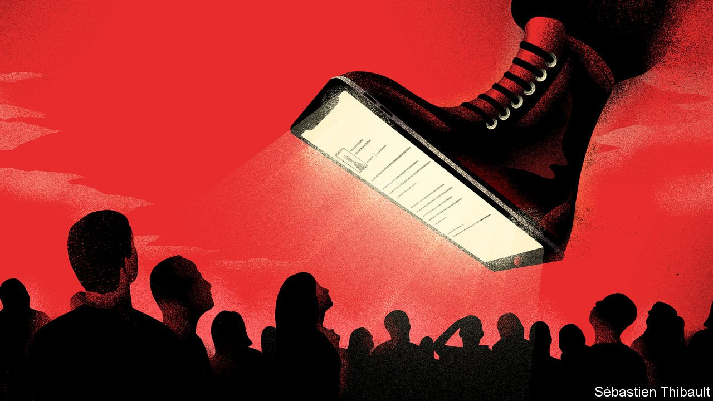

###### The menace of mendacity

# For modern autocrats, lying is more useful than killing 

##### “Spin Dictators” examines the phoney democrat’s arsenal of deceit 

 

> Apr 2nd 2022 

Spin Dictators. By Sergei Guriev and Daniel Treisman. Princeton University Press; 360 pages; $29.95 and £25

RUSSIA DID not invade Ukraine. Ukrainians are shelling their own cities. A Jewish president is actually a Nazi. Dictators have always told lies, so the Kremlin’s recent whoppers have precedent. Dictators have often used terror, too, so what Vladimir Putin is doing to civilians in Ukraine is nothing new, either. But the balance between lying and killing has changed, argues a fascinating new book. For most modern autocrats, lying matters more.


In “Spin Dictators”, Sergei Guriev, a Russian economist living in exile, and Daniel Treisman, a political scientist, describe how this shift has occurred. For much of the 20th century, despots were ostentatiously violent. Hitler, Stalin and Mao slew millions. Lesser monsters such as Mobutu Sese Seko, a Congolese tyrant, hanged cabinet ministers in public. The aim was to terrify people into submission.

The authors contrast such “fear dictators” with “spin dictators”, who kill fewer people, and deny it when they do. The latter are now more common. Among autocrats who took power in the 1960s, roughly a quarter killed more than 100 dissidents a year; among those who took power in the 2000s, less than a tenth did.

Spin dictators pretend to be democrats. They hold multiparty elections and seldom claim to have won more than 90% of the vote, as was the norm for non-democracies in the 1960s, 1970s and 1980s. They rig less and gerrymander more. In 2018 Viktor Orban, Hungary’s spinner-in-chief, turned less than half the vote for his party into a two-thirds supermajority in parliament. He will be  at the election on April 3rd.

Fear dictators’ propaganda was crude and relentless. Busts of Stalin were placed on 38 mountain peaks in Central Asia. So many Mao badges were produced that China’s aircraft industry ran short of aluminium. It was often absurd, too. Mussolini and Kim Jong Il could supposedly conjure up rain and teleport from place to place, respectively. This absurdity was itself a weapon, demonstrating the regime’s “capacity to force people to repeat nonsense”.

Spin dictators like to project an image of competence. Nursultan Nazarbayev used to address Kazakhs from behind a stack of papers, reading out lists of bread-and-butter policies and chiding his ministers for not serving the public better. Spin dictators seldom have a coherent ideology, but use humour to paint themselves as noble and their opponents as vile. They even weaponise light entertainment. In Peru under Alberto Fujimori, a Jerry Springer-style show featured screaming guests, allegations of infidelity and calm words from the host praising the president.

Censorship under fear dictators was total. When an impure snippet found its way into an agricultural paper in the Soviet Union, “censors raced to track down every copy sold, including 50 already pasted into ersatz wallpaper and 12 used as toilet paper.” Spin dictators, by contrast, let a few highbrow, low-circulation dissident papers survive, to show they respect freedom of speech. Meanwhile, independent broadcasters are crippled with spurious tax demands and then bought by the president’s cronies. Critics are harassed with libel suits or fined for spreading “fake news”. Ecuador’s former president, Rafael Correa, forced documentaries off the web by suing for unauthorised use of his picture. Authoritarian leaders who manipulate, rather than censor, the media are typically more popular than democratic ones who face a genuinely free press.

The goal of a spin dictator is to appear to allow political competition while making it nearly impossible in practice. Rather than criminalising dissent, he imprisons his opponents for non-political crimes, such as fraud or rape, of which they are innocent. Sometimes he locks them up for short periods, so they do not become martyrs, and often, so their work is constantly disrupted. Rather than banning opposition parties, he tangles them in red tape or bankrupts them with fines and lawsuits. For extra deniability, the task of making dissidents’ lives hell can be outsourced to a youth militia or army of online trolls, who may rough them up, publish their addresses or leak embarrassing photos.

In some respects, the authors’ argument is optimistic. Political killing has declined because it has grown more taboo. As people become more educated, they expect better from their governments. As Singapore’s former leader, Lee Kuan Yew, put it: “One simply cannot ask a highly educated workforce to stop thinking when it leaves the factory.” That is why spin dictators try so hard to pretend to be democrats.

Mr Guriev and Mr Treisman suggest a policy of “adversarial engagement”. The free world should watch more closely for signs that leaders—including its own—are grabbing unwarranted powers or undermining institutions. It should welcome modernisation even in dictatorships, since economic and social development may ultimately create more demands for liberty. It should stop helping dictators by laundering their money and reputations—anonymous shell companies should be banned, and mischievous lawsuits against exiled dissidents should be curbed.

Unfortunately, the arsenal of deceit is highly effective at keeping malign leaders in power, which is perhaps why global democracy has been in retreat for the past decade. And if those leaders remain in power for a long time, they often grow more repressive. Mr Putin may be less brutal than Stalin, but in his third decade in office he has shifted firmly from “spin” to “fear”. Xi Jinping, who also shows no sign of retiring, has turned China into a surveillance state. That is an aspect of 21st-century repression that this otherwise admirable book fails adequately to explore. In many countries people can neither trust their rulers, nor hide from them. ■

