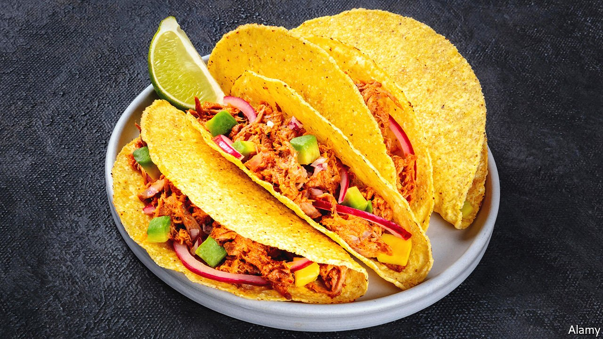

###### World in a dish

# In praise of mass-market American tacos 

##### Authenticity is a terrible metric for judging food 

 

> Apr 2nd 2022 

A CERTAIN TYPE of big-city eater—including, sometimes, the author of this column—reflexively assumes that noodles eaten at a restaurant without an English menu are, by definition, superior to those from a strip-mall outlet catering to non-Chinese diners. Such people are liable also to think that non-Italian ingredients have no place on a pizza, or that using Italian rather than Tunisian olive oil in couscous is a grave culinary sin.

A taco, these diners will explain (often without being asked), consists of paired soft tortillas, typically made of corn. These are wrapped around a modest amount of meat, usually braised, with a sprinkling of chopped raw onion, a couple of sprigs of coriander and a squirt of salsa—the spicier the better. Made well, these are indeed delicious, with an almost Japanese austerity that lets every ingredient shine and complement each other.


What innumerable Americans know as a taco—a hard-shell tortilla that comes in boxes on grocery shelves, stuffed to bursting with ground meat cooked in mass-market seasoning, topped with orangey mass-produced cheese, iceberg lettuce, tomatoes and mild salsa from a jar—bears little relation to this “real thing”. So, the authenticity-policing diners argue, it should be shunned and mocked.

This is a joyless way to eat. Chubby, crackly American tacos may be unknown in Culiacán or Toluca, but they taste good. They may well seem “inauthentic” in Mexico, but they are deeply authentic in the minds and memories of millions in America. Korean tacos—tortillas filled with Korean-seasoned barbecued meat and kimchi—are also little known in Mexico. But they emerged authentically from the marriage of Korean and Mexican cultures and cuisines in multicultural Los Angeles.

That is how food develops. Being the original progenitor of a recipe may merit some bragging rights at the dining table, but nothing more. Legend has it that Marco Polo brought noodles back to Italy from China: that does not make spaghetti just bastardised lamian, except in the way that all foods (and people) are hybrid and derivative. Lebanese emigrants brought lamb cooked upright on a rotating spit with them to Mexico. Decades and countless chillies, onions and pineapples later, Mexicans turned shawarma into tacos al pastor.

Judging dishes by their authenticity ignores the development that follows naturally as food and people migrate. It also encourages unwelcome stereotyping. In 2019 Sara Kay, a culinary consultant, studied 20,000 online reviews of restaurants in New York, and found “authentic” to be associated with “dirt floors [and] plastic stools” when describing non-European restaurants. For European eateries, it meant elegant decor.

That exemplifies the common but regrettable belief that non-European food should be cheap and served in tatty surroundings—even when the cuisines in question are intricate and delicious. In the end, whether someone considers a food authentic says more about their own biases than about what is on their plate. ■

