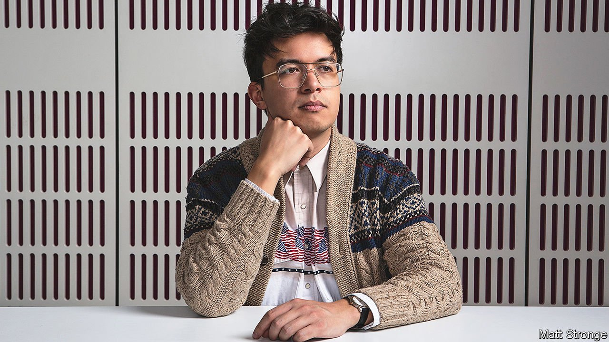

###### Stand-up comedy

# Phil Wang’s jokes are seriously funny 

##### The subtly daring comedian is having a moment 

 

> Apr 2nd 2022 

DURING HIS stand-up set at the London Palladium, Phil Wang explored his mixed heritage—his mother is British, his father is Chinese-Malaysian—his love of unusual delicacies and his enthusiasm for male contraception. He closed with some advice for these fractious and sensitive times: in particular, on how to gauge “whether or not it is morally acceptable to do another person’s accent”.

First and foremost, he argued, the speaker must put in the time and effort to make the impression convincing. Beyond that, any country that has had an empire—or was on the “naughty” side in the second world war—is fair game. This “gets you more accents than you think”: as well as many European ones, Chinese, Egyptian, Japanese, Russian and Turkish are permissible. Just the thought of such impersonations makes his left-leaning white friends queasy, he confided. Yet given their country’s vaulting ambitions, for the Chinese, at least, such neuroses are trivial, he insisted. After all, “the eagle does not concern itself with the impressions of the worm.”


Mr Wang is one of Britain’s sharpest and most surprising stand-up comedians, widely known for his observations on race and the legacy of colonialism. The set he performed at the Palladium and elsewhere on his recent tour, called “Philly Philly Wang Wang”, was released on Netflix last year; he embarks on his first American tour, with fresh material, this month. His new memoir, “Sidesplitter: How To Be From Two Worlds At Once”, includes incisive essays on language, cultural assimilation and dating. Meanwhile “BudPod”, a podcast co-hosted with Pierre Novellie, a fellow comedian, has exceeded 2m downloads since its debut in 2019.

His life and career are an accident of history, both grand and intimate. Britain controlled parts of the Malay peninsula between the 18th and mid-20th centuries; it was exerting a softer kind of power by the time Mr Wang’s mother, an anthropologist, joined the Voluntary Service Overseas. She was posted to northern Borneo where she met Mr Wang’s father, a martial-arts teacher. The comedian was born in 1990 in Stoke-on-Trent in central England, but his family returned to Malaysia soon afterwards. In his book he interweaves their story with that of Kota Kinabalu, the city in which he grew up, and his attitude towards his own identity. “For an enterprise so heavily associated with death,” he writes, “I ironically owe the British Empire my life.”

He acknowledges a debt to British comedy, too. From a young age he watched shows like “Blackadder” and “French and Saunders” (while admiring Harith Iskander, the “godfather of stand-up comedy in Malaysia”). Comedy was a safe haven during tough years at a Chinese school, where there was a “constant threat of physical pain” from corporal punishment. This period shaped his career in another way. “I became really introverted and quite afraid of speaking out,” he says, leaning back and closing his eyes, as if recoiling from the memory. “Then finding stand-up, it was this form of communication that I thought I could do. I felt I could earn the right to speak by writing something funny.”

Moving back to Britain in his teens, Mr Wang took part in his first comedy night at school. Most of the material was borrowed: “I didn’t realise at the time you had to write your own jokes.” He went on to Cambridge University, which had a thriving comedy scene, and became president of the Footlights, an incubator of entertainment greats including Eric Idle and Hugh Laurie. In 2010 he won the prestigious Chortle Student Comedy Awards. Steve Bennett, editor of Chortle, a comedy website, recalls his cool delivery, self-deprecating jokes and “intricate, detached wordplay”.

That accolade helped Mr Wang make comedy a full-time job. He has since appeared on assorted television and radio programmes and, alongside his stand-up gigs, performed with a sketch group called Daphne. He has encountered bigots as well as fans. In one painful passage in “Side splitter”, he describes how a woman in the audience once loudly announced that he was unattractive because of his ethnicity. The incident confirmed his comic vocation, he says, making him even surer “that British society would benefit from an outspoken East Asian making jokes about himself from a place of authority”.

Mr Novellie, his collaborator on “BudPod”, likens Mr Wang’s ability to take on subjects such as race to that of American counterparts such as Dave Chapelle. As well as their joint interest in history, films, games and scatological mishaps, Mr Novellie—who was born in South Africa and brought up on the Isle of Man—suggests he and Mr Wang share an “outside perspective”. That means that when they discuss subjects like the Elgin Marbles, ancient Greek sculptures currently held in the British Museum, they are not constrained by the sense of national embarrassment that many of their liberal peers exude.

For his part, Mr Wang denies that comedy has a political duty. He says he mostly strives to entertain, encourage listeners to take themselves less seriously and point out jarring truths—such as, in his bit about impressions, Chinese people being considered a “very vulnerable minority” in Britain while also being linked to a “globally very powerful” country. Yet, intentionally or otherwise, he is a subtle champion of nuance and balance.

He uses the set-ups of jokes, and the sudden switch of a punchline, to undermine preconceptions about people and places. Perhaps, he says, the gags would come easier if he were more polemical. “It’s much more funny to have a really strong opinion about something and scream about it, than it is to say: ‘But let’s look at this from the other perspective’,” he concedes. “But I don’t. I can’t.” ■

