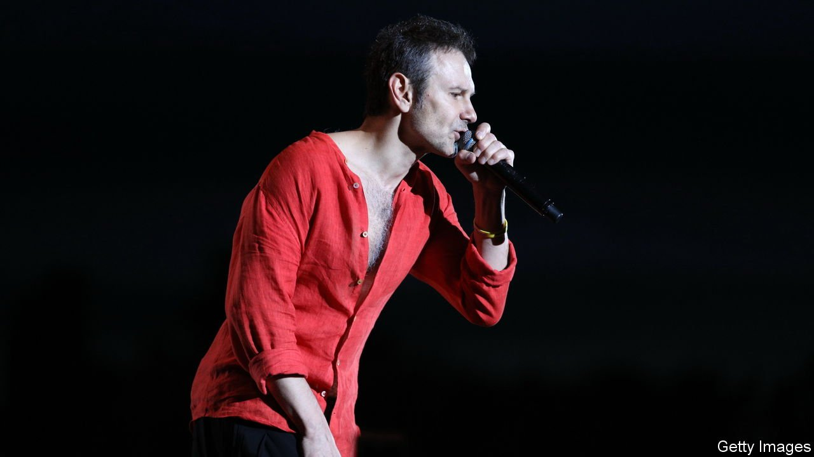

###### Back Story

# Ukraine’s most famous rock star is singing for victory 

##### For Slava Vakarchuk, rock‘n’roll is warfare by other means 

 

> Apr 2nd 2022 

A LITTLE GIRL sings “Let It Go” in a bomb shelter. A cellist plays alone in a ruined city. The chorus of the Odessa opera performs Verdi in the open air. The clips of Ukrainians making music in adversity are among the war’s most poignant: the melodies seem at once ephemeral and indomitable, ordinary and defiant. In one video, a stubbly man in a hoodie sings for an entranced crowd taking shelter in Kharkiv’s metro. Gradually the listeners join in, as if in a rite.

The figure with the gravelly, soulful voice is Sviatoslav Vakarchuk, known as Slava, the frontman of Okean Elzy (Ocean of Elza), Ukraine’s most popular rock band, which he co-founded in 1994. “Sometimes I sing,” he says of the visits he is making to hospitals, wounded soldiers and refugee centres from Kharkiv to Lviv. Sometimes he just talks. Some onlookers are fans, others simply buoyed by seeing a celebrity—Mr Vakarchuk is the Ukrainian equivalent of Bono or Bruce Springsteen—in a dangerous place.


He is one of the many Ukrainian actors, musicians and dancers to have joined the war effort. Several have been wounded or killed. He doesn’t consider himself a hero: “I’m not Mel Gibson in ‘Braveheart’.” Everyone knows fear, he says, but you do what you can “to make the victory closer”. In his case, signing up to the army has let him criss-cross his embattled country with his guitar.

Mr Vakarchuk is not a regular soldier, but nor is he a regular rock star. He has a PhD in theoretical physics. In 2005 he won the jackpot on Ukraine’s version of “Who Wants to be a Millionaire?” and donated the prize to orphanages. He has done stints at Stanford and Yale, and two as an MP, on the second occasion launching his own party, both times surmising that parliament was not for him.

Rock’n’roll has often been politics by other means. During the Orange revolution of 2004, when protests overturned a rigged election, Okean Elzy played sets on Independence Square to keep morale and the numbers up. “Rise up, my darling!” Mr Vakarchuk sang, bouncing on the stage as a gentle snow fell. “Your land is waiting.” That track rose up again during the revolution of 2013-14, along with “Without a Fight”, a love song repurposed as a resistance tune. Off-stage he strove to halt the ensuing violence. Escalating tragically from peaceful to bloodstained uprisings, then to this invasion, these three events—in all of which Mr Vakarchuk has played a role—are, he reckons, part of a single struggle for independence.

These days the Okean Elzy song people most want to hear is, consolingly, “Everything Will Be Alright”. But a hit of 2015 that decried the Kremlin-backed conflict in the Donbas, “Not Your War”, is in demand too. How many more children, it asks, will you lose in someone else’s war? The tendency of his lyrics to chime with current events has led some to take him for “an oracle”, Mr Vakarchuk says. Perhaps it’s a gift, he speculates, or a coincidence, or just a form of wishful thinking.

For Ukrainians, after all, artists have always carried a special burden. For generations, their sense of nationhood rested more on bards—above all Taras Shevchenko, a revered 19th-century poet—than on politicians. Misrule since independence in 1991 has meant stars like Mr Vakarchuk have again embodied the country’s yearnings. “Culture is the best cement” while a true political nation is evolving, he comments, but afterwards symbolic figureheads are no longer needed. Artists can just be artists.

Amid the agony, the war is accelerating that process, rallying Ukrainians around the values of “dignity and freedom”, as he puts it. As for the aggressor: in the past Okean Elzy played in arenas and stadiums in Russia, hoping to improve relations and showcase Ukraine’s culture. But it stopped going after Crimea was annexed, resolving not to return until “there is a new Russia and our territory comes back”. Now things are grimly “black and white”, and Russians who back their murderous army, or keep silent, have become “our enemy”.

Music is part of war—national anthems, marching songs, battle hymns, ballads of loss and longing—yet also its opposite, as creation is to destruction. There is never much time for songwriting on the road, Mr Vakarchuk says, let alone on his emergency solo tour. But he has written a poem: “Where have you come from, my hatred?” He has never hated anyone before and hopes the feeling will pass when the war is won. And he has made a recording, a cover of “You Are So Beautiful”, accompanying himself on the piano. “The beautiful woman I am singing to”, he says, “is Ukraine.”

