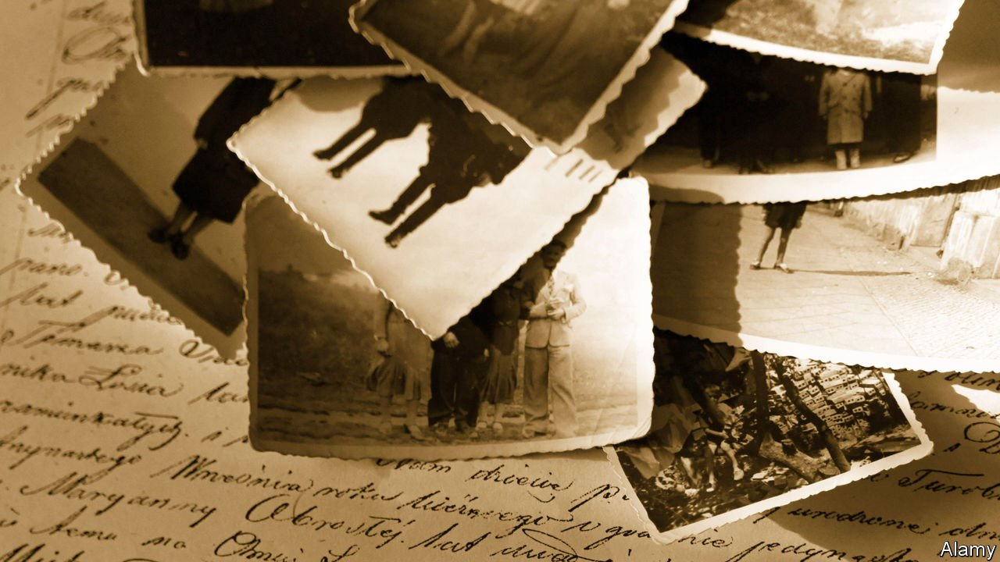

###### Sins of the forefathers

# What do people inherit from their ancestors? 

##### Asks Maud Newton in “Ancestor Trouble” 

 

> Apr 2nd 2022 

Ancestor Trouble. By Maud Newton. Random House; 324 pages; $28.99

NEARLY ONE in seven American adults are curious enough about their forebears to have tested their DNA, according to the Pew Research Centre, a think-tank. Maud Newton is one of them—but as well as spitting into a tube she spent years digging into her ancestry, researching not just her lineage but everything from the science of genetics to traditional “ancestor veneration”. This “ancestor obsession”, she writes in her first book, sprang from worry about what she might have inherited from her troubled family.


Unpalatable behaviour among her relations includes homicide by hay hook, Bible-thumping mania, mental illness and a grandfather who was married ten times. Ms Newton’s own conception was “a home-grown eugenics project”, she reports. Her parents “married not for love but because they believed they would have smart children together”. If, as Tolstoy famously remarked, every unhappy family is unhappy in its own way, Ms Newton’s clan is a knockout.

Such wild material can make for compelling memoir. Yet Ms Newton has broader ambitions. Her book is stuffed with detailed forays into biology, anthropology and intergenerational trauma, as well as ancient and modern stories. No stone is left unturned as she seeks to discover what her nutty ancestors might have handed down. Readers new to genealogy will find it a useful introduction; to others it may feel like an overfull carpet-bag.

Still, her desire to know where she comes from is widely shared. The preoccupation with “roots” has been burgeoning in America since 1977, when Alex Haley’s television programme of that name was first broadcast. People whose presence on the continent is due to colonisation, enslavement and migration tend to be hazier on their ancestry than citizens of longer settled countries. For many Americans, the internet changed that. Millions of people now pore over family trees; ancestral sleuthing is big business, including the use of DNA databases to identify criminals.

Much of this was made possible by the Mormons. Among the fascinating titbits Ms Newton relates is the fact that the Church of Jesus Christ of Latter-day Saints “requires members to routinely produce names of dead relatives for posthumous baptism”. Thus was born the vast genealogical database that it keeps in a vault in a Utah mountain. Such registries, though popular, are imprecise, and can suck in people who never asked to be included. In particular, DNA databases lend themselves to abuses such as racial profiling (as in the creation of facial “mugshots” that are extrapolated from DNA evidence).

For all that research, though, “the nature-nurture puzzle of personality” remains unsolved. Epigenetics, the study of the interplay between genes and their expression, is still in its infancy, Ms Newton notes. At bottom, this is what she most wants to understand. Are her bouts of depression, irrationality and self-harm—and her creativity—in some sense inherited? Psychotherapy seems not to have supplied an answer. Ultimately she finds relief in connecting with those troublesome predecessors through an alternative approach called “ancestral lineage healing”.

Her most compelling chapters detail a whole set of “monstrous bequests” handed down to this white daughter of the American South. On one side, an ancestor robbed and probably murdered Native Americans. On the other, successive generations of plantation owners in the Mississippi Delta enslaved scores of African-Americans. Her estranged father’s parents were “openly, unremittingly—‘jubilantly’ would not be too strong a word—racist.”

It is a toxic inheritance, to which Ms Newton returns again and again, asking whether and how descendants today can atone for their ancestors’ sins. At a moment of reckoning over America’s violent history, her book is a salutary call for an “acknowledgment genealogy” of the harms that are hidden in many family trees. ■

