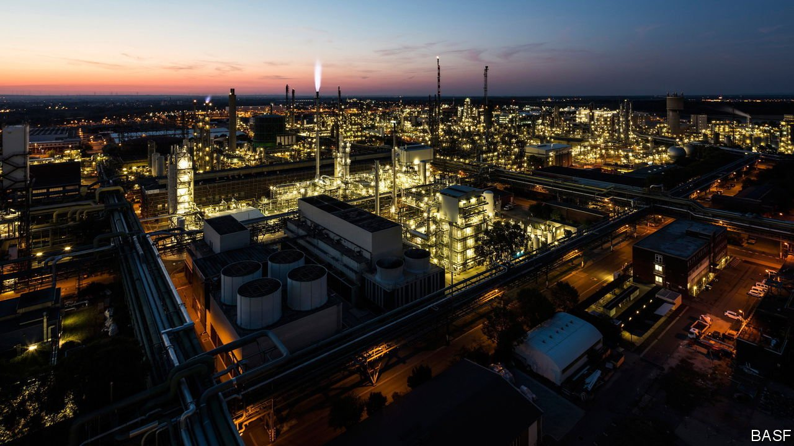
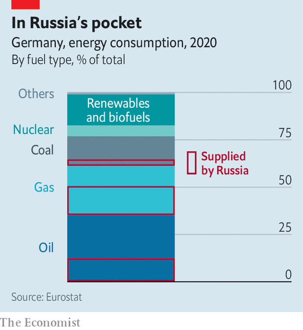

###### Energy dependence

# Can Germany cope without Russian gas? 

##### The government and economists disagree 

 

> Apr 2nd 2022 

OLAF SCHOLZ reacted on March 27th with unusually harsh words to a question by Anne Will, a popular Sunday talk-show host, about studies by economists that suggest an immediate stop of imports of Russian energy would reduce German economic growth by only a modest amount. “Their view is wrong,” said Mr Scholz, adding that it was “irresponsible” to feed numbers into mathematical models to arrive at this conclusion.

For several weeks prominent economists have argued passionately among themselves and with Mr Scholz’s ministers about the possible consequences of banning Russian energy. The government, as well as industrial lobby groups and think-tanks close either to it or to trade unions, argue that a ban would lead to high unemployment, mass poverty and a recession. But some independent economists, as well as a number of opposition politicians, insist that the consequences would be manageable, if substantial.


The debate may yet become moot. On March 30th Robert Habeck, Germany’s minister for economy and climate, activated the first stage of an emergency plan to manage gas supplies in case Russia turns off the tap. Russia is threatening to do so because Germany and the rest of the G7 are refusing to accept its demand that “unfriendly” countries pay for gas in roubles rather than euros or dollars, which sanctions have made it hard for Russia to use.

 


But if the gas keeps flowing, so will the debate about the morality of buying it. Germany has been importing around €1.8bn ($2bn)-worth of Russian gas, oil and coal a month, thereby helping to finance Vladimir Putin’s war in Ukraine. Mr Scholz says stopping that would hurt Germany more than Russia, even though other European governments have called for an embargo. This week the IMK, a think-tank close to Germany’s trade unions, published a study that backs the government’s gloomy assessment. It says halting energy imports from Russia would cause a deep recession, with GDP shrinking by more than 6% even if alternative suppliers could make up for half of the gas supplied by Russia. These are rough estimates. “It is impossible to model a stop of gas imports seriously,” cautions Sebastian Dullien of the IMK.

The IMK finds itself in rare agreement with industrial lobbies such as the BDI, the association of German industry. In early March, Siegfried Russwurm, the BDI’s boss, warned that talk about an EU embargo on Russian energy is “playing with fire” and would harm the EU more than the aggressor. BASF, a German chemicals giant, said that if its gas supply is halved it will need to halt production at the world’s biggest chemicals plant in Ludwigshafen, which employs around 40,000 people. Hundreds of thousands of related jobs would be in danger. Martin Brudermüller, the boss of BASF, told investors on March 26th, “There is no way Russian gas can be replaced in the short term.”

These pessimistic assessments are contradicted by the German Institute for Economic Research (DIW); a working paper co-written by a group of German and international economists and published by IFO, another research outfit; and ECONtribute, an economics research group involving the universities of Bonn and Cologne. These suggest that German GDP would take a hit of up to 3% if imports of Russian energy were to cease immediately. That is substantially less than the 4.5% decline of German GDP in 2020, the first year of the covid-19 pandemic, which Germany stoically managed to weather.

“The big problem is gas,” says Moritz Schularick, one of the authors of the paper. The loss of Russian oil and coal could be managed relatively easily, since they can be replaced by imports from other countries. But Germany gets roughly half its gas from Russia. An increase in gas imports from other countries, the substitution of electricity from coal or nuclear power for the gas-fired sort and a steady refilling of storage facilities over the summer could only make up for 70% of that, he reckons.

The central question is how German industry would cope. Everyone agrees that finding quick substitutes for gas in industrial processes is a daunting task. Yet Benjamin Moll, one of the other authors of the paper, notes that during the second world war the American economy showed an astonishing ability to adapt to similar shortages. When in 1940 America’s president, Franklin Roosevelt, demanded that American firms produce 50,000 fighter planes a year, economists deemed his request insane, because yearly aircraft production for the military in 1939 was fewer than 3,000. By the end of the war America was producing 300,000 fighters annually.

In an interview with Welt am Sonntag, a weekly newspaper, Wolfgang Schäuble, a former finance minister, argues that people sometimes have to make substantial sacrifices for their way of life and their freedoms. Moreover, prolonging the war in Ukraine is also costly for European economies. “There are lots of hidden costs because of the uncertainty,” says Luis Garicano, a Spanish member of the European Parliament, who backs an immediate EU energy embargo. Mr Garicano fears that such an embargo will only happen after Russia further escalates its brutal war. “We should not wait for that,” he says. ■

