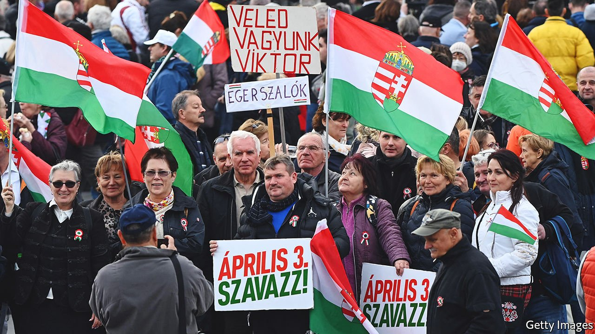
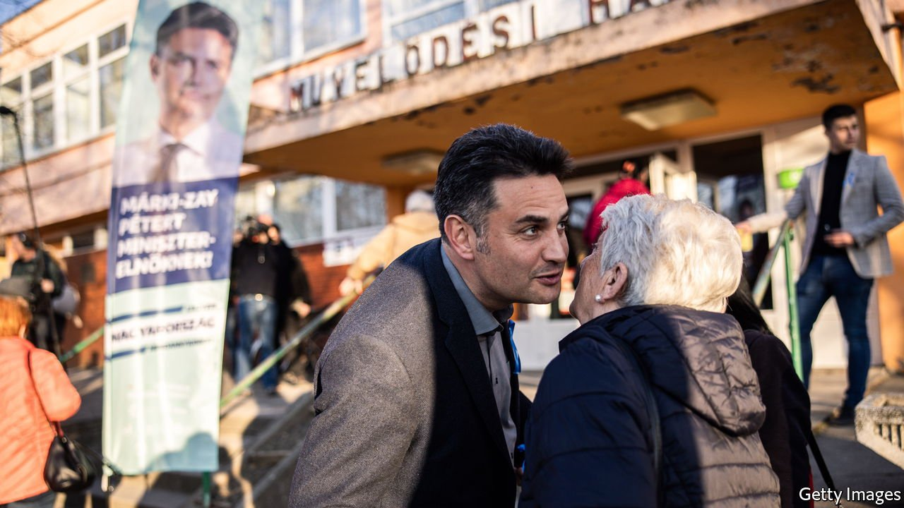
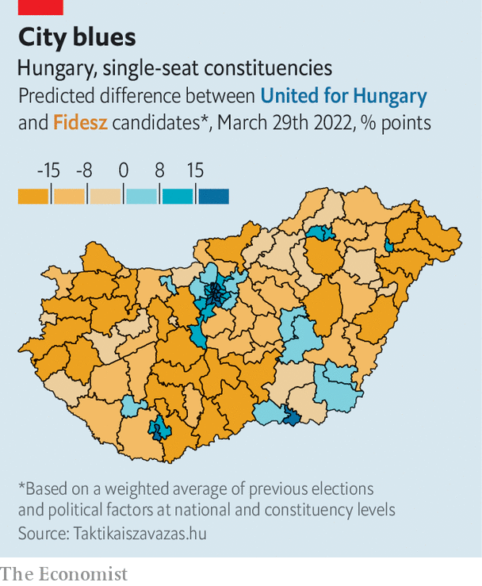
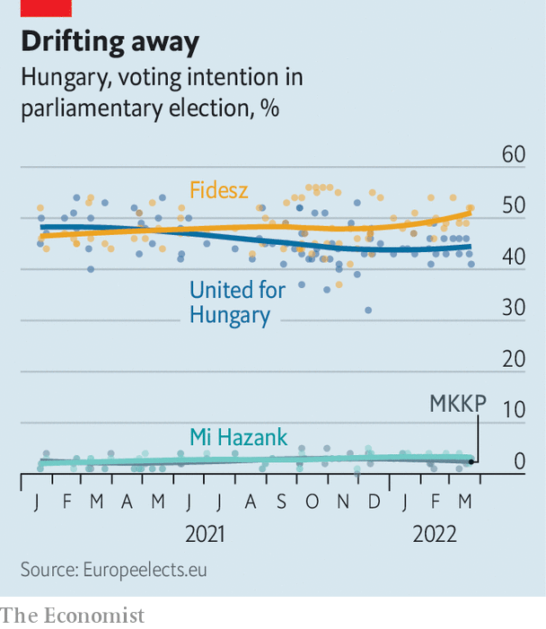

###### Last-ditch pitch

# Hungary’s opposition struggles to beat Viktor Orban’s stealth autocracy 

##### The populist prime minister has subverted nearly every institution that matters 

 

> Apr 2nd 2022 

THE RALLY stretched half a kilometre along the Danube, past Budapest’s Technical University where in 1956 students launched a doomed rebellion against their communist overlords. It was March 15th, the day Hungary commemorates its revolution of 1848. On the stage Peter Marki-Zay, the opposition candidate for prime minister, was invoking history. In 1848, 1956 and 1989, when the communists were finally ousted, Hungarians had been “on the right side”, he said. Now they were embarrassed by their country, which had become the fief of one man: Viktor Orban.

In 12 years as prime minister Mr Orban had split the nation and enriched only his own supporters. He had turned Hungary towards Russia and autocracy, and away from Europe and the rule of law. Mr Marki-Zay promised support for the EU and NATO in Ukraine, inclusion for gay people and an economy based on merit rather than political connections. Hungarian, Ukrainian, EU and rainbow flags waved in the crowd.


Across the river Mr Orban was addressing a far bigger throng with a very different message. The annual government-sponsored “Peace March” had been turned into a rally for the ruling party, Fidesz. “It is not in our interests to become casualties in someone else’s war,” Mr Orban said. Ukraine’s refugees deserved help (something he did not say about migrants from Syria in 2014-15), but he would not let arms be transferred through Hungary or accept sanctions on Russian energy that hurt its economy. The opposition would drag Hungary into the war, in which it would be a mere pawn on the chessboard of America and Russia. He would stay out—and stop “gender madness” too. Here the flags were of Hungary or Fidesz; the few blue-and-yellow ones were not Ukrainian, but the banner of Romania’s ethnic Hungarians.

Hungary’s election on April 3rd is more than a routine vote in a small central-European country. Because Mr Orban is a hero to many right-wing populists in Europe and America, it is a crucial test for them. The war in Ukraine adds an extra dimension. The Hungarian leader has long-established ties to Vladimir Putin, and has emerged as the most reluctant member of the coalition against him. Volodymyr Zelensky, Ukraine’s president, singled him out in a speech on March 24th to the European Council, demanding that he and Hungary “decide which side you are on”.

That casts the election as part of a global struggle between liberal democracy and populist autocracy. Hungary is still a democracy, but in his three consecutive terms Mr Orban has undermined democratic norms. The media, the courts, the education system and other institutions are largely controlled by Fidesz or by friendly oligarchs. In 2014 Mr Orban spoke of turning Hungary into an “illiberal state”. It has since become the only EU country rated by Freedom House, a watchdog, as only “partly free” rather than “free”.

Mr Orban’s allies see themselves as patriotic Christian conservatives, fighting an alliance of globalists who want to erase national traditions and swamp Europe with migrants. Their bêtes noires are the European Commission and George Soros, a Hungarian-born billionaire and liberal philanthropist. Mr Orban’s critics think his main goals are actually financial. His relatives and friends in business have become hugely wealthy; much EU aid ends up going to them. To its opponents Orbanism looks like Putinism-light: single-party rule without the need for violence.

The popularity of Mr Orban and Fidesz is genuine and striking. In the past two elections they have drawn about half the vote, while a fragmented opposition split the rest. That was enough to give Fidesz a two-thirds majority in parliament, because it had twisted the electoral system to its own advantage (see Graphic Detail).

A rule change in 2012 shrank parliament and raised the share of single-candidate districts, which naturally favour the biggest party, from 176 of 386 seats to 106 of 199. The rest are determined by proportional representation. It also gerrymandered those districts. In 2020 the government made things even tougher, requiring parties to run candidates in at least 71 districts to get on the proportional ballot.

 


Last year, fear of Mr Orban’s growing control finally made the opposition co-operate. Two centrist parties, Democratic Coalition and Momentum Movement, a hard-right party, Jobbik, the centre-left Socialists and the progressive Green and Dialogue parties have fielded a single list under the rubric United for Hungary. They ran primaries last October for each single-candidate seat and nationally for the job of prime minister. Mr Marki-Zay, an independent conservative who is mayor of a small city, came out on top.

Such cross-party alliances have unseated populist leaders in other countries, including Israel’s Binyamin Netanyahu and the Czech Republic’s Andrej Babis. Yet in Hungary Mr Marki-Zay’s chances are not good. Because of the mixed electoral system, The Economist calculates the opposition needs to win about 54% of the vote to get a majority in parliament. Polls show them trailing Fidesz by about 50% to 44%.

Message control

One reason is Mr Orban’s domination of the media. He has turned the country’s state-backed outlets into propaganda megaphones. Nearly all of the country’s big private news sources have been bought by oligarchs friendly to the government. Most were donated in 2018 to a foundation headed by an ally of Fidesz.

Of the plucky outfits that remained, several have since been throttled. Klub radio, a liberal station in Budapest, had its broadcast licence denied in 2020. Index.hu was the country’s most-visited news website until a new owner with links to Mr Orban took over in 2021 and fired its editor-in-chief. “I knew Index would eventually be captured, the only question was when,” says Viktoria Munk, who used to be deputy editor. The staff quit and founded a new outlet called Telex, but it has less than half the audience. Other independent websites are read mostly inside the liberal bubble.

 


Hence the opposition is struggling to be heard. The two main TV news channels, one public and one owned by a government ally, give opposition candidates less than a quarter the speaking time of those from Fidesz, according to Mertek, a media watchdog. Only RTL Klub, a popular foreign-owned channel, presents even-handed news coverage. For months before the election, roadsides were lined with placards of Mr Orban and his slogan “Forward, not back”. These were put up not by Fidesz but by the government. Other posters, some paid for by a murky foundation funded by state-owned companies, portrayed Mr Marki-Zay as the “mini-me” of Ferenc Gyurcsany, an unpopular former prime minister, or depicted the opposition candidates as a “Gyurcsany Show”. (The Democratic Coalition’s entry in the primary was Klara Dobrev, Mr Gyurcsany’s wife.)

That leaves social media and “knocking on doors”, says Anna Donath, an opposition MEP. Yet during the primary Fidesz’s social-media spending outweighed the combined budgets of all opposition candidates. Campaign spending limits kicked in on February 12th, and since then the two sides have spent roughly the same amount on advertising. But lots of Facebook ads have been bought by a sketchy new party created in December by the wealthy Hungarian owner of LiveJasmin, a pornography website. The opposition thinks it is a decoy intended to divide the anti-Fidesz vote.

 


Fidesz makes use of every conceivable government resource for the campaign. In January people who had registered for vaccinations against covid-19 began receiving pro-government emails. A national referendum has been scheduled on the same day as the election. It asks questions like “Do you support the unrestricted exposure of underage children to sexually explicit media content that may affect their development?”—falsely insinuating that the opposition does.

In poor rural areas, officials are told that if their municipality does not vote for Fidesz there will be no government jobs. After Budapest had the temerity to elect Gergely Karacsony of the Dialogue party as mayor in 2019, the national government slashed a local tax on businesses, depriving the city of about 20% of its budget, and vetoed a loan from the European Investment Bank to upgrade its trams. Mr Orban wants “to squeeze the city, and then portray the mayor as incompetent,” says David Koranyi, an adviser to Mr Karacsony.

The voting rules are biased, too. Mr Orban gave ethnic Hungarians in neighbouring countries the right to vote, along with pensions and other benefits; so most vote for Fidesz. They can vote by post, whereas émigrés (who tend to vote for the opposition) must travel to consulates. There are some concerns about secret balloting and counting votes. But a civil-society group has trained more than 20,000 vote-watchers, enough for the opposition to send two to every precinct in the country.

Some tricks are just old-fashioned politics. The government has raised the minimum wage by 20% and paid an unexpected 13th month of pension benefits. Last year Mr Orban eliminated income tax for under-25s, and this year he gave a rebate to every family with children up to the amount paid by an average worker. Zoltan Kovacs, the government’s spokesman, says it wants to reward families and thus raise the birth rate. But like much Hungarian tax policy, the freebies reward the middle class more than the poor, notes Daniel Prinz of the Institute for Fiscal Studies.

The handouts will also accelerate inflation, which is projected to hit 9% this year, says Peter Virovacz of ING Bank. The government has capped the prices of basic foods and fuel, leading to shortages at petrol stations. Economic growth is strong, though the war in Ukraine has cut forecasts for this year to perhaps 4.5%. Unemployment is a scant 3.8%. The next government, though, will probably need to make unpleasant cuts.

The economy is Mr Orban’s justification for resisting energy sanctions on Russia. In February he travelled to Moscow and extended a long-term gas contract with Gazprom. The terms are secret, but Mr Orban says they are very beneficial. Responding to Mr Zelensky’s criticism, he claimed that without Russian gas and oil Hungary’s economy would “grind to a halt”. (The country’s dependency on Russian energy is high, but not unusually so for central Europe.) In 2014 Mr Orban struck a deal with Rosatom to upgrade Hungary’s nuclear power plant that entails billions of dollars in Russian loans.

For some of its troubles the opposition has itself to blame. It has not found a central theme to hammer away at. The party leaders have campaigned like “six dwarves”, says Gabor Toka, a political scientist. Mr Marki-Zay is more right-wing than most of his alliance, and is prone to odd lines of attack, such as unconvincingly charging the government with sending arms to Ukraine. (NATO planes based in Hungary are carrying out deliveries, but only between other countries.)

That partly reflects the coalition’s breadth. Dialogue is an urban party that strongly supports gay rights. Jobbik is a rural nationalist party that used to engage in anti-Roma racism. The lack of conflict between such parties during the campaign is striking. Opposition voters, too, seem willing to set aside ideology. “I am economically more free-market, but that doesn’t matter now. The point is to get democracy back,” said Ben Tordai, a student at the rally on March 15th.

For all Mr Orban’s rhetoric about energy prices, his policy on Ukraine reflects a philosophical difference from other Europeans. “Hungary is a country in the buffer zone” between Russia and the West, says Zoltan Kiszelly of the Szazadveg Foundation, a pro-government think-tank. “We fought four wars with Russia and lost all of them. We don’t want to try for a fifth. The Poles had a much worse history, but they want to try one more time.”

This position is starting to hurt Hungary. Mr Orban was once seen as a leader of a group of populist governments across central Europe. Poland is a close ally: its Law and Justice party has imitated Mr Orban by trying to take over its courts and media. The EU is imposing penalties on both for eroding the rule of law. They rely on each other’s vetoes to quash further sanctions. But Law and Justice is vociferously anti-Putin. On March 26th Andrzej Duda, Poland’s president, said Mr Orban’s policy would “cost Hungarians a lot”. Poland and the Czech Republic later cancelled a visit by their defence ministers to Budapest.

Yet Hungary’s opposition is having trouble convincing voters this matters, or getting them angry about the corruption at the heart of Mr Orban’s government. As in Mr Putin’s regime, the list of rich Hungarians is filled with Mr Orban’s friends. A former schoolmate is now the richest man in the country. A huge mansion is under construction outside Budapest for Mr Orban’s father. EU funds and state business flow to Fidesz’s backers, who use the money in part to keep the party in power.

For many in the opposition this year’s united effort seemed the last and best chance to stop Mr Orban from locking up power. Should it fail, the way ahead is not clear. Ms Dobrev says the EU should deny Hungary aid while it defies the rule of law. After Mr Putin’s invasion, Europe should have no more illusions, she says: “The way from illiberalism to dictatorship is a one-way road, it’s a dead-end road, and it ends with catastrophe.” ■

