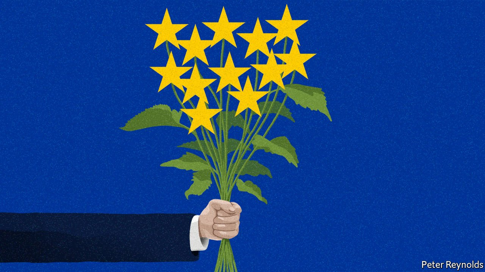

###### Charlemagne

# It will take years for Ukraine to become an EU member 

##### Better start working on it now 

 

> Apr 2nd 2022 

BEING A MEMBER of the European Union is, like marriage, a binary thing: either you are or you are not. Unlike marriage, little romance is involved in getting there. Ukraine got a taste of this in 2013 when it negotiated an “association agreement” with the bloc, a deal to keep both sides sweet while they mulled a closer union. The document came in at 2,135 pages. It included 44 uses of the term inter alia and 12 mutatis mutandises. One annexe sets out the quality of paper (“not less than 25 g/m”) and size (“210 × 297mm; a tolerance of up to minus 5mm or plus 8mm in the length may be allowed”) to be used in certain official correspondence. Even by the standards of pre-nups, it was charmless.

So firm has Ukraine’s belief been that its future lies within the European family of nations that such soullessness did not cool its ardour. In 2019 its aspiration to become a member of the EU was enshrined in its constitution. War has further fanned the flames of attraction, at least in one direction. Within a week of Russia invading on February 24th President Volodymyr Zelensky called for a shotgun wedding under a “fast-track” accession procedure. Europe, in full mutatis mutandis mode, has made clear that there is no such thing and rules are rules. These stipulate that aspirant members must adopt decades-worth of EU edicts on everything from how food is labelled to how banks are regulated. Even that only results in EU membership for those countries the club has committed itself to. Ukraine is not among them.


Europe needs to let go of the ablative absolutes and allow its romantic side to shine through. Yes, the EU has rules and these matter: how else could a marriage of French officiousness and Germanic efficiency have endured for six decades? And indeed Ukraine is not going to meet the accession criteria for several years yet. Nobody thinks it should become the EU’s 28th member immediately—not even Mr Zelensky, probably. But Ukraine craves a commitment that, if it carries out the necessary reforms over the coming years, it will be allowed to become a member of the club. To this Europe should say: “I will.”

Such a decision is principally one for national governments, all 27 of which need to agree on matters relating to enlargement. Plenty want at least to give Ukraine a “European perspective”, Euro-speak for starting the process of enlargement informally. The eastern European states would like for it to be officially considered a candidate for membership, a step further in the complex accession process. Reluctance from old-timers such as the Netherlands and Denmark, as well as lukewarm French support, mean the EU thus far is only agreeing to “support Ukraine in pursuing its European path”, which is diplomatic lingo for nothing. The European Commission has been asked to produce a report, a time-honoured stalling tactic.

Ukraine’s misfortune—beyond sharing a border with Vladimir Putin’s Russia—is to have brought up the question of EU membership at a time when enlargement fatigue reigns. No new member has been let in since Croatia in 2013. A handful of accession applications from the western Balkans are essentially frozen. That is in part because governments in countries from previous waves of accession, notably Poland and Hungary, have not lived up to their commitments on corruption and the rule of law. Diplomats from founding countries of the EU mutter that they would be keener to divorce existing member states than tie the knot with new ones.

Ukraine is different. Becoming an EU member is a milestone for any country. But it would have special resonance in this case. Mr Putin, desperate to stop Ukraine from slipping out of Russia’s sphere of influence, derailed the signing of that association agreement in 2013. The ensuing Maidan protests in Kyiv featured a sea of demonstrators waving EU flags with more ardour than is ever seen inside the bloc. Dozens were shot and killed for it before a thuggish Kremlin-backed Ukrainian president fled to Russia. The EU deal was ratified in 2014. By then, Russia had annexed Crimea and invaded eastern Ukraine, a prelude to the current war.

Amor vincit omnia

Several arguments are made against giving Ukraine even informal assurances of future EU membership. Emmanuel Macron of France says one could hardly open talks about accession with a country at war. That is beside the point, as what Ukraine really wants is a promise that once hostilities cease it can start jumping through the required hoops—a process that took ten years for Croatia, and would take longer for a country needing reconstruction to boot. Mark Rutte, the Dutch prime minister, argues that immediate ways of helping Ukraine, such as supplying it with arms or imposing sanctions on Russia, matter more than long-term aspirations. Yet as Benjamin Tallis of the Hertie School in Berlin points out, the issue of EU accession is important enough for Mr Zelensky, a man with rather a lot going on, to keep bringing it up.

Some argue that any signal that Ukraine will one day join the EU might provoke Russia. Into doing what that it is not already doing, exactly? Others say it would complicate peace talks. Again, Mr Zelensky probably knows best when it comes to Ukraine’s national interest. Is there not a collective defence mechanism in the EU that would tie existing member states to Ukraine? In truth that carries little weight. Bending the rules and giving Ukraine a status other countries have earned through years of reforms would ruffle Balkan feathers. That is true, but manageable.

Much would need to go right for Ukraine to join the EU. It needs to fend off Russia, find a suitable peace then improve what until the war began had been a distinctly patchy record of reforms. If it pulls all of that off, letting a Europe-minded Ukraine into the club would not be a favour to Kyiv, as some stuffier member states seem to think, but a boon to the EU, too. As things stand European leaders are thinking with their heads, as bureaucrats are wont to do. But a union—any union—is a thing of the heart, too. ■

Read more from Charlemagne, our columnist on European politics:

 (Mar 26th) 

 (Mar 12th)

 (Mar 5th)

