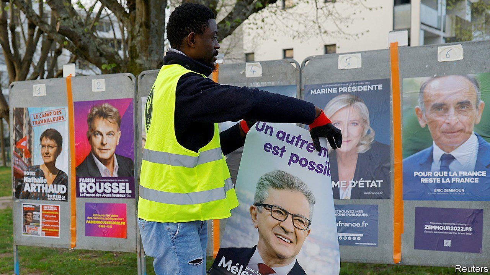
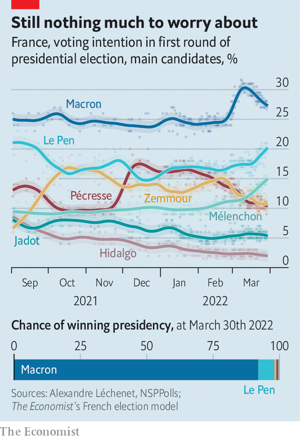

###### France’s elections

# Macron still leads a tightening presidential race 

##### He may need to show he is ready for a match 

 

> Apr 2nd 2022 

“I WANT IT to be less like a rally,” declares Emmanuel Macron in an electoral clip, as he strolls around the empty indoor arena west of Paris in an overcoat and scarf, scouting out the venue: “I want something more like a sporting event.” On April 2nd, a mere eight days before the first round of voting in France’s two-round presidential election, the sitting president will finally hold his first election rally. He might need to take his gloves off at last. He is still the firm favourite. But the race is tightening in the final stretch. And a narrow second-round victory could spell trouble for a second-term president later on.

The average gap between Mr Macron and his nearest rival, the nationalist-populist Marine Le Pen, has narrowed from 13 points on March 15th to seven points two weeks later, according to The Economist’s poll of polls. On March 29th  still gave Mr Macron an 89% chance of re-election, and only a one-in-ten chance to Ms Le Pen. But two new polls suggest that, if the pair meet in the run-off as they did in 2017, his victory over her could be as narrow as 53% to 47%.


As Russia’s war against Ukraine drags on, the poll bump that Mr Macron enjoyed from being at the centre of diplomatic efforts to end it has begun to wear off. The French still seem to credit their president for trying, despite his lack of success. But they are now worried about the effects of the war on their wallets. Moreover, the initial damage suffered by three rival contenders—Ms Le Pen, the far-right Eric Zemmour and the far-left Jean-Luc Mélenchon—owing to their past sympathy for Vladimir Putin seems to have had a lasting impact only on Mr Zemmour. Indeed Mr Mélenchon, a wise-cracking anti-NATO firebrand who is against arming Ukraine, has crept up in the polls. With fully six candidates on the left, including a Communist and two Trotskyists, the sprightly 70-year-old is the tactical choice for leftist voters.

 


Furthermore, Mr Macron is now saying things that the French do not much care to hear. During the pandemic, he focused on spending “whatever it costs” to protect people and jobs. On March 17th he laid out his plans for a second term. Unlike his manifesto brochure in 2017, which was filled with smiling faces and exclamation marks, this year’s displays sombre images and refers to the “brutal return of the tragic in history”. Mr Macron promises, among other things, to raise the pension age from 62 years to 65; to oblige beneficiaries of basic benefits to enrol in training or work; and to pay teachers more only if they take on more tasks. Mr Mélenchon offers a more appealing alternative: “Retirement at 65 with Macron, 60 with me.”

Charges that Mr Macron represents a cosy business elite have also resurfaced, after a report found the government spent €894m ($1bn) on private consulting firms in 2021. This is in line with other countries, but seen as an affront in statist France.

Ms Le Pen, meanwhile, has campaigned deftly. On March 29th our model gave her an 84% chance of making it to the run-off. She has taken her promises to cut taxes on motor fuel and ease the cost of living to la France profonde, leaving ranting about immigration to Mr Zemmour. At a time when old fears about migrants and Islamism have given way to support for refugees fleeing Ukraine, his diatribes have jarred. At an outdoor rally in Paris on March 27th, before a crowd waving French flags, his supporters chanted “This is our home!”, an old far-right mantra. At one point, during a passage on the victims of terrorism, they broke into: “Macron, murderer.”

In short, despite having 12 candidates to pick from, voters on April 24th may, as last time, see a run-off between Mr Macron and Ms Le Pen. Some are already saying that, should he defeat her again, it would be a victory “by default”. Mr Macron can hardly be blamed for the mediocrity of his opponents, nor the poor campaigns of the mainstream left and right. Yet muttering about illegitimacy has already begun. ■

For more coverage of the French election, visit our dedicated 

