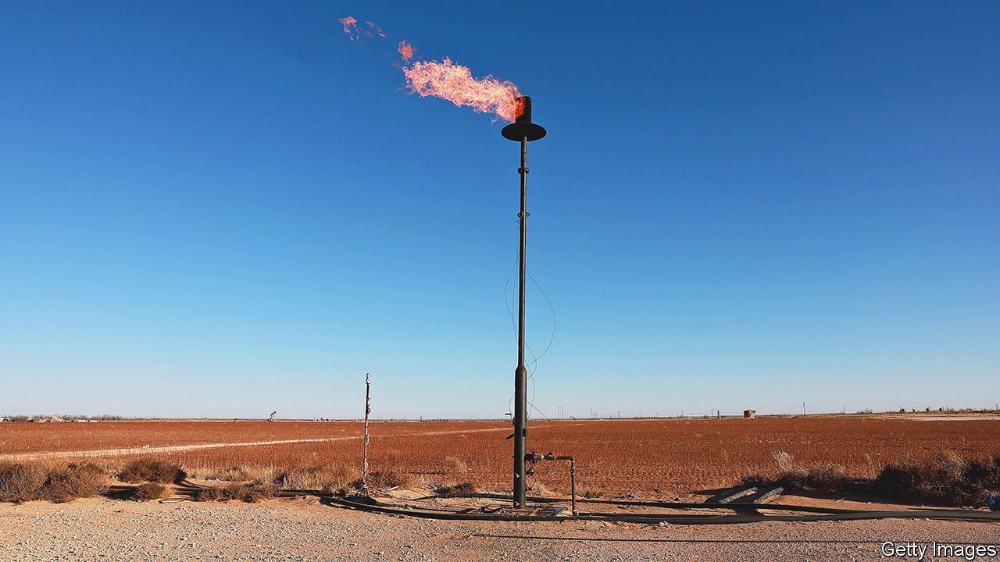

###### A little help from a friend

# America’s gas frackers limber up to save Europe 

##### There might be little they can do in the short term 

 

> Apr 2nd 2022 

“NO PAYMENT, NO gas”, growled a Russian government spokesman on March 29th. Angered by the West’s economic sanctions, President Vladimir Putin ordered that “unfriendly” countries must start paying for Russian natural gas in roubles, a demand that ministers from the G7 group of countries refused. Gas prices began to rise at the prospect that Mr Putin would turn off the taps. On March 30th Germany began bracing for the worst, taking its first step towards gas rationing. By the end of the day, however, the German government said it had received assurances that European firms would not have to make payments in roubles.

Even if an embargo has been averted, the latest confrontation surely strengthens Europe’s desire to relax Mr Putin’s grip on the economy. The EU has vowed to slash imports of natural gas from Russia, which made up some 40% of its consumption of the fuel last year, by two-thirds by the end of 2022. Ursula von der Leyen, the head of the European Commission, dreams that the EU can “get rid” of Russian imports entirely within a few years. Can America, one of the world’s largest natural-gas exporters, help fill the gap?


When the Trump administration tried to persuade European officials to reduce their reliance on Russian energy by implementing policies to import more liquefied natural gas (LNG) from America—which it dubbed “molecules of freedom”—the proposal was ridiculed. Yet President Joe Biden finds himself doing something very similar to his predecessor. On March 25th he and Ms von der Leyen announced a “groundbreaking” plan to help end the EU’s reliance on Russian gas. It calls for American help in securing an additional 15bn cubic metres of LNG for Europe this year (equal to roughly a tenth of total European imports of Russian gas in 2021). It also promises to “ensure additional EU market demand” for 50bn cubic metres per year of the fuel from America by 2030.

Industry insiders have greeted the ambitious plan with scepticism. One reason is that American gas companies face severe infrastructure constraints. The share of American exports going to Europe shot up from 4% in 2017 to almost 30% last year (equivalent to 22bn cubic metres), as prices soared on the continent. America “has almost 100% of its liquefaction capacity already in use”, reckons Rystad, a research firm, meaning that “there is no additional LNG to be exported” in the short term. Jack Fusco, boss of Cheniere, a big American energy company, confirms that his firm is “maxed out”. It would take four or five years and tens of billions of dollars in investment, not to mention the fast-tracking of regulatory approvals, to change that.

There are also questions about whether the EU has the infrastructure to cope with the imports. Receiving cargoes of LNG and converting them into usable natural gas requires big facilities for regasification. Europe has spare capacity, but much of it is on the coasts of western countries like Spain and France. Poor interconnections mean that these are not very useful in getting imports to eastern parts of the EU, where an embargo would hit hardest. Germany, which has no LNG terminals, has vowed to build two, but that will take several years. Some European countries talk of acquiring floating LNG terminals, which can be set up more quickly—but there is a severe global shortage of them.

Look to the longer term, though, and the new approach to natural gas shows more promise. That is because the EU appears ready to jettison its misguided hostility to long-term gas contracts, which it had discouraged as part of its effort to boost spot markets for gas. The intent had been to promote competition, but, as last winter’s rocketing gas prices revealed, it also left Europe badly exposed to a supply shock. As a top American LNG exporter explains, Europe focused on expanding the spot market when it should have secured “fantastic” long-term pricing instead.

Now the commission says it will encourage long-term contracts “to support final investment decisions on both LNG export and import infrastructure”. That should give investors in American export facilities the confidence to spend the billions required, boosting transatlantic trade. Giles Farrer of Wood Mackenzie, a consultancy, reckons that the infrastructure needed to achieve the aim of 50bn cubic metres of liquefaction capacity in America would cost roughly $25bn, not including upstream investments and supply-chain inflation. Rystad thinks the spending needed to meet Europe’s extra demand could be in the region of $35bn.

Diversification away from Russia in the long term, then, may be possible. But that does little to help with the short-term problem of an aggressive Mr Putin. A rational calculus suggests that he should be unwilling to turn off the taps, considering he profits handsomely from high prices. Energy Intelligence, an industry publisher, reckons Gazprom earned $20.5bn from European gas sales in the first two months of the year, nearly as much as it made from Europe in all of 2020. But few observers would dare to predict the actions of an increasingly erratic dictator. ■

For more expert analysis of the biggest stories in economics, business and markets, , our weekly newsletter.

