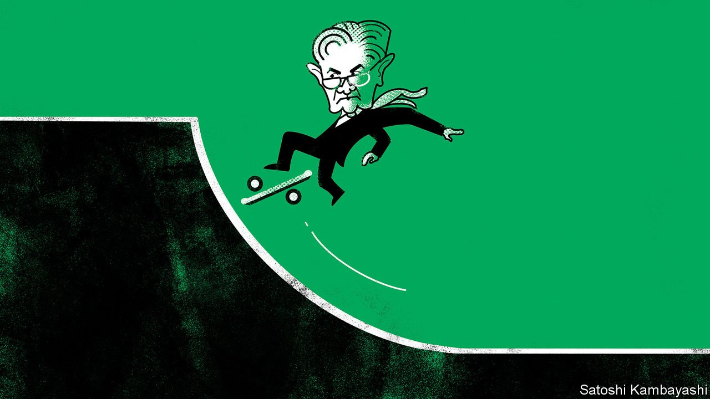

###### Buttonwood

# Can the Fed pull off an “immaculate disinflation”? 

##### Past experience suggests soft landings are hard to pull off 

 

> Apr 2nd 2022 

FIGHTING INFLATION gets harder the longer it is put off—and the Federal Reserve has waited quite a while. For most of 2021 the central bank said that it had the tools to slow price rises, but saw no need to put them to use. Now investors are coming to terms with the fact that the Fed will have to deploy them at scale. Since March 1st the three-year Treasury yield has risen by more than a percentage point, the biggest absolute change since yields collapsed in January 2008 during the global financial crisis.

The move reflects the emergence of expectations that the Fed will increase interest rates by another two percentage points this year, having already raised them by a quarter of a point on March 16th. The impact has been felt worldwide. On March 28th the Bank of Japan promised to buy Japanese government debt in unlimited quantities over four days in order to defend its cap on the ten-year government-bond yield. The yield on ten-year German bunds, which turned positive only in January, now stands at over 0.6%, even as soaring energy prices darken the growth outlook.


The most important question for bond investors in America is whether the higher interest rates that are arriving hard and fast can bring about a fabled “soft landing”, in which the heat is taken out of the economy without provoking a recession. Past experience suggests that this will be difficult; tightening has often preceded downturns. Jerome Powell, the Fed’s chairman, has pointed to successful soft landings in 1964, 1984 and 1993. But those comparisons do not account for the difficulty of the present situation. In none of those cases did the Fed let inflation rise as far as it has today.

The central bank’s latest projections are rosy, portraying what its critics have dubbed an “immaculate disinflation”: three years of steadily falling inflation, despite GDP growth remaining above its long-run trend and both the unemployment rate and the Fed’s policy rate remaining unusually low. Mr Powell may have given up calling inflation “transitory”, but these forecasts make sense only if inflation goes away of its own accord.

It seems likelier that the central bank will have to squeeze inflation out of the economy. Noting that there is no precedent for doing so gracefully, Bill Dudley, a former head of the New York Fed, wrote in a Bloomberg column on March 29th that a recession was now inevitable. The r-word is also in the air because yields on some short-term bonds have risen above those on longer-term bonds. Such a yield-curve “inversion” suggests that investors expect interest rates to be cut eventually as the economy weakens.

An inverted yield curve is often regarded as a sign that markets think the central bank is making a mistake. The uncomfortable truth, however, is that a recession and a mistake are not the same thing if causing a downturn is the only way to restore price stability. In the 1980s Paul Volcker’s Fed vanquished inflation by inducing recessions that pushed the unemployment rate to 10.8%. Nobody accuses it of having done so inadvertently; rather, it chose to pay the high price of disinflation. That is not a position in which today’s central bankers want to be; they talk as much about their duty to support jobs and growth as they do about ensuring stable prices.

The good news for Mr Powell is that for all the chatter about the yield curve, investors remain mostly on his side. Most economists put the neutral level of interest rates, at which monetary policy is pressing on neither the accelerator nor the brake, at around 2-2.5%. Both the Fed and the bond market expect the policy rate to overshoot that level only slightly. Rates a notch or two above neutral can hardly be compared with Volcker’s tightening. The market expects immaculacy, too, believing that modestly tight money will be enough to control inflation.

The recent predictive record of both central bankers and bond markets has been poor, however. Just a year ago the Fed’s message was that it was not even “talking about talking about” tightening monetary policy, and investors expected consumer prices to rise by just 2.7% over the following year. If they are caught out again, the Fed could find that meeting its inflation target demands that it induce a recession. The yield curve would then invert more steeply.

In that scenario America would pay a dear price for the glacial pace of action in 2021, which was justified, ironically, by the supposed dangers of sudden moves. It has left the central bank, the world economy and asset prices on more perilous ground.

Read more from Buttonwood, our columnist on financial markets:

 (Mar 26th)

 (Mar 19th)

 (Mar 12th)

For more expert analysis of the biggest stories in economics, business and markets, , our weekly newsletter.

