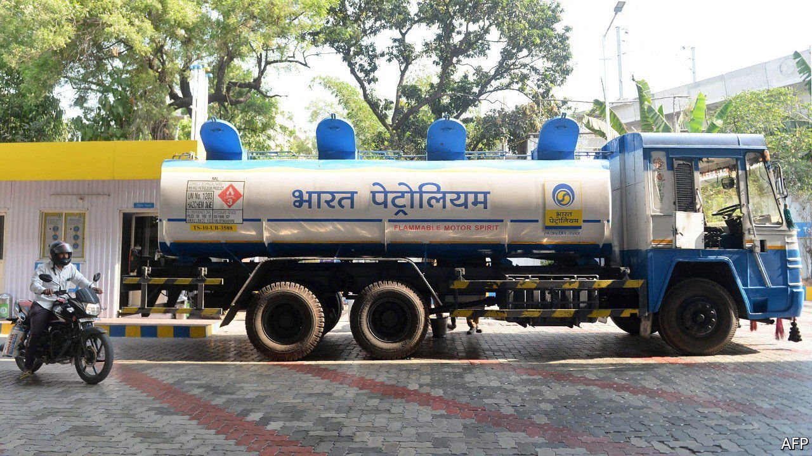

###### Side channels

# India grapples with the new realities of the global oil market 

##### The question is how to pay for Russian oil 

 

> Apr 2nd 2022 

NOTHING SHORT of outright war and plague is as likely to tank India’s economy as much as rising oil prices. Petroleum products made up more than a quarter of the country’s overall spending on imports last year—more than for any other big economy. Could cheap Russian crude lower the bill?

India has refrained from condemning Russia for its invasion of Ukraine, even as the West has imposed sanctions. But big Russian banks have been cut off from the SWIFT messaging system used for cross-border transactions and American measures have largely blocked the use of dollars, complicating trade. Sergei Lavrov, Russia’s foreign minister, was due to visit Delhi on March 31st, after we wrote this. One item on the agenda was expected to be finding ways to work around sanctions to enable Russian oil sales to India.


Oil-and-gas firms in the two countries already work together. ONGC Videsh, the Indian government’s overseas oil-and-gas exploration and production arm, is involved in three projects in Russia, for instance; Rosneft, a Russian state-owned giant, owns 49% of Nayara Energy, a Mumbai-based firm with 6,000 filling stations and a large refinery in Gujarat.

Yet overall oil trade between the countries is limited: according to India’s government, less than 1% of its oil imports last year came from Russia. The fact that trade is a mere trickle is a reflection of geography rather than politics. India bought oil from Iran, another country that faced American sanctions, until about 2019. But Iran is separated from India only by a body of water. By contrast, there are neither direct overland routes nor short water crossings from Russia to India.

In recent weeks a spate of reports in the Indian media have detailed new purchase agreements for Russian crude by Indian state-run oil companies. Hindustan Petroleum was said to have purchased 2m barrels and Indian Oil 3m barrels; Mangalore Refinery and Petrochemicals has sought to buy 1m. Others are said to have made bids for Russian oil, too.

All told, the amount comes to perhaps 15m barrels, around three days of India’s consumption. But this is seen as the first sign of closer engagement. Russia is said to have offered to pay transport and insurance costs, while offering steep discounts.

The main difficulty, though, is payments. To deal with Iran after it came under sanctions in 2011, India used Uco Bank, a state-run firm with foreign operations that extended only to Singapore, Hong Kong and Tehran, and which was therefore outside the West’s regulatory net. This time around, however, Singapore has cracked down on Russian transactions, meaning Uco cannot be used.

India’s government and central bank are therefore mulling other options. One idea that is reportedly being considered is using SPFS, Russia’s alternative to SWIFT, to conduct cross-border transactions, which would circumvent the dollar’s financial plumbing. Another proposal, according to the Economic Times, involves using the Indian operations of several large Russian banks as a conduit for transactions, by opening rupee accounts for Russian exporters.

The problem, however, is that trade between the two countries is unbalanced: India imports more than twice as much from Russia as it exports, which would leave Russian sellers holding on to unwanted rupees. Plenty for Mr Lavrov and his hosts to chew over. ■

For more expert analysis of the biggest stories in economics, business and markets, , our weekly newsletter.

