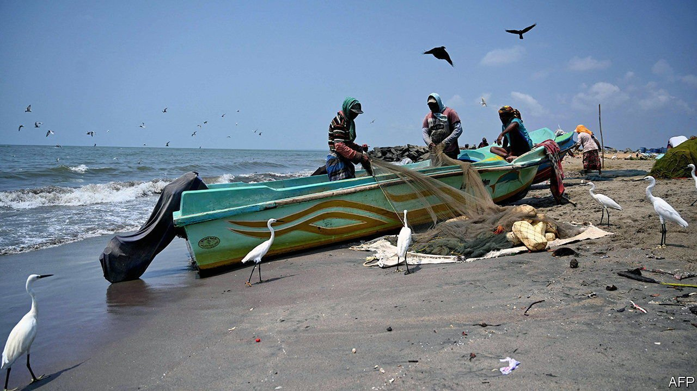
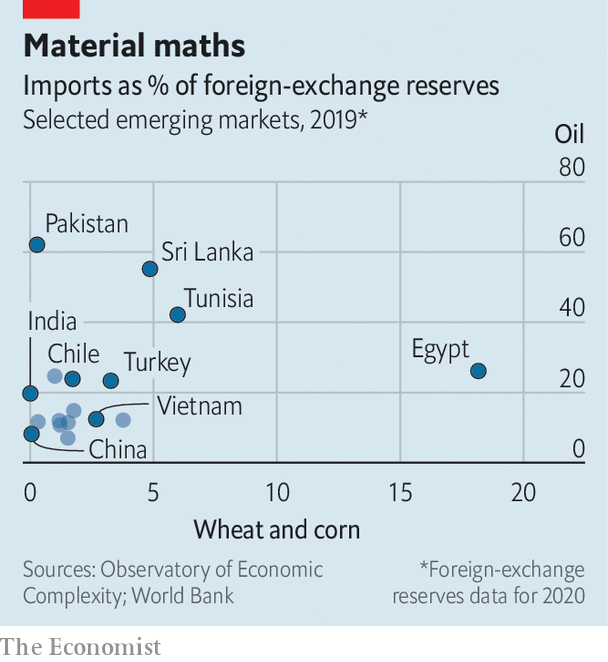

###### Menu costs

# Surging food prices take a toll on poor economies 

##### In places like Sri Lanka and Egypt, they add to existing strains 

 

> Apr 2nd 2022 

THE SRI LANKAN economy was in danger well before Russian tanks began rolling into Ukraine. Burdened by foreign debts and squeezed by the effects of the pandemic on its tourist receipts, Sri Lanka’s government dithered over approaching the IMF for help as the year began. Now a devaluation of the currency and the impact of the war on commodity markets is sending consumer prices soaring. Troops have been deployed to calm the crowds queuing for fuel, and a debt default may be unavoidable. As the prices of everything from oil and gas to corn and wheat surge, other countries may fear a similar fate.

Food makes up a modest share of households’ budgets in the rich world, but accounts for more than 20% of consumer spending across most of the emerging world and about 40% in sub-Saharan Africa. Prices had already risen substantially over the past couple of years, owing to interruptions to production and extreme weather. Global food prices, in real terms, approached an all-time high in February, according to an index maintained by the UN Food and Agriculture Organisation. They will have only gone up further since.


One consequence of this is a surge in poverty. The Centre for Global Development, a think-tank, estimates that 40m people worldwide will be pushed into extreme poverty as a result of Russia’s invasion of Ukraine. (By comparison, the World Bank estimated in 2021 that roughly 100m people may have fallen into poverty because of the covid-19 pandemic.) High commodity prices will also add to macroeconomic strains in many places.

Total debt across emerging and developing economies stood at a 50-year high last year, relative to GDP. The cost of servicing those borrowings is rising, as central banks worldwide begin pushing up interest rates in order to check inflation. The tough economic conditions are weighing on emerging-market currencies, raising the cost of foreign-currency debt and forcing governments to drain currency reserves in order to shore up exchange rates. Higher commodity prices could also further complicate the fiscal picture for emerging economies, given that many governments offer generous food and energy subsidies to households.

Sri Lanka’s case is illustrative. Its foreign-exchange reserves shrank from more than $8bn in 2019 to around $2bn earlier this year. Though the government has sought aid from both India and China, it will almost certainly require help from the IMF, with which it is expected to begin negotiations in April (and which may ask for a reduction in subsidies as part of any rescue package).

 


Egypt has also struggled. It imports nearly two-thirds of the wheat it consumes, the vast majority of which comes from Russia and Ukraine. At a pre-pandemic level of consumption, Egypt’s annual bill for food and energy imports amounts to about 40% of its foreign-exchange reserves (see chart). Sensing trouble, foreign investors began pulling money out of the country, which in turn forced the government to devalue the currency by 14%. On March 23rd it officially sought the IMF’s help.

According to estimates by the World Bank, at least a dozen countries may find themselves unable to service debts over the next 12 months, as stores of hard currency run low. Some south Asian and north African economies are in danger; Pakistan and Tunisia look particularly vulnerable. Even emerging markets with healthier financial positions can expect to face slower growth, higher inflation and grumpier citizens as a result of Russia’s war.

The news is not all grim. Economies that specialise in the production of the commodities most disrupted by the war stand to reap some benefit from soaring prices. Oil-exporting Gulf states will collect a windfall, which higher prices for imported foodstuffs will only partly offset. Some Latin American currencies have appreciated since the outbreak of war, in expectation of higher earnings for their oil and grain exports. In 2021 Brazil seemed to be slipping into crisis, weighed down by high inflation and fiscal profligacy. The war has given the country, which is a big commodity exporter, a reprieve. For much of the rest of the world, though, it has been anything but. ■

For more expert analysis of the biggest stories in economics, business and markets, , our weekly newsletter.

