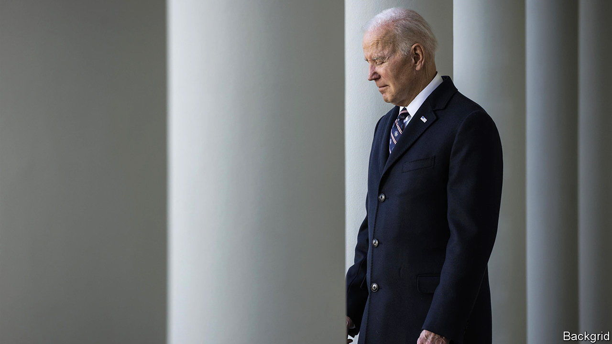

###### Before death do us part

# The White House wants to close a tax loophole used by the ultra-rich 

##### A plan to go after unrealised capital gains faces big hurdles 

 

> Apr 2nd 2022 

MOST AMERICANS want the government to impose higher taxes on the ultra-rich. Every few months or so Democratic lawmakers unveil plans for doing just that, only to stumble well before enacting them. It is not just that the wealthy can afford powerful lobbyists. The nature of their fortunes also makes them an elusive target for tax authorities. A new proposal by the Biden administration may offer a partial solution, provided it can overcome political and legal hurdles.

The idea, contained in President Joe Biden’s new budget proposal on March 28th, is that Americans worth more than $100m would pay a minimum tax of 20% on all their income, including, controversially, the appreciation of their investments. If an ultra-rich American makes a paper gain of, say, $10m on his stock portfolio in a year, he would face a liability of $2m.


The goal is to close a gaping loophole. Wealthy Americans must pay capital-gains taxes of at least 20% when they sell assets. But when assets are inherited, the price at the time of the transfer forms the new basis for calculating capital gains. In this way the ultra-rich can shrink their tax bills: they owe nothing on unsold assets while alive and their heirs then benefit from the “stepped-up basis” for capital gains. Economists in the Biden administration have calculated that the 400 wealthiest American families pay an average federal income-tax rate of just 8%, far below the rates paid by most in the middle class.

A simple way to close this loophole would be to recognise all capital gains upon inheritance. Indeed that was Mr Biden’s preference in legislation last year. But opponents tarred it as a “death tax” that would bankrupt family farms. Although that charge was unfair—almost all farms would have been below the tax threshold—the Democrats dropped the idea.

The Biden administration dubs the new proposal a “billionaire minimum income tax”. Steve Rosenthal of the Tax Policy Centre, a think-tank, calls this an ingenious rebranding of the stepped-up basis idea. “It would operate like a pre-payment,” he says. Taxes owed at death would be reduced by those paid previously.

The White House reckons the new tax would bring in $360bn over the next decade, impressive for a levy that hits the wealthiest 0.01% of households. That, however, reflects a windfall for the state when it collects on decades of gains for the likes of Jeff Bezos and Elon Musk. To pay the tax, they may need to sell down stakes in their firms, potentially remaking their ownership structures. The government would cushion the blow by breaking payments into instalments (spread over nine years at first and, later, five years). Once established, the revenues would be slimmer. “The $360bn estimate makes it look more promising than it really is in the long run,” says Kyle Pomerleau of the American Enterprise Institute, a think-tank.

There are two immediate obstacles. As with every idea from the Biden White House, the political question is whether Joe Manchin and Kyrsten Sinema, two moderate Democratic senators, support it. They have, for different reasons, opposed previous tax increases. Then there are the courts. The constitution limits the federal government to taxing incomes, not wealth. The White House would argue that accrued capital gains are a form of income, but its proposal would face legal challenges.

Even if Mr Biden were to succeed in shepherding the tax into law, another concern would emerge. The levy would be complex, especially for assets that do not trade in public markets. Lawyers would devise new structures to shelter wealth. “Their pencils are being sharpened even as we speak,” says Joel Slemrod, an economist at the University of Michigan. ■

For more expert analysis of the biggest stories in economics, business and markets, , our weekly newsletter.

