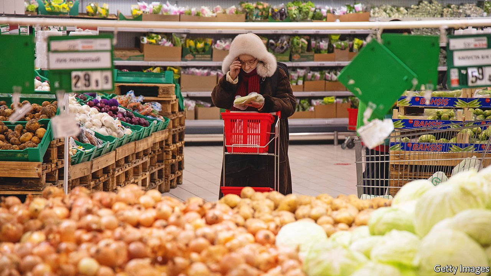
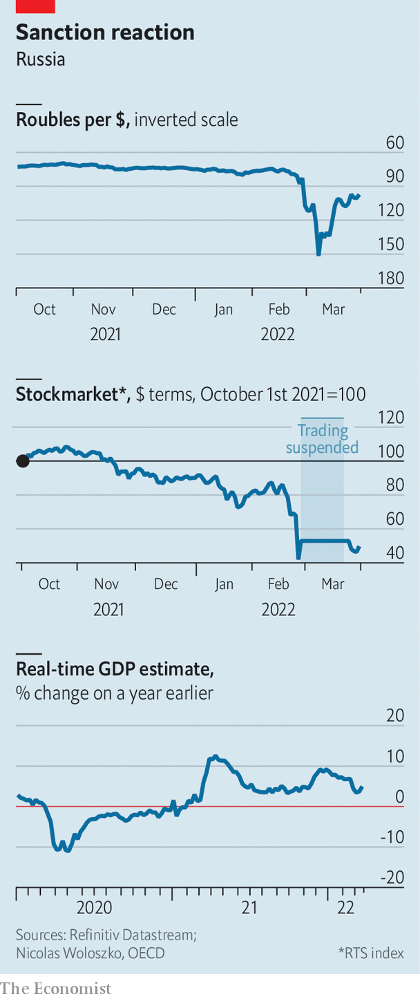

###### Wounded bear

# Under unprecedented sanctions, how is the Russian economy faring? 

##### Better than you might think 

 

> Apr 2nd 2022 

IN RESPONSE TO Russia’s invasion of Ukraine, the West launched an economic war. America banned the sale of a wide range of goods to Russia; big companies pulled out by the dozen; and a number of countries together froze 60% of the central bank’s international reserves. The idea was to send Russia’s economy into free fall, punishing President Vladimir Putin for his aggression. In the week after the invasion the rouble fell by more than a third against the dollar, and the share prices of many Russian companies collapsed.

Is the West’s strategy still going to plan? The chaos in Russian markets seems to have subsided. Since its low in early March the rouble has jumped, and is now approaching its pre-war level. The main benchmark of Russian stocks plunged by a third, but has since stabilised. The government and most firms are keeping up with their payments on foreign-currency bonds. A run on banks that saw nearly 3trn roubles ($31bn) withdrawn came to an end, with Russians returning much of the cash to their accounts.


A battery of policies has helped stabilise the markets. Some are orthodox. The central bank has raised interest rates from 9.5% to 20%, encouraging people to hold interest-bearing Russian assets. Other policies are less conventional. The government has decreed that exporters must convert 80% of their foreign-exchange proceeds into roubles. Trading on the Moscow stock exchange has become, to use the central bank’s euphemism, “negotiated”. Short-selling is banned, and non-residents cannot offload stocks until April 1st.

 


The real economy, though, is in some ways the mirror image of the financial one: healthier than it seems at first glance. A weekly measure of consumer prices shows that they have risen by more than 5% since the beginning of March alone. Many foreign firms have pulled out, cutting the supply of goods, while a weaker currency and sanctions have made imports more expensive. But not everything is surging in price. Vodka, largely produced domestically, costs only a bit more than it did before the war. Petrol costs about the same. And though it is early days, there is little evidence yet of a big hit to economic activity.

According to an estimate based on internet-search data and produced by the OECD, a rich-country think-tank, Russia’s GDP in the week to March 26th was about 5% higher than the year before. Other “real-time” data gathered by The Economist, such as electricity consumption and railway loadings of goods, are holding up. A spending tracker produced by Sberbank, Russia’s largest lender, is slightly up year on year. Part of this reflects people stockpiling goods before prices rise: spending on home appliances is especially strong. But spending on services has fallen only a bit, and remains far healthier than it was during much of the pandemic.

Russia seems sure to enter a recession this year. But whether it ends up faring as badly as most economists predict—the wonks are pencilling in a GDP decline of 10-15%—depends on three factors. The first is whether ordinary Russians start worrying about the economy as the war drags on, and reduce spending—as happened in 2014, when Russia invaded Crimea. The second is whether production eventually grinds to a halt as sanctions block firms’ access to imports from the West. Russia’s aviation sector looks particularly vulnerable, as does the car industry. Yet many big businesses that started during Soviet times are used to operating without imports. If any economy could come close to coping with being cut off from the world, it would be Russia’s.

The third and most important factor relates to Russia’s fossil-fuel exports. Despite the many sanctions imposed on it, Russia is still selling about $10bn-worth of oil a month to foreign buyers, equivalent to a quarter of its pre-war exports; revenues from the sale of natural gas and other petroleum products are still flowing in, too. This provides a valuable source of foreign currency with which it can buy some consumer goods and parts from neutral or friendly countries. Unless that changes, the Russian economy may continue to defy the worst predictions. ■

For more expert analysis of the biggest stories in economics, business and markets, , our weekly newsletter.

