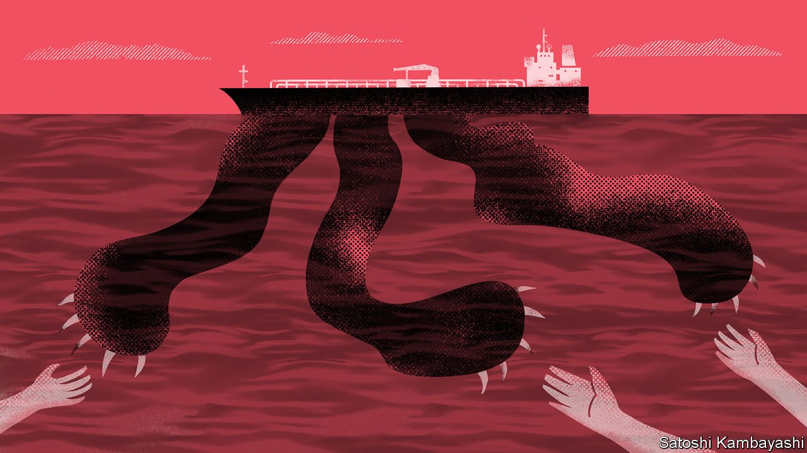
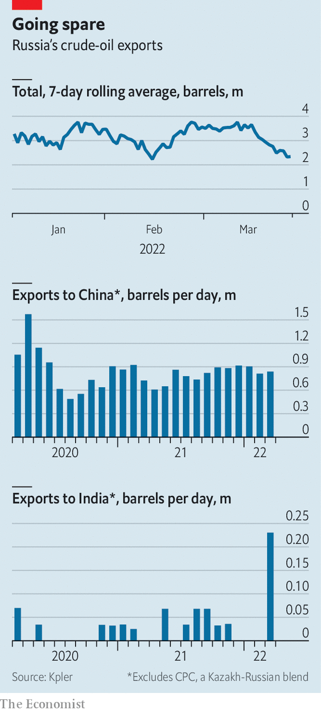
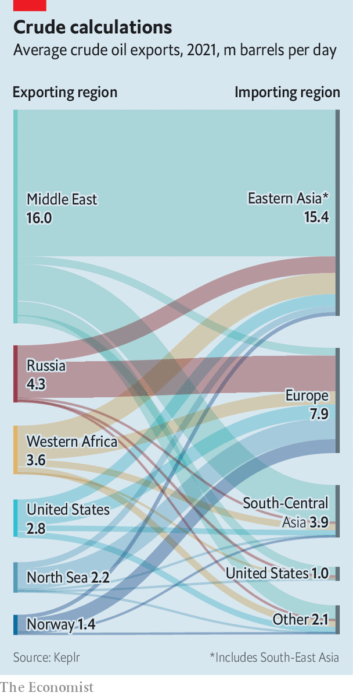

###### Diversionary tactics

# What can Russia do to sell its unwanted oil? 

##### China and India sniff a bargain 

 

> Apr 2nd 2022 

ON FEBRUARY 22ND, two days before Russia invaded Ukraine, a German-flagged vessel left the Russian port of Primorsk loaded with 33,000 tonnes of oil. When it reached Tranmere, a British oil terminal, on March 3rd, it received a frosty welcome. Some dockers refused to unload the freight when they learnt where it had come from. Similar boycotts have sprung up elsewhere. Kayrros, a data firm, estimates that the volume of oil “on water” rose by nearly 13% in the fortnight after the invasion, in large part as undelivered Russian cargo sought new takers. The number of vessels returning to Russia also jumped.

Most of what has flowed out of Russia in recent weeks was bought and paid for before the war started. Now less oil is leaving the country in the first place. Worries about sanctions and bad publicity have prompted many buyers to pause purchases. On March 24th the volume of Russian seaborne oil exports, at 2.3m barrels per day (bpd), was nearly 2m below the level on March 1st, reckons Kpler, a data firm. As those barrels fail to sell, the price of Brent crude is nearing $115. Yet for the countries willing to risk opprobrium and jump through new logistical hoops, Russian oil is beginning to look like a bargain.


The partial embargo of Russia has echoes with the blockade of Iran by the West in the 2010s, which led the Islamic Republic to put together an unrivalled playbook for smuggling oil. In May 2018 America imposed “maximum pressure” sanctions, with the aim of halting Iran’s oil exports altogether. It almost succeeded: by October 2019 they had fallen to an average of 260,000 bpd, from 2.3m before the sanctions. Since then, however, they have revived a little, averaging 850,000 bpd in the three months to February 2022.

 


Iran manages to sell oil through two channels. The first is through authorised but restricted sales. As it imposed its sanctions America granted a limited exemption to eight importing countries. There is a big catch, however: the sales have to be made in the buyers’ currency and either kept in escrow accounts at local banks or spent on a list of goods produced locally. For Iran that is deeply frustrating. In December it was forced to accept tea from Sri Lanka as payment for an oil debt valued at $251m.

To circumvent the restrictions Iran smuggles vast quantities of oil—its second channel for sales. Iranian tankers sail to America’s foes, such as Venezuela, with their transponders turned off. Some are repainted to hide their provenance. Others transfer their cargo in the high seas, often at night, to ships sailing under a different flag. Oil is also moved over land by smuggling gangs, says Julia Friedlander, a former intelligence official now at the Atlantic Council, a think-tank in Washington. Petroleum is bartered with China, Turkey and the United Arab Emirates against gold, pesticides and even housing projects in Tehran. Traders in Dubai, home to half a million Iranians, blend crude from the Islamic Republic with other, similar grades which they then rebrand as Kuwaiti oil.

Russia is unlikely to take a leaf out of Iran’s book, mainly because, for now, it doesn’t need to. The penalties imposed on Iran include secondary sanctions that threaten third-country banks dealing with it with huge fines. That makes overtly buying its oil risky. By contrast, Russia faces a weaker embargo. Only America, which did not buy much to begin with, has banned its oil. On March 25th Germany said it would cut its purchases by half, but it is unclear when that would start. Sales transmitted through pipelines, which are less conspicuous than shipments and represent about a fifth of Russia’s total exports of crude, are still flowing. Secondary sanctions have not been imposed.

Instead seaborne exports have cratered because Western buyers, such as big energy firms, fear a public backlash. They also face logistical headaches as cautious banks cut credit, ship owners struggle to obtain insurance and freight costs soar. And each time sanctions are tweaked, says Antonia Tzinova of Holland &amp; Knight, a law firm, compliance staff must study hundreds of pages of legalese, making many Russian deals hardly worth the hassle. As a result, Urals crude, the grade pumped out by Russia, is currently trading at a discount of around $31 a barrel. One trader expects the gap to hit $40 within a week’s time.

 


Two big countries that have not joined in with the West’s sanctions—India and China—sense a bargain to be had. India is certainly acting on the opportunity. Russian ship loadings headed for the subcontinent are expected to have risen to 230,000 bpd in March, up from nothing in the previous three months (this excludes CPC, a blend of mainly Kazakh and Russian crude). Yet India is unlikely to buy much, at least in the short term. Nearly half its imports come from the Middle East, and shipping from the Gulf is much cheaper than shipping from Russia. Payment cannot be settled in dollars, requiring India to experiment with a rouble-rupee mechanism (see next story).

Adi Imsirovic, a former oil-trading boss of Gazprom now at the Oxford Institute of Energy Studies, does not see India buying more than 10m barrels a month. This is small, considering that Russia’s pool of unwanted oil is expected by the International Energy Agency, an official forecaster, to reach 3m bpd in April.

Only China, then, can save Russia. It imports a total of about 10.5m bpd (11% of the world’s daily production). Mr Imsirovic thinks China could opportunistically increase its purchases to 12m bpd. That could allow it to buy 60m from Russia in relatively short order. It helps that China has lots of empty storage.

None of this is happening yet. Even for China, transporting oil from Russia has become harder. Whereas shipment from Russia to Europe usually takes three or four days, to Asia it takes 40. Oil must be loaded onto bigger tankers, which is slow and costly. Chinese banks are loth to lend.

Payment is another problem. Financiers in Hong Kong, who have ample access to greenbacks, have helped North Korea receive hard currency in the past. But Russia’s energy deals would be far too large to hide in the city’s financial system, says a trade lawyer. And its main regulator would not turn a blind eye to such dealings, lest they lead America to suspend Hong Kong’s ability to clear dollars locally, a privilege central to its economy.

One fix, however, is for Russia to use Chinese bank accounts within China to receive payment in yuan. Those accounts could then be used to finance imports of essential goods, avoiding the cross-border dimension of trade accounting.

China may also be biding its time. Even with the extra costs, buying Russian oil would save lots of money. And Chinese traders know a bargain when they see one: when the oil price neared single digits during the covid-induced downturn of 2020, they stocked up to the gills. As Russia’s trading position weakens, the Urals discount will go up. So will China’s purchases.

Such a move will not be easily reversed. Most refineries are configured to guzzle certain types of crude, meaning switching from the high-sulphur Urals variety to, say, Saudi Arabia’s super light takes time and money. That in turn suggests Russia’s push into Asia and Europe’s scramble for supplies could reshape the global market. Much of North Sea oil usually goes east; more of it might now stay in Europe. The continent will probably also buy more from West Africa and America, and crank up its imports of sulphur-rich grades from the Gulf. The rest of the world—Asia included—will have to content itself with what Europe does not want. Oil from the Tupi field in Brazil already trades at twice the premium to Brent than usual.

The result of this more fragmented global oil-trading system will be a structurally higher price for importers. Until the war petroleum generally flowed seamlessly from oilfields to the fuel tanks that needed it most. Now, says Ben Luckock of Trafigura, a trading firm, that finely tuned system has been disrupted. ■

For more expert analysis of the biggest stories in economics, business and markets, , our weekly newsletter.

