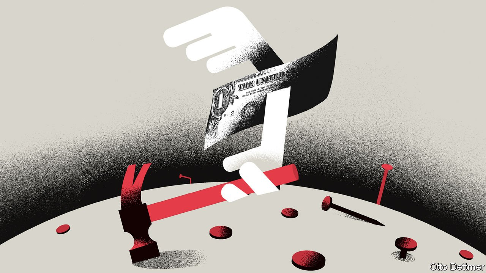

###### Free exchange

# Will dollar dominance give way to a multipolar system of currencies? 

##### Recent trends suggest the yuan will not gain much 

 

> Apr 2nd 2022 

IN THE WAKE of an invasion that drew international condemnation, Russian officials panicked that their dollar-denominated assets within America’s reach were at risk of abrupt confiscation, sending them scrambling for alternatives. The invasion in question did not take place in 2022, or even 2014, but in 1956, when Soviet tanks rolled into Hungary. The event is often regarded as one of the factors that helped kick-start the eurodollar market—a network of dollar-denominated deposits held outside America and usually beyond the direct reach of its banking regulators.

The irony is that the desire to keep dollars outside America only reinforced the greenback’s heft. As of September, banks based outside the country reported around $17trn in dollar liabilities, twice as much as the equivalent for all the other currencies in the world combined. Although eurodollar deposits are beyond Uncle Sam’s direct control, America can still block a target’s access to the dollar system by making transacting with them illegal, as its latest measures against Russia have done.


This fresh outbreak of financial conflict has raised the question of whether the dollar’s dominance has been tarnished, and whether a multipolar currency system will rise instead, with the Chinese yuan playing a bigger role. To understand what the future might look like, it is worth considering how the dollar’s role has evolved over the past two decades. Its supremacy reflects more than the fact that America’s economy is large and its government powerful. The liquidity, flexibility and the reliability of the system have helped, too, and are likely to help sustain its global role. In the few areas where the dollar has lost ground, the characteristics that made it king are still being sought out by holders and users—and do not favour the yuan.

Eurodollar deposits illustrate the greenback’s role as a global store of value. But that is not the only thing that makes the dollar a truly international currency. Its role as a unit of account, in the invoicing of the majority of global trade, may be its most overwhelming area of dominance. According to research published by the IMF in 2020, over half of non-American and non-EU exports are denominated in dollars. In Asian emerging markets and Latin America the share rises to roughly 75% and almost 100%, respectively. Barring a modest increase in euro invoicing by some European countries that are not part of the currency union, these figures have changed little in the past two decades.

Another pillar of the dollar’s dominance is its role in cross-border payments, as a medium of exchange. A lack of natural liquidity for smaller currency pairs means that it often acts as a vehicle currency. A Uruguayan importer might pay a Bangladeshi exporter by changing her peso into dollars, and changing those dollars into taka, rather than converting the currencies directly.

So far there has been little shift away from the greenback: in February only one transaction in every five registered by the SWIFT messaging system did not have a dollar leg, a figure that has barely changed over the past half-decade. But a drift away is not impossible. Smaller currency pairs could become more liquid, reducing the need for an intermediary. Eswar Prasad of Cornell University argues convincingly that alternative payment networks, like China’s Cross-Border Interbank Payment System, might undermine the greenback’s role. He also suggests that greater use of digital currencies will eventually reduce the need for the dollar. Those developed by central banks in particular could facilitate a direct link between national payment systems.

Perhaps the best example in global finance of an area in which the dollar is genuinely and measurably losing ground is central banks’ foreign-exchange reserves. Research published in March by Barry Eichengreen, an economic historian at the University of California, Berkeley, shows how the dollar’s presence in central-bank reserves has declined. Its share slipped from 71% of global reserves in 1999 to 59% in 2021. The phenomenon is widespread across a variety of central banks, and cannot be explained away by movements in exchange rates.

The findings reveal something compelling about the dollar’s new competitors. The greenback’s lost share has largely translated into a bigger share for what Mr Eichengreen calls “non-traditional” reserve currencies. The yuan makes up only a quarter of this group’s share in global reserves. The Australian and Canadian dollars, by comparison, account for 43% of it. And the currencies of Denmark, Norway, South Korea and Sweden make up another 23%. The things that unite those disparate smaller currencies are clear: all are floating and issued by countries with relatively or completely open capital accounts and governed by reliable political systems. The yuan, by contrast, ticks none of those boxes. “Every reserve currency in history has been a leading democracy with checks and balances,” says Mr Eichengreen.

Battle royal

Though the discussion of whether the dollar might be supplanted by the yuan captures the zeitgeist of great-power competition, the reality is more prosaic. Capital markets in countries with predictable legal systems and convertible currencies have deepened, and many offer better risk-adjusted returns than Treasuries. That has allowed reserve managers to diversify without compromising on the tenets that make reserve currencies dependable.

Mr Eichengreen’s research also speaks to a plain truth with a broader application: pure economic heft is not nearly enough to build an international currency system. Even where the dollar’s dominance looks most like it is being chipped away, the appetite for the yuan to take even a modest share of its place looks limited. Whether the greenback retains its paramount role in the international monetary system or not, the holders and users of global currencies will continue to prize liquidity, flexibility and reliability. Not every currency can provide them. ■

Read more from Free Exchange, our column on economics:

 (Mar 26th (Mar 19th) (Mar 12th)


