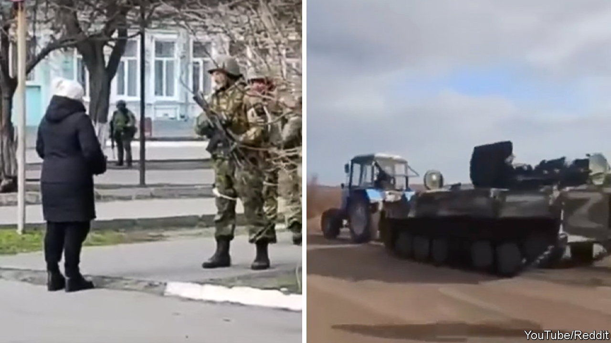

###### #PutinsWar

# The invasion of Ukraine is not the first social media war, but it is the most viral 

##### Ukraine is the most wired country ever to be invaded 

 

> Apr 2nd 2022 

YOU HAVE probably seen the videos from Ukraine. There is the one where Volodymyr Zelensky, Ukraine’s president, stands outside Kyiv’s government quarter in dim light, holding his smartphone with the camera pointed selfie-style at himself and several senior officials. “We are all here,” he declares, days after Vladimir Putin, Russia’s president, sent his tanks across the border. Or the one a Ukrainian soldier took, showing his mates in a snowy field firing anti-tank missiles, set to a thumping techno soundtrack. Or the one where a Ukrainian woman approaches a group of Russian soldiers and tells them to put sunflower seeds in their pockets so that something useful will grow from their bodies when they die.

Each spread online, generating millions of views and likes, reposts and remixes. They became part of the instant digital annals of the war, alongside pictures of Ukrainian tractors towing abandoned Russian tanks, which is now a global meme, and audio of Ukrainian soldiers at an islet in the Black Sea telling an approaching fleet, “Russian warship: go fuck yourself”, which is now a rallying cry at protests as far away as Tokyo.


The war in Ukraine is not, as some commentators rushed to declare, the “first social-media war”. Israel and Hamas have long sparred on Twitter as well as IRL. During Mr Putin’s previous invasion of Ukraine, in 2014-15, digital sleuths used selfies that Russian soldiers posted online to prove their presence on the battlefield in the Donbas region. (Russia subsequently barred soldiers from carrying smartphones while on duty.) Nor is the war in Ukraine the first conflict to appear on a new generation of social networks such as TikTok, which launched in 2016. Videos from the war in Syria have long circulated there; those interested could also find plenty of clips from Nagorno-Karabakh, the disputed enclave that Armenia and Azerbaijan fought over in 2020.

But Ukraine has become the most vivid example yet of how social media are changing the way that war is chronicled, experienced and understood, and how that, in turn, can change the course of a war itself. “Anyone who thinks it is a sideshow isn’t paying attention to war and politics in the 21st century,” says Peter Singer, co-author of #LikeWar, a book about the intersection of social media and modern conflict.

Online chatter can spur rapid shifts in public opinion, especially when pre-existing beliefs are reinforced. Posts on social networks have become a crucial source of information for gatherers of open-source intelligence (OSINT) and conventional media alike. Social media can be used as an “instrument” for governments to achieve wartime aims, says Mykhailo Fedorov, Ukraine’s minister for digital transformation, who has used Twitter to push for a “digital blockade” of Russia by global technology firms. Along with rallying NATO and delivering arms to Ukraine, the White House recently held a briefing on the war for 30 young TikTok influencers. “Whether you like it or not, there are a lot of people on these apps,” says Victoria Hammett, who attended as part of Gen-Z for Change, an activist group.

The war in Ukraine has saturated those apps. “What’s new is the scale of it,” Mr Singer argues. The sheer horror of the war naturally attracts attention. European audiences are especially fascinated because Ukraine is on their doorstep, and they, too, fear Vladimir Putin. Race and psychology may add to the mix: Western audiences may identify more with Ukrainians than Syrians, and thus more readily watch, share or like posts about Ukraine.

But Ukraine is also more wired than other recent war zones. Some 75% of Ukrainians use the internet, according to the International Telecommunication Union, part of the UN. Internet access has remained stable in all but the most brutally besieged Ukrainian cities, thanks in part to satellite coverage. When Russian bombers began pounding Syria on behalf of Bashar al-Assad in 2015, 30% of Syria’s population was online. In Afghanistan at the time of the American withdrawal, the figure stood at less than 20%.

The evolution of social media and communications technologies plays a role too. The shifts can be seen in Ukraine itself: when Russia began its war in 2014, just 4% of Ukrainian mobile subscribers had access to networks of 3G speed or faster; this year, more than 80% are on high-speed networks, according to Kepios, a research firm. In 2014 just 14% of Ukrainians had smartphones, reckons Kepios; by 2020 more than 70% did, estimates GSMA, a telecommunications industry body. When Mr Putin launched the recent invasion, 4.6bn people were using social media globally, more than double the number in 2014. Where users once saw content from those they follow in chronological order, they now consume an algorithmic news-feed that promotes the items attracting the most interest. Social networks had limited capacity to display videos or livestreams in 2014, but are now heaving with them, a shift Ukrainians have made the most of. “Everyone is filming and posting every last bombing,” says Maria Popova, a communications executive who now co-ordinates a volunteer movement to gather and disseminate information from Ukraine.

Such recordings are the latest stage in the long evolution of the imagery of war. Before the camera, artists had to convince audiences they had witnessed the events they depicted: “I saw this,” Francisco Goya wrote under one of the etchings in his classic series, “The Disasters of War”. Photographers began documenting conflict in the mid-19th century, but cumbersome equipment and processes made capturing combat impossible. Instead, pictures tended to show the aftermath of the fighting, such as in “The Valley of the Shadow of Death”, Roger Fenton’s iconic image of a cannonball-strewn road during the Crimean War. The invention of lightweight, 35mm cameras made it possible to operate at the frontlines. During the Spanish Civil War, photojournalists took searing pictures of battle that helped mobilise support for the resistance to Franco, such as Robert Capa’s defining snapshot of a Republican soldier falling dead. With the Vietnam war, conflict came to television. Cable news carried the first Gulf war live. As the critic Susan Sontag wrote in 2002, “The understanding of war among people who have not experienced war is now chiefly a product of the impact of these images.”

Today’s instantly shareable, smartphone-fuelled photographs and videos take things a step further. Nathan Jurgenson, a social-media theorist, dubs such images “social photo” and “social video”, and reckons their power depends less on the information they convey than on the experience they express. They function more as a means of communication than of documentation. “Images within the social stream evoke more than they explain; they transmit a general alertness to experience rather than facts,” Mr Jurgenson writes. Coexisting alongside traditional photojournalism and television, social photo and video add a rawer, darker, more personal quality to the picture of war outsiders see. “News reports give you the big bits, but a lot of what I’m seeing [online] is everyday life as the war makes it, like the lines for bread,” says Simon Kemp of Kepios. “Those scenes make it a lot more like, ‘Fuck, that could be me’—it makes it more human.”

Ukrainians have adapted deftly to the new information environment. It helps to have a charismatic, social-media savvy leader in Mr Zelensky, a former TV star. His messages often break with the formal presidential approach and embrace the intimate aesthetic of social media, in contrast to his older, staider foe in Moscow. “It’s organic for him to use technology,” says Mr Fedorov, who ran digital operations for Mr Zelensky’s presidential campaign in 2019. “He wants to share, wants to spread the word, wants to convey his emotions—like a normal person.” Officials across Ukraine have adopted the same approach. Vitaly Kim, the governor of Mykolaiv, a frontline region in southern Ukraine, posts regular selfie-style videos to his channel on Telegram, a messaging and publishing platform that is widely used in both Ukraine and Russia.

The Ukrainian government has taken to social media to pursue various aims. On March 17th Dmytro Kuleba, the foreign minister, sought to embarrass Nestlé for refusing to cease all operations in Russia by posting a meme-style image that contrasts “Nestle’s positioning”—a picture of a healthy child—with “Nestle’s position”—a picture of a dead child. The digital ministry launched a chatbot on Telegram that allows citizens to send videos and locations of Russian forces; it receives around 10,000 messages a day, which Ukraine’s army uses to supplement traditional intelligence. “Wherever they may be, we see them,” Mr Fedorov says. The government uses social media to spread everything from information about evacuation trains to stories about heroic soldiers. The tales have been no less powerful even when untrue: the soldiers from the islet in the Black Sea were not killed after delivering their famous line, as Ukraine’s government originally reported, but captured, a fact that has done little to dent their reputation as martyrs.

The government has had plenty of help. Across Ukraine, public-relations specialists, designers and other media types have banded together through bottom-up networks that emerged within hours of the invasion. “Everybody is an information warrior these days,” says Liubov Tsybulska, an adviser to the Ukrainian government who helps co-ordinate several teams of them, each with a specific focus. One group packages content aimed at Russians; another produces patriotic clips for a domestic audience; a third focuses on TikTok; a fourth churns out memes; yet others work to archive photos and videos from social media for what they hope will be future war-crimes tribunals. Part of the aim is to make sure the world gets its information about Ukraine directly from Ukraine, says Serhii Didkovsky, a PR strategist who belongs to another network of creative professionals. “We want a Frenchman sitting in Paris, looking at the Eiffel Tower, eating his croissant, to understand that he can do all of that because the Ukrainian army is defending him,” Mr Didkovsky says.

Just as Ukraine has shifted towards the West geopolitically in recent years, so has its online life. When Russia invaded in 2014, Ukraine’s internet culture, like its economy as a whole, was oriented towards Russia. The most popular social network was VK, a Russian platform. In recent years, Ukraine’s tech scene has boomed; many developers and designers work for Western technology companies. “We have lots of people who know how to design content for the global internet,” Mr Didkovsky says. Ukrainian users speak to Western audiences in a common digital language. A travel photographer who posts as @valerisssh became a viral sensation with videos that applied popular TikTok memes to her life in wartime Chernihiv with humour and pathos. One appropriates an Italian song often used on the platform for videos of users cooking pasta to take her followers on a tour of her family’s bomb shelter.

That has helped win hearts and minds in the West. Americans already tended to dislike Russia, and they have been swift to embrace Ukraine. At the end of last year 55% of Americans saw Ukraine as “friendly” or “allied”. Two weeks after Mr Putin’s bombs began falling, more than 80% of Americans did, a greater share than those who thought the same of France or Japan, both longtime allies. Diplomats in Europe say similar shifts in public opinion there have helped galvanise support for tougher sanctions against Russia and a more liberal approach to refugees from Ukraine. The real-time storytelling has also helped boost morale amongst Ukrainians. “We witness how a new narrative about Ukraine is being born and it gives us strength, gives us courage,” says Ms Tsybulska.

Russia has floundered on the information battlefield inside Ukraine as much as on the physical one, despite its reputation as a pioneer of disinformation. Russian occupying forces have handed out fliers appealing to “comrades” and taken over local radio stations to broadcast speeches by Mr Putin. “They’re using crap from the second world war,” says Kristina Berdynskykh, a prominent Ukrainian journalist originally from Kherson, a city currently under Russian control. “Information isn’t spread that way any more.” Residents in occupied cities continue to stream Ukrainian television and radio online and through Diia, a Ukrainian government app. They use Telegram to organise protests and share recordings of the Russian occupiers. Videos of unarmed protesters challenging Russian soldiers have gone viral, including one of a lone man trying to stop a tank with his bare hands.

In the West, Russian narratives have gained little traction. That may be because the reality is too stark to spin. Western platforms have also taken tougher stances towards the disinformation spread by Russian state media. But Russia has also made less of an effort to reach western audiences, reckons Carl Jack Miller of Demos, a think-tank in London.

The preponderance of Ukraine-friendly messages on Western users’ news-feeds hardly means the information war is over. “The narrative that Ukraine has won the information war is complacent and not necessarily backed up by anything empirical,” Mr Miller argues. Independent researchers say that social networks’ unwillingness to share data makes it difficult to assess how information is spreading online. That is especially true of organic content, and of newer platforms, in particular TikTok. “There is no systemic, reliable way to look across these platforms and see what the information ecosystems look like,” laments Brandon Silverman, co-founder of CrowdTangle, a social analytics tool.

Inside Russia, Mr Putin has kept a tight grip on the narrative by tightening the flow of information. Twitter, Facebook, and Instagram have all been banned; users on TikTok cannot create new content. Wartime censorship laws make calling the war a war punishable by up to 15 years behind bars. Russian authorities have created Telegram chatbots for citizens to inform on those spreading “incorrect information”.

Russian disinformation campaigns seem to be targeting Asia, Africa, and the Middle East, crafting messages that tap into pre-existing anti-Western or anti-American sentiments, says Mr Miller. A team at Demos used semantic analysis of accounts pushing pro-Putin hashtags on Twitter and found a preponderance of activity in South Africa and India. Public opinion on the conflict in Asia is not as definitively anti-Russian as in the West. Cyril Ramphosa, South Africa’s president, recently tweeted that “the war could have been avoided if NATO had heeded the warnings” about its eastward expansion.

As the physical war settles into a bloody grind of attrition, so will the one for attention online. Westerners “like the stories about tractors and tanks, but not the stories about pregnant women suffering”, Ms Tsybulska sighs. “Tractors and tanks are entertainment, but if you acknowledge the suffering, we all have to do something.” Photographs did not bring about an end to war by making suffering visible, as some hoped they would in the 19th century; neither will social images now. Yet they will continue to be taken, posted and shared. As Ukraine demonstrates, real life is increasingly lived online, both at peace and at war.

Read more of our recent coverage of the 

