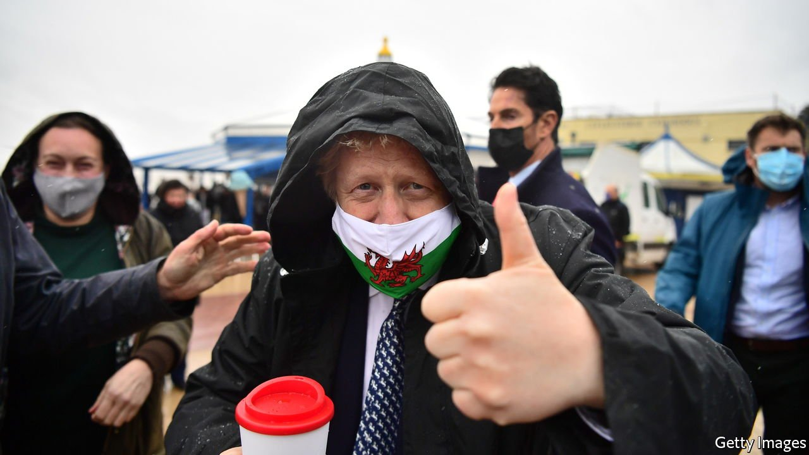

###### These septic isles

# Devolution is making the United Kingdom chronically miserable 

##### Here is how to fix it 

 

> Apr 2nd 2022 

IN RECENT YEARS it has sometimes seemed as if the only question worth asking about the state of the United Kingdom is which of its four nations would be the first to break away. Northern Ireland, already carved off from the British internal market as the price of Boris Johnson’s Brexit deal? Scotland, where the first minister, Nicola Sturgeon, is demanding a second independence referendum next year? Or perhaps even Wales, where polls find up to a third of voters would back a split?

In fact, pessimism about the union’s survival is overdone. In Northern Ireland the Brexit protocol is leading to closer economic ties with the republic, but not a new wave of support for a . Any referendum in Scotland or Wales would require Mr Johnson’s permission, which he has made clear he will not give. None of the independence movements has gone beyond a back-of-the-envelope sketch of how their breakaway country would be run.


Supporters of the union are therefore winning. But for the union to survive is not the same as for it to thrive. If the United Kingdom is to do any better than lurch from one crisis to the next, it needs a new constitutional settlement.

Under New Labour, the devolved parliaments in Edinburgh, Cardiff and Belfast were meant to bring bread-and-butter issues, such as health care and schooling, before each country’s voters. Instead such issues are neglected, because elections are dominated by unresolved arguments about the constitution. The Scottish National Party (SNP) has been sustained in office despite its poor stewardship of schools and hospitals, because it monopolises pro-independence voters. In Northern Ireland a crisis looms. Sinn Fein, which favours a united Ireland, is likely to win the most seats in the assembly election in May. The Democratic Unionist Party (DUP), which opposes reunification, may refuse to share power with it, and cause the government to collapse.

Relations with Westminster are dysfunctional, too. Under devolution, powers were crudely handed out around the United Kingdom, but the politics favour blaming the centre rather than working with it. London and Edinburgh are clashing over whether to widen a Scottish road carrying freight arriving by sea from Northern Ireland to England. Attempts to build new nuclear power stations or drill for gas have been stymied, because energy policy is set in London whereas planning is devolved.

A better combination of devolution and centralisation would compel governments to work together. Leaders in Scotland and Wales want more say over issues that affect all of Britain, such as immigration and relations with the European Union. They should get it. In exchange, they should let Westminster co-ordinate areas of national importance, such as major transport links and energy security. Tougher central scrutiny is needed, too. If schools in Scotland or hospitals in Wales are failing, Westminster has a legitimate role in helping turn them around.

If the DUP tries to block devolution from being restored in May, Westminster should remove the veto power wielded by Northern Ireland’s two largest parties, one of which backs the union and the other a united Ireland. Making assembly rules fairer would boost parties that are neither unionist nor republican. The political culture needs to change, too. The SNP should accept that its dream of independence will not soon be fulfilled. It is failing its own people if it chooses not to work with Westminster partly for fear that they may become content with the status quo. For their part, the Conservatives should stop using the spectre of secession to stir up their own English voters.

Last, the heat needs to be taken out of Brexit, which further strained the union. Liz Truss, the foreign secretary, is right to seek a new deal with the EU on the flow of goods to and from Northern Ireland, and to downplay threats to trigger Article 16, the suspension clause of the Brexit treaty. Softening the sharp edges of Brexit, for example by making it easier for students and artists to travel, would make remaining in a United Kingdom outside the EU more palatable for the majorities in Scotland and Northern Ireland who voted to remain within the bloc.

One for all

The union has proved surprisingly robust in the face of the threats of Brexit, rising separatism and Mr Johnson’s populism. Devolution enshrined the noble principle that the nations of the United Kingdom should take control of their own affairs while working in a greater whole. It is an idea worth saving. ■

